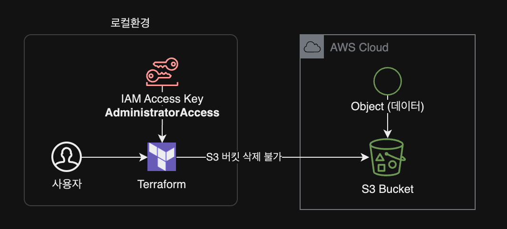
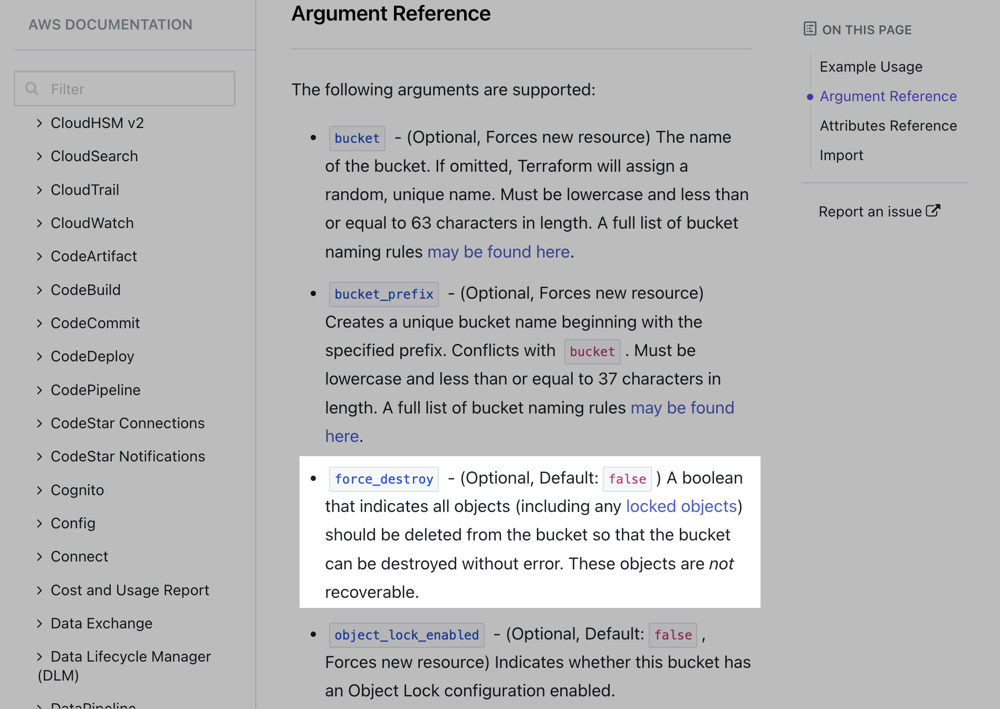
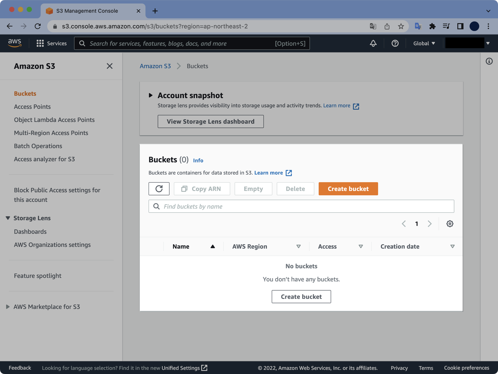

## 문제점

테라폼으로 생성한 버킷을 삭제하려고 할 때 내용물이 들어 있으면 테라폼으로 삭제되지 않습니다.



`terraform destroy` 실행 후 발생하는 에러 메세지는 다음과 같습니다.

```bash
$ terraform destroy
...
aws_iam_role.s3-mybucket-role: Destroying... [id=s3-mybucket-role]
aws_iam_role.s3-mybucket-role: Destruction complete after 0s
╷
│ Error: deleting S3 Bucket (mybucket-seyslee-terraform-training): BucketNotEmpty: The bucket you tried to delete is not empty
│   status code: 409, request id: NM7NS0KDN2YV6JG4, host id: 0M0e2q8n/aHzPgCqWJWo0/6WVOGEisA7WyA4smqB/9c4wyd8/ArZAbVT60BragCP7x+dWGB9Co8=
│
│
```

S3 안에 오브젝트(데이터)가 들어 있어서 버킷을 삭제할 수 없다는 에러 메세지입니다.

&nbsp;

이 문서에서는 S3 버킷을 수작업으로 비울 필요 없이 테라폼만으로 버킷을 비우고 강제 삭제<sup>force destroy</sup>하는 방법을 소개합니다.

&nbsp;

## 원인

테라폼으로 삭제하려고 하는 S3 버킷에 `helloworld.txt`라는 텍스트 파일 오브젝트가 들어있어서 삭제되지 않고 있습니다.

```bash
$ aws s3 ls s3://mybucket-seyslee-terraform-training/
2022-06-09 00:22:54        211 hello-world.txt
```

오브젝트들이 들어 있는 버킷을 테라폼으로 강제 삭제하는 방법에 대해 알아보겠습니다.

&nbsp;

## 환경

### 로컬 환경

- **Terraform v1.2.2** (brew로 설치)
- **Provider** : [terraform-provider-aws_v4.17.1_x5](https://github.com/hashicorp/terraform-provider-aws/tree/v4.17.1)
- AWS CLI 권한은 현재 [AdministratorAccess](https://docs.aws.amazon.com/ko_kr/IAM/latest/UserGuide/access_policies_job-functions.html#jf_administrator) 권한이 부여된 상태

&nbsp;

## 해결방법

### 강제삭제 옵션<sup>`force_destroy`</sup> 사용

1. 테라폼 파일을 수정합니다. S3 버킷의 강제 삭제 설정값을 `false`에서 `true`로 변경합니다.
2. 변경사항을 `terraform apply`로 적용해서 테라폼 상태 파일 `.tfstate` 에 반영합니다.
3. `terraform destroy`를 다시 실행합니다.
4. 안에 들어있는 오브젝트들과 함께 버킷이 삭제됩니다.

&nbsp;

## 조치 전 주의사항

테라폼을 사용해서 강제로 삭제된 버킷은 다시 복구할 수 없다는 점을 명심하세요.  
삭제 전에 꼭 지우려고 하는 대상 리소스가 맞는지 다시 한 번 확인하도록 합니다.

> AWS 관리형 백업 서비스인 [AWS Backup](https://aws.amazon.com/ko/backup/)을 사용해서 S3 버킷을 백업해둔 경우는 데이터 복구가 가능합니다.

&nbsp;

## 상세 조치방법

### 테라폼 코드 확인

S3 버킷이 선언된 테라폼 파일의 내용을 확인합니다.

```bash
$ cat s3.tf
resource "aws_s3_bucket" "b" {
  bucket = "mybucket-seyslee-terraform-training"

  tags = {
    Name      = "mybucket-seyslee-terraform-training"
    ManagedBy = "terraform"
  }
}

```

&nbsp;

### `force_destroy` 옵션 활성화

[force_destroy](https://registry.terraform.io/providers/hashicorp/aws/4.17.1/docs/resources/s3_bucket#force_destroy)는 필수 옵션은 아닌 `optional`한 값이며 테라폼 파일에서 따로 설정해주지 않으면 기본값인 `false`로 설정됩니다.



&nbsp;

s3 버킷 resource의 `force_destroy` 값을 `false`에서 `true`로 변경합니다.

```diff
  # s3.tf
  resource "aws_s3_bucket" "b" {
    bucket        = "mybucket-seyslee-terraform-training"
-   force_destroy = false
+   force_destroy = true

    tags = {
      Name      = "mybucket-seyslee-terraform-training"
      ManagedBy = "terraform"
    }
  }
```

&nbsp;

테라폼 코드의 변경결과는 다음과 같습니다.

```terraform
# s3.tf
resource "aws_s3_bucket" "b" {
  bucket        = "mybucket-seyslee-terraform-training"
  force_destroy = true

  tags = {
    Name      = "mybucket-seyslee-terraform-training"
    ManagedBy = "terraform"
  }
}
```

참고로 위 `mybucket-seyslee-terraform-training` 버킷은 이미 예전에 `terraform apply`로 생성했던 리소스입니다.

&nbsp;

테라폼 명령어에서 `-target` 옵션을 사용하면 특정 리소스에만 플랜, 적용, 삭제를 할 수 있습니다.

```terraform
# s3.tf
resource "aws_s3_bucket" "b" {
  # ... 생략 ...
}
```

위 `s3.tf` 파일에서 버킷의 리소스 주소는 `aws_s3_bucket.b` 가 됩니다.

&nbsp;

`aws_s3_bucket.b` 리소스의 force_destroy 옵션을 활성화하기 위해 `terraform apply` 합니다.

```bash
$ terraform apply -target aws_s3_bucket.b
```

```bash
aws_s3_bucket.b: Refreshing state... [id=mybucket-seyslee-terraform-training]

Terraform used the selected providers to generate the following execution plan.
Resource actions are indicated with the following symbols:
  ~ update in-place

Terraform will perform the following actions:

  # aws_s3_bucket.b will be updated in-place
  ~ resource "aws_s3_bucket" "b" {
      ~ force_destroy               = false -> true
        id                          = "mybucket-seyslee-terraform-training"
        tags                        = {
            "ManagedBy" = "terraform"
            "Name"      = "mybucket-seyslee-terraform-training"
        }
        # (9 unchanged attributes hidden)


        # (2 unchanged blocks hidden)
    }

Plan: 0 to add, 1 to change, 0 to destroy.
╷
│ Warning: Resource targeting is in effect
│
│ You are creating a plan with the -target option, which means that the result of
│ this plan may not represent all of the changes requested by the current
│ configuration.
│
│ The -target option is not for routine use, and is provided only for exceptional
│ situations such as recovering from errors or mistakes, or when Terraform
│ specifically suggests to use it as part of an error message.
╵

Do you want to perform these actions?
  Terraform will perform the actions described above.
  Only 'yes' will be accepted to approve.

  Enter a value: yes

aws_s3_bucket.b: Modifying... [id=mybucket-seyslee-terraform-training]
aws_s3_bucket.b: Modifications complete after 0s [id=mybucket-seyslee-terraform-training]
╷
│ Warning: Applied changes may be incomplete
│
│ The plan was created with the -target option in effect, so some changes requested
│ in the configuration may have been ignored and the output values may not be fully
│ updated. Run the following command to verify that no other changes are pending:
│     terraform plan
│
│ Note that the -target option is not suitable for routine use, and is provided only
│ for exceptional situations such as recovering from errors or mistakes, or when
│ Terraform specifically suggests to use it as part of an error message.
╵

Apply complete! Resources: 0 added, 1 changed, 0 destroyed.
```

변경사항이 1개 적용되었습니다.

&nbsp;

`force_destory` 값이 `false`에서 `true`로 변경될 예정임을 미리 확인할 수 있습니다.

```terraform
...
  ~ resource "aws_s3_bucket" "b" {
      ~ force_destroy               = false -> true
...
```

&nbsp;

현재 버킷의 `force_destroy` 값이 `true`이기 때문에 이제 삭제 명령어를 재시도합니다.

테라폼 삭제 명령어를 실행할 때에도 `-target` 옵션을 사용해서 문제가 발생했던 버킷에 한정해서 삭제를 진행할 수 있습니다.

```bash
$ terraform destroy -target aws_s3_bucket.b
```

```bash
aws_s3_bucket.b: Refreshing state... [id=mybucket-seyslee-terraform-training]

Terraform used the selected providers to generate the following execution plan.
Resource actions are indicated with the following symbols:
  - destroy

Terraform will perform the following actions:

  # aws_s3_bucket.b will be destroyed
  - resource "aws_s3_bucket" "b" {
      - arn                         = "arn:aws:s3:::mybucket-seyslee-terraform-training" -> null
      - bucket                      = "mybucket-seyslee-terraform-training" -> null
      - bucket_domain_name          = "mybucket-seyslee-terraform-training.s3.amazonaws.com" -> null
      - bucket_regional_domain_name = "mybucket-seyslee-terraform-training.s3.ap-northeast-2.amazonaws.com" -> null
      - force_destroy               = true -> null
      - hosted_zone_id              = "Z3W03O7B5YMIYP" -> null
      - id                          = "mybucket-seyslee-terraform-training" -> null
      - object_lock_enabled         = false -> null
      - region                      = "ap-northeast-2" -> null
      - request_payer               = "BucketOwner" -> null
      - tags                        = {
          - "ManagedBy" = "terraform"
          - "Name"      = "mybucket-seyslee-terraform-training"
        } -> null
      - tags_all                    = {
          - "ManagedBy" = "terraform"
          - "Name"      = "mybucket-seyslee-terraform-training"
        } -> null

      - grant {
          - id          = "84a9142d6f4328db8f659834b9b87f22be5cdee2c61f0cd4da3a0f0dadefe959" -> null
          - permissions = [
              - "FULL_CONTROL",
            ] -> null
          - type        = "CanonicalUser" -> null
        }

      - versioning {
          - enabled    = false -> null
          - mfa_delete = false -> null
        }
    }

Plan: 0 to add, 0 to change, 1 to destroy.
╷
│ Warning: Resource targeting is in effect
│
│ You are creating a plan with the -target option, which means that the result of
│ this plan may not represent all of the changes requested by the current
│ configuration.
│
│ The -target option is not for routine use, and is provided only for exceptional
│ situations such as recovering from errors or mistakes, or when Terraform
│ specifically suggests to use it as part of an error message.
╵

Do you really want to destroy all resources?
  Terraform will destroy all your managed infrastructure, as shown above.
  There is no undo. Only 'yes' will be accepted to confirm.

  Enter a value: yes

aws_s3_bucket.b: Destroying... [id=mybucket-seyslee-terraform-training]
aws_s3_bucket.b: Destruction complete after 1s
╷
│ Warning: Applied changes may be incomplete
│
│ The plan was created with the -target option in effect, so some changes requested
│ in the configuration may have been ignored and the output values may not be fully
│ updated. Run the following command to verify that no other changes are pending:
│     terraform plan
│
│ Note that the -target option is not suitable for routine use, and is provided only
│ for exceptional situations such as recovering from errors or mistakes, or when
│ Terraform specifically suggests to use it as part of an error message.
╵

Destroy complete! Resources: 1 destroyed.
```

삭제가 안되던 S3 버킷이 삭제 완료되었습니다.

&nbsp;

테라폼 상태파일 `terraform.tfstate`의 내용을 확인합니다.

```bash
$ cat terraform.tfstate
```

```json
{
  "version": 4,
  "terraform_version": "1.2.2",
  "serial": 126,
  "lineage": "1e2c7869-b23e-3c00-6b89-e8096e5343ab",
  "outputs": {},
  "resources": []
}

```

테라폼 상태 파일 `terraform.tfstate`에서도 S3 리소스가 삭제되어 깔끔해졌습니다.

&nbsp;

AWS Management Console에서 S3 버킷 목록을 조회합니다.



`terraform destroy` 명령어로 삭제할 수 없던 버킷이 삭제되어 없어진 걸 확인할 수 있습니다.

&nbsp;

AWS CLI에서도 S3 버킷이 삭제된 걸 확인할 수 있습니다.

```bash
$ aws s3 ls s3://mybucket-seyslee-terraform-training/

An error occurred (NoSuchBucket) when calling the ListObjectsV2 operation: The specified bucket does not exist
```

존재하지 않는 버킷이라고 나옵니다.

&nbsp;

이상으로 S3 버킷의 강제 삭제 조치를 완료했습니다.

&nbsp;

## 참고자료

[Terraform force_destroy](https://registry.terraform.io/providers/hashicorp/aws/latest/docs/resources/s3_bucket#force_destroy)  
[Terraform: Handling the deletion of a non-empty AWS S3 Bucket](https://dev.to/the_cozma/terraform-handling-the-deletion-of-a-non-empty-aws-s3-bucket-3jg3)
