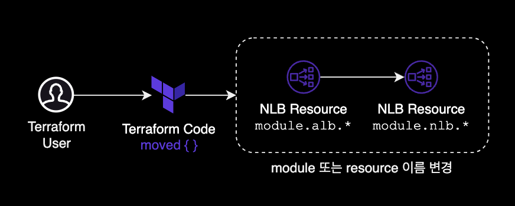
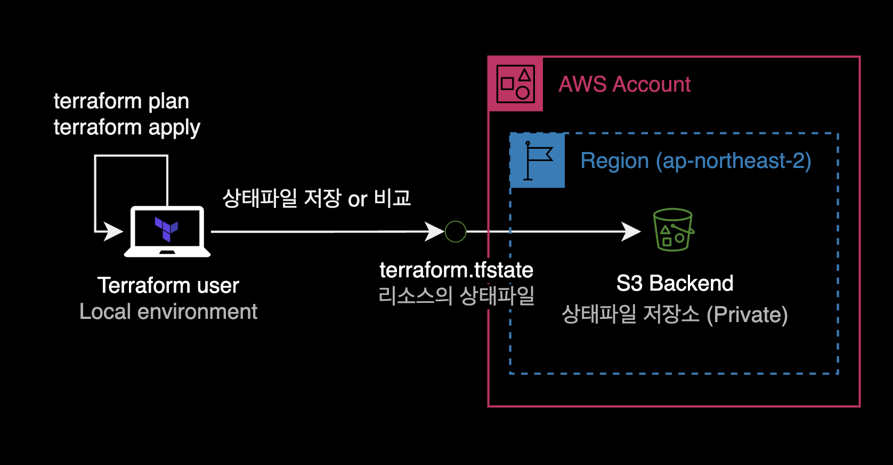

## 개요

기존에 테라폼을 사용해서 생성한 `module` 혹은 `resource`의 이름(Resource ID)을 리소스 재생성<sup>recreate</sup> 없이 변경하는 방법을 가이드하는 문서입니다.

이 글에서는 `terraform state mv` 명령어가 아닌 `moved {}` 블록을 사용해서 문제를 해결합니다.

&nbsp;

## 배경지식

### `moved {}` 블록

terraform의 `moved` 블록은 Terraform v1.1 이상에서 사용 가능한 기능으로, 리소스 혹은 모듈을 이동하거나 이름을 변경할 때 사용됩니다.

&nbsp;

Terraform으로 이미 생성한 리소스에 대해 다른 이름으로 변경하고 싶을 경우, 리소스 블록에서 `a`에서 `b`로 이름을 변경하고, `moved {}` 블록 내에 변경할 이름을 기록할 수 있습니다.

```terraform
resource "aws_instance" "b" {
  count = 2

  # (resource-type-specific configuration)
}

moved {
  from = aws_instance.a
  to   = aws_instance.b
}
```

이 기능을 사용하면 Terraform 구성 파일 내에서 리소스를 새 위치로 이동시키거나 구성을 변경할 수 있습니다.

&nbsp;

### `moved` 블록의 등장배경과 장점

기존 리소스 이름, 상태를 바꾸는 명령 조차도 CLI 대신 HCL<sup>Hashicorp Configuration Language</sup> 코드로 선언하여, 상태를 바꾸는 행위 자체도 코드화할 수 있다는 것이 `moved {}` 블록이 가진 장점입니다.

&nbsp;

테라폼 공식 발표 [Announcing Terraform 1.1 with Improved Refactoring Capabilities and Enhanced Cloud Experience](https://www.youtube.com/watch?v=bDgoGBusX0k&t=178s)에서는 `moved {}` 블록이 등장한 배경에 대해 크게 3가지를 언급했습니다.

#### `terraform state mv`가 가진 3가지 문제점

- Risky and error prone
- Terraform Cloud users couldn’t refactor within core workflows
- Module authors couldn’t coordinate changes themselves

&nbsp;

## 제약사항

`moved {}` 블록은 Terraform v1.1 이상부터만 지원합니다.

Terraform 버전이 v1.1 이하이거나 복잡한 리팩토링 작업이 필요한 경우는 `moved {}` 블록 대신 `terraform state mv` 명령어을 사용하도록 합니다.

```bash
terrafrom state mv SOURCE DESTINATION
```

```bash
# Example: rename a resource
terraform state mv packet_device.worker packet_device.helper
```

[terraform state mv 공식문서](https://developer.hashicorp.com/terraform/cli/commands/state/mv#usage)

&nbsp;

## 환경

### 로컬 환경

- **OS** : macOS 13.5 (M1 Max)
- **Shell** : zsh + oh-my-zsh
- **Terraform** : v1.5.4
- **Provider** : AWS Provider 4.59.0

&nbsp;

## 사용방법

현재 시나리오에서 테라폼 모듈의 디렉토리 구조는 다음과 같습니다.

```bash
$ tree nlb/
nlb/
└── internet-facing
    ├── backend.tf
    ├── main.tf
    ├── output.tf
    ├── variables.tf
    └── versions.tf
```

위 5개의 `.tf` 코드가 모여 하나의 NLB를 생성하고 있습니다.

해당 NLB는 테라폼의 `resource`가 아닌 AWS에서 제공하는 [공식 ALB 모듈](https://registry.terraform.io/modules/terraform-aws-modules/alb/aws/latest)을 사용해서 생성했습니다.

&nbsp;

NLB main 디렉토리 안으로 이동한 후, 사용중인 terraform providers 정보를 확인합니다.

```bash
$ cd /nlb/internet-facing/
```

```bash
$ terraform providers

Providers required by configuration:
.
├── provider[registry.terraform.io/hashicorp/aws] >= 4.59.0
├── provider[registry.terraform.io/hashicorp/null] >= 2.0.0
└── module.nlb
    └── provider[registry.terraform.io/hashicorp/aws] >= 4.59.0

Providers required by state:

    provider[registry.terraform.io/hashicorp/aws]
```

기존에 AWS Provider v4.59.0를 사용해서 생성한 걸 알 수 있습니다.

&nbsp;

NLB 모듈의 이름이 선언된 `main.tf` 파일의 일부 내용입니다.

```terraform
# main.tf

# We need to change module "alb" to module "nlb"
module "alb" {
  source  = "git::https://github.doge.com/doge-company/terraform-modules.git//aws/alb"

  name               = local.name
  load_balancer_type = "network"
  internal           = false
  
  vpc_id          = local.vpc_id
  subnets         = [
    data.aws_subnet.public_a.id,
    data.aws_subnet.public_c.id
  ]

  # ...
}
```

제 경우 실제로는 NLB 리소스를 생성하는 코드인데 module 이름이 `"alb"`로 되어 있는 게 문제였습니다.

&nbsp;

기존에 테라폼으로 생성한 리소스를 삭제하고 다시 만들 필요 없이, module 이름만 `alb`를 `nlb`로 변경하고 싶었습니다.



&nbsp;

### module 이름 변경

가장 먼저 NLB를 생성하는 메인코드 `main.tf`에서 module 이름을 원하는 이름으로 변경합니다.

```diff
- module "alb" {
+ module "nlb" {
    # ...
  }
```

&nbsp;

참고로 기존에 생성한 NLB에 대한 Terraform 상태파일은 모두 S3 백엔드 버킷에 저장되어 있습니다.



&nbsp;

상태파일의 백엔드에 대한 설정은 `backend.tf` 코드에 아래와 같이 선언되어 있습니다.

```terraform
# backend.tf
terraform {
  backend "s3" {
    encrypt = true
    region  = "ap-northeast-2"
    bucket  = "dogecompany-terraform-state-devops"
    key     = "doge/apne2/doge-server/nlb/internet-facing/terraform.tfstate"
  }
}
```

```bash
$ terraform state list
data.aws_ec2_managed_prefix_list.jira_cloud
data.aws_subnet.public_a
data.aws_subnet.public_c
module.alb.aws_lb.this[0]
module.alb.aws_lb_listener.frontend_http_tcp[0]
module.alb.aws_lb_listener.frontend_http_tcp[1]
module.alb.aws_lb_listener.frontend_http_tcp[2]
module.alb.aws_lb_target_group.main[0]
module.alb.aws_lb_target_group.main[1]
module.alb.aws_lb_target_group.main[2]
module.alb.aws_lb_target_group_attachment.this["0.ghe_primary"]
module.alb.aws_lb_target_group_attachment.this["1.ghe_primary"]
module.alb.aws_lb_target_group_attachment.this["2.ghe_primary"]
```

`module.alb.*`를 `module.nlb.*`로 변경해야 하는 것이 제 현재 목표입니다.

&nbsp;

기존 `main.tf` 코드에서 모듈이름 `module "alb"`를 `module "nlb"`로 변경했습니다.

```terraform
# main.tf
module "nlb" {
  source  = "git::https://github.doge.com/doge-company/terraform-modules.git//aws/alb"

  name               = local.name
  load_balancer_type = "network"
  internal           = false
  
  vpc_id          = local.vpc_id
  subnets         = [
    data.aws_subnet.public_a.id,
    data.aws_subnet.public_c.id
  ]

  # ...
}
```

&nbsp;

### moved 블록 선언

그 다음 `moved {}` 블럭을 `main.tf` 코드에 새롭게 추가합니다.

```diff
  # main.tf
  module "nlb" {
    source  = "git::https://github.doge.com/doge-company/terraform-modules.git//aws/alb"

    name               = local.name
    load_balancer_type = "network"
    internal           = false
    
    vpc_id          = local.vpc_id
    subnets         = [
      data.aws_subnet.public_a.id,
      data.aws_subnet.public_c.id
    ]

    # ...
  }

+ moved {
+   from = module.alb  # 기존 module 이름
+   to   = module.nlb  # 변경할 module 이름
+ }
```

&nbsp;

`main.tf` 코드에 `moved {}` 블럭을 추가한 결과입니다.

```terraform
# main.tf
module "nlb" {
  source  = "git::https://github.doge.com/doge-company/terraform-modules.git//aws/alb"

  name               = local.name
  load_balancer_type = "network"
  internal           = false
  
  vpc_id          = local.vpc_id
  subnets         = [
    data.aws_subnet.public_a.id,
    data.aws_subnet.public_c.id
  ]

  # ...
}

# 새로 추가한 moved 블럭
moved {
  from = module.alb  # 기존 module 이름
  to   = module.nlb  # 변경할 module 이름
}
```

`terraform apply`를 하면 `moved {}` 블록은 이미 생성되어 있는 module의 기존 이름 `alb`를 `nlb`로 변경하는 작업을 수행하게 됩니다.

&nbsp;

### plan

이후 `terraform plan`을 돌려서 리소스의 변경사항을 미리 확인합니다.

```bash
$ terraform plan
data.aws_subnet.public_c: Reading...
data.aws_ec2_managed_prefix_list.jira_cloud: Reading...
data.aws_subnet.public_a: Reading...
module.nlb.aws_lb_target_group.main[1]: Refreshing state... [id=arn:aws:elasticloadbalancing:ap-northeast-2:111122223333:targetgroup/https-20230809060305165300000002/469c12d66ae53716]
module.nlb.aws_lb_target_group.main[0]: Refreshing state... [id=arn:aws:elasticloadbalancing:ap-northeast-2:111122223333:targetgroup/https-20230809060305165300000001/a85e7b6195c0e180]
module.nlb.aws_lb_target_group.main[2]: Refreshing state... [id=arn:aws:elasticloadbalancing:ap-northeast-2:111122223333:targetgroup/user-20230809061330863200000001/52641bd2a68b265a]
module.nlb.aws_lb_target_group_attachment.this["0.ghe_primary"]: Refreshing state... [id=arn:aws:elasticloadbalancing:ap-northeast-2:111122223333:targetgroup/https-20230809060305165300000001/a85e7b6195c0e180-20230809060358861800000001]
module.nlb.aws_lb_target_group_attachment.this["2.ghe_primary"]: Refreshing state... [id=arn:aws:elasticloadbalancing:ap-northeast-2:111122223333:targetgroup/user-20230809061330863200000001/52641bd2a68b265a-20230809061358959300000001]
module.nlb.aws_lb_target_group_attachment.this["1.ghe_primary"]: Refreshing state... [id=arn:aws:elasticloadbalancing:ap-northeast-2:111122223333:targetgroup/https-20230809060305165300000002/469c12d66ae53716-20230809060358952300000002]
data.aws_subnet.public_c: Read complete after 1s [id=subnet-xxxxxsubnetxxxxxx]
data.aws_subnet.public_a: Read complete after 1s [id=subnet-yyyyysubnetyyyyyy]
module.nlb.aws_lb.this[0]: Refreshing state... [id=arn:aws:elasticloadbalancing:ap-northeast-2:111122223333:loadbalancer/net/doge-api-public-nlb/1fbec21ba0f60c88]
module.nlb.aws_lb_listener.frontend_http_tcp[0]: Refreshing state... [id=arn:aws:elasticloadbalancing:ap-northeast-2:111122223333:listener/net/doge-api-public-nlb/1fbec21ba0f60c88/dfac473dc3c9a126]
module.nlb.aws_lb_listener.frontend_http_tcp[2]: Refreshing state... [id=arn:aws:elasticloadbalancing:ap-northeast-2:111122223333:listener/net/doge-api-public-nlb/1fbec21ba0f60c88/fe50ecca7ff4e974]
module.nlb.aws_lb_listener.frontend_http_tcp[1]: Refreshing state... [id=arn:aws:elasticloadbalancing:ap-northeast-2:111122223333:listener/net/doge-api-public-nlb/1fbec21ba0f60c88/0c8b7068a8658810]
data.aws_ec2_managed_prefix_list.jira_cloud: Read complete after 1s [id=pl-0badad04d863107b3]

Terraform will perform the following actions:

  # module.alb.aws_lb.this[0] has moved to module.nlb.aws_lb.this[0]
    resource "aws_lb" "this" {
        id                               = "arn:aws:elasticloadbalancing:ap-northeast-2:111122223333:loadbalancer/net/doge-api-public-nlb/1fbec21ba0f60c88"
        name                             = "doge-api-public-nlb"
        tags                             = {
            "ManagedBy"   = "terraform"
        }
        # (13 unchanged attributes hidden)

        # (4 unchanged blocks hidden)
    }

  # module.alb.aws_lb_listener.frontend_http_tcp[0] has moved to module.nlb.aws_lb_listener.frontend_http_tcp[0]
    resource "aws_lb_listener" "frontend_http_tcp" {
        id                = "arn:aws:elasticloadbalancing:ap-northeast-2:111122223333:listener/net/doge-api-public-nlb/1fbec21ba0f60c88/dfac473dc3c9a126"
        tags              = {
            "ManagedBy"   = "terraform"
        }
        # (5 unchanged attributes hidden)

        # (1 unchanged block hidden)
    }

  # module.alb.aws_lb_listener.frontend_http_tcp[1] has moved to module.nlb.aws_lb_listener.frontend_http_tcp[1]
    resource "aws_lb_listener" "frontend_http_tcp" {
        id                = "arn:aws:elasticloadbalancing:ap-northeast-2:111122223333:listener/net/doge-api-public-nlb/1fbec21ba0f60c88/0c8b7068a8658810"
        tags              = {
            "ManagedBy"   = "terraform"
        }
        # (5 unchanged attributes hidden)

        # (1 unchanged block hidden)
    }

  # module.alb.aws_lb_listener.frontend_http_tcp[2] has moved to module.nlb.aws_lb_listener.frontend_http_tcp[2]
    resource "aws_lb_listener" "frontend_http_tcp" {
        id                = "arn:aws:elasticloadbalancing:ap-northeast-2:111122223333:listener/net/doge-api-public-nlb/1fbec21ba0f60c88/fe50ecca7ff4e974"
        tags              = {
            "ManagedBy"   = "terraform"
        }
        # (5 unchanged attributes hidden)

        # (1 unchanged block hidden)
    }

  # module.alb.aws_lb_target_group.main[0] has moved to module.nlb.aws_lb_target_group.main[0]
    resource "aws_lb_target_group" "main" {
        id                                 = "arn:aws:elasticloadbalancing:ap-northeast-2:111122223333:targetgroup/https-20230809060305165300000001/a85e7b6195c0e180"
        name                               = "https-20230809060305165300000001"
        tags                               = {
            "ManagedBy"   = "terraform"
        }
        # (16 unchanged attributes hidden)

        # (3 unchanged blocks hidden)
    }

  # module.alb.aws_lb_target_group.main[1] has moved to module.nlb.aws_lb_target_group.main[1]
    resource "aws_lb_target_group" "main" {
        id                                 = "arn:aws:elasticloadbalancing:ap-northeast-2:111122223333:targetgroup/https-20230809060305165300000002/469c12d66ae53716"
        name                               = "https-20230809060305165300000002"
        tags                               = {
            "ManagedBy"   = "terraform"
        }
        # (16 unchanged attributes hidden)

        # (3 unchanged blocks hidden)
    }

  # module.alb.aws_lb_target_group.main[2] has moved to module.nlb.aws_lb_target_group.main[2]
    resource "aws_lb_target_group" "main" {
        id                                 = "arn:aws:elasticloadbalancing:ap-northeast-2:111122223333:targetgroup/user-20230809061330863200000001/52641bd2a68b265a"
        name                               = "user-20230809061330863200000001"
        tags                               = {
            "ManagedBy"   = "terraform"
        }
        # (16 unchanged attributes hidden)

        # (3 unchanged blocks hidden)
    }

  # module.alb.aws_lb_target_group_attachment.this["0.ghe_primary"] has moved to module.nlb.aws_lb_target_group_attachment.this["0.ghe_primary"]
    resource "aws_lb_target_group_attachment" "this" {
        id               = "arn:aws:elasticloadbalancing:ap-northeast-2:111122223333:targetgroup/https-20230809060305165300000001/a85e7b6195c0e180-20230809060358861800000001"
        # (3 unchanged attributes hidden)
    }

  # module.alb.aws_lb_target_group_attachment.this["1.ghe_primary"] has moved to module.nlb.aws_lb_target_group_attachment.this["1.ghe_primary"]
    resource "aws_lb_target_group_attachment" "this" {
        id               = "arn:aws:elasticloadbalancing:ap-northeast-2:111122223333:targetgroup/https-20230809060305165300000002/469c12d66ae53716-20230809060358952300000002"
        # (3 unchanged attributes hidden)
    }

  # module.alb.aws_lb_target_group_attachment.this["2.ghe_primary"] has moved to module.nlb.aws_lb_target_group_attachment.this["2.ghe_primary"]
    resource "aws_lb_target_group_attachment" "this" {
        id               = "arn:aws:elasticloadbalancing:ap-northeast-2:111122223333:targetgroup/user-20230809061330863200000001/52641bd2a68b265a-20230809061358959300000001"
        # (3 unchanged attributes hidden)
    }

Plan: 0 to add, 0 to change, 0 to destroy.

───────────────────────────────────────────────────────────────────────────────────────────────────────────────────────────────────────────────────────────

Note: You didn't use the -out option to save this plan, so Terraform can't guarantee to take exactly these actions if you run "terraform apply" now.
```

&nbsp;

### apply

`terraform apply`로 모듈 이름만 바뀌는 변경사항을 적용합니다.

```bash
$ terraform apply

  ...

  # module.alb.aws_lb_target_group_attachment.this["0.ghe_primary"] has moved to module.nlb.aws_lb_target_group_attachment.this["0.ghe_primary"]
    resource "aws_lb_target_group_attachment" "this" {
        id               = "arn:aws:elasticloadbalancing:ap-northeast-2:111122223333:targetgroup/https-20230809060305165300000001/a85e7b6195c0e180-20230809060358861800000001"
        # (3 unchanged attributes hidden)
    }

  # module.alb.aws_lb_target_group_attachment.this["1.ghe_primary"] has moved to module.nlb.aws_lb_target_group_attachment.this["1.ghe_primary"]
    resource "aws_lb_target_group_attachment" "this" {
        id               = "arn:aws:elasticloadbalancing:ap-northeast-2:111122223333:targetgroup/https-20230809060305165300000002/469c12d66ae53716-20230809060358952300000002"
        # (3 unchanged attributes hidden)
    }

  # module.alb.aws_lb_target_group_attachment.this["2.ghe_primary"] has moved to module.nlb.aws_lb_target_group_attachment.this["2.ghe_primary"]
    resource "aws_lb_target_group_attachment" "this" {
        id               = "arn:aws:elasticloadbalancing:ap-northeast-2:111122223333:targetgroup/user-20230809061330863200000001/52641bd2a68b265a-20230809061358959300000001"
        # (3 unchanged attributes hidden)
    }

Plan: 0 to add, 0 to change, 0 to destroy.

Do you want to perform these actions?
  Terraform will perform the actions described above.
  Only 'yes' will be accepted to approve.
```

&nbsp;

`apply` 실행 전 결과를 확인해보니 생성, 변경, 삭제되는 리소스가 하나도 없습니다.

```bash
Plan: 0 to add, 0 to change, 0 to destroy.
```

module의 이름만 `alb`에서 `nlb`로 그대로 변경될 뿐 리소스의 변동사항은 전혀 없다는 점을 확인했습니다.

&nbsp;

실행 여부를 묻는 프롬프트에서 `yes`를 입력해 실제 리소스에 변경사항을 반영합니다.

```bash
$ terraform apply

...

  # module.alb.aws_lb_target_group_attachment.this["0.ghe_primary"] has moved to module.nlb.aws_lb_target_group_attachment.this["0.ghe_primary"]
    resource "aws_lb_target_group_attachment" "this" {
        id               = "arn:aws:elasticloadbalancing:ap-northeast-2:111122223333:targetgroup/https-20230809060305165300000001/a85e7b6195c0e180-20230809060358861800000001"
        # (3 unchanged attributes hidden)
    }

  # module.alb.aws_lb_target_group_attachment.this["1.ghe_primary"] has moved to module.nlb.aws_lb_target_group_attachment.this["1.ghe_primary"]
    resource "aws_lb_target_group_attachment" "this" {
        id               = "arn:aws:elasticloadbalancing:ap-northeast-2:111122223333:targetgroup/https-20230809060305165300000002/469c12d66ae53716-20230809060358952300000002"
        # (3 unchanged attributes hidden)
    }

  # module.alb.aws_lb_target_group_attachment.this["2.ghe_primary"] has moved to module.nlb.aws_lb_target_group_attachment.this["2.ghe_primary"]
    resource "aws_lb_target_group_attachment" "this" {
        id               = "arn:aws:elasticloadbalancing:ap-northeast-2:111122223333:targetgroup/user-20230809061330863200000001/52641bd2a68b265a-20230809061358959300000001"
        # (3 unchanged attributes hidden)
    }

Plan: 0 to add, 0 to change, 0 to destroy.

Do you want to perform these actions?
  Terraform will perform the actions described above.
  Only 'yes' will be accepted to approve.

  Enter a value: yes


Apply complete! Resources: 0 added, 0 changed, 0 destroyed.

Outputs:

...
```

`Apply complete!`가 되었고 생성, 변경, 삭제된 리소스는 하나도 없다는 걸 확인할 수 있습니다.

&nbsp;

이제 다시 Terraform 상태파일의 목록을 확인합니다.

```bash
$ terraform state list
data.aws_ec2_managed_prefix_list.jira_cloud
data.aws_subnet.public_a
data.aws_subnet.public_c
module.nlb.aws_lb.this[0]
module.nlb.aws_lb_listener.frontend_http_tcp[0]
module.nlb.aws_lb_listener.frontend_http_tcp[1]
module.nlb.aws_lb_listener.frontend_http_tcp[2]
module.nlb.aws_lb_target_group.main[0]
module.nlb.aws_lb_target_group.main[1]
module.nlb.aws_lb_target_group.main[2]
module.nlb.aws_lb_target_group_attachment.this["0.ghe_primary"]
module.nlb.aws_lb_target_group_attachment.this["1.ghe_primary"]
module.nlb.aws_lb_target_group_attachment.this["2.ghe_primary"]
```

저희가 의도한대로 `module.alb` 이름이 `module.nlb`로 정상 변경되었습니다.

작업 종료.

&nbsp;

## 참고자료

[Renaming a Resource](https://developer.hashicorp.com/terraform/language/modules/develop/refactoring#renaming-a-resource)  
[Command: state mv](https://developer.hashicorp.com/terraform/cli/commands/state/mv#usage)

[Terraform Tips 4 - Move (Refactoring)](https://heuristicwave.github.io/TerraformTips4)
