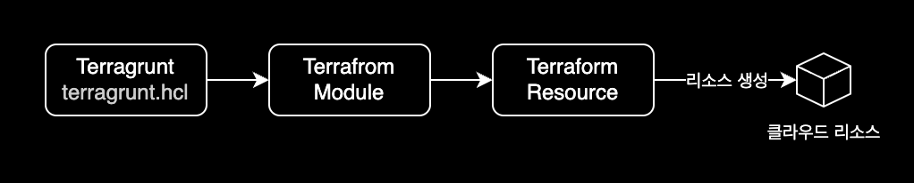

## 개요

`terragrunt`에서 한 번에 여러 모듈에서 Terraform 명령 실행하는 방법을 소개합니다.



&nbsp;

## 환경

- Terragrunt version v0.42.3
- Terraform v1.3.6 on linux_arm64

&nbsp;

## 배경지식

### terragrunt의 모듈 구조

Terragrunt를 사용하게 되면 디렉토리 구조가 여러 계층 구조로 나눠지면서 디렉토리 구조 뎁스가 크게는 7~8단계까지 늘어나게 됩니다.  
이런 경우, 각 뎁스마다 들어가서 `terragrunt.hcl`을 `terragrunt plan`, `terragrunt apply`를 계속 반복하는 상황이 발생합니다.

&nbsp;

이 때 하나씩 `terragrunt` 명령어를 실행하는 게 매우 번거롭고 고된 작업입니다.  
이에 대한 해결책으로 `terragrunt`는 `terragrunt run-all` 명령어를 지원하고 있습니다.  
`terragrunt run-all`은 여러 개 모듈에 대해 한번의 커맨드로 실행 할 수 있도록 만들어 주는 기능입니다.

```bash
$ cd your-root-dir
$ terragrunt run-all <한 번에 사용할 명령어>
```

&nbsp;

## 사용법

`terragrunt run-all`의 사용 예시를 들어보겠습니다.

`terragrunt` 파일 구조는 다음과 같습니다.

```bash
$ tree
.
|-- subnets
|   |-- private
|   |   |-- dmz
|   |   |   |-- a
|   |   |   |   `-- terragrunt.hcl
|   |   |   `-- c
|   |   |       `-- terragrunt.hcl
|   |   `-- private
|   |       |-- a
|   |       |   `-- terragrunt.hcl
|   |       `-- c
|   |           `-- terragrunt.hcl
|   `-- public
|       |-- firewall
|       |   |-- a
|       |   |   `-- terragrunt.hcl
|       |   `-- c
|       |       `-- terragrunt.hcl
|       `-- public
|           |-- a
|           |   `-- terragrunt.hcl
|           `-- c
|               `-- terragrunt.hcl
`-- vpc
    `-- terragrunt.hcl
```

&nbsp;

이 때 현재 경로에서 다음 명령어를 실행해서 한 번에 `apply`를 할 수 있습니다.

```bash
$ cd your-root-dir
$ terragrunt run-all apply
```

`terragrunt run-all apply` 명령을 실행하면 Terragrunt는 현재 작업 디렉토리의 모든 하위 폴더를 재귀적으로 살펴보고 `terragrunt.hcl` 파일이 있는 모든 폴더를 찾은 다음, 각 폴더에서 `terragrunt apply`를 동시에 실행합니다.

&nbsp;

한 번에 리소스 삭제도 가능합니다.

```bash
$ cd your-root-dir
$ terragrunt run-all destroy
```

&nbsp;

## 참고자료

[Execute Terraform commands on multiple modules at once](https://terragrunt.gruntwork.io/docs/features/execute-terraform-commands-on-multiple-modules-at-once/)  
테라그런트 공식문서
