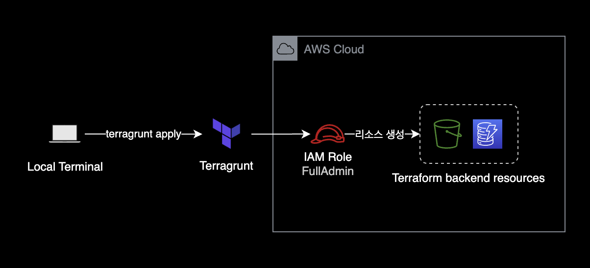
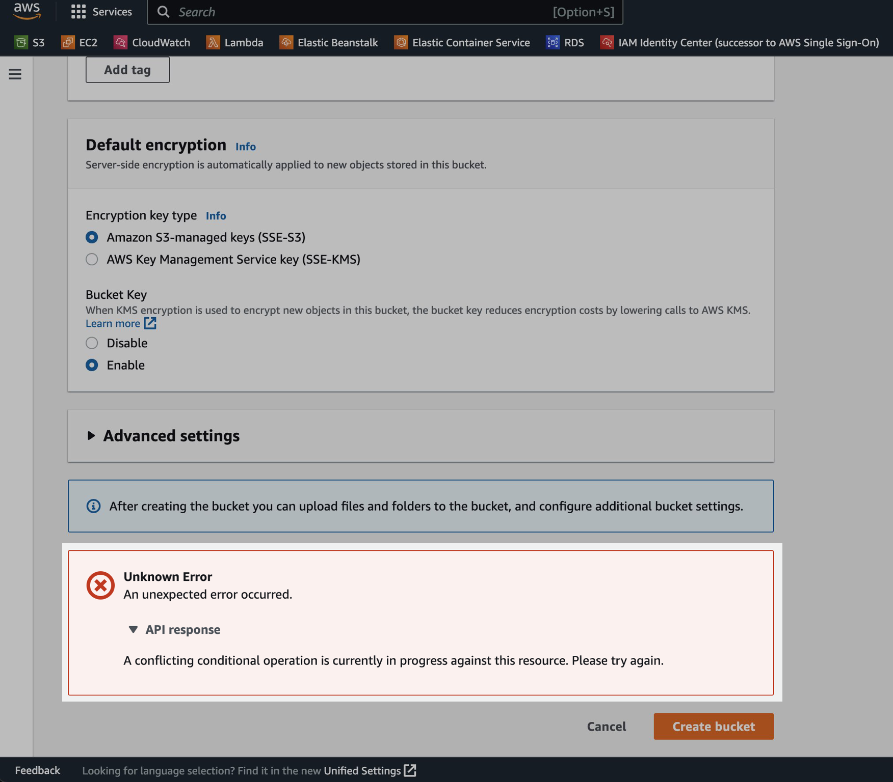

## 개요

`terragrunt`에서 초기 AWS 계정 셋업 과정에서 백엔드 S3 버킷 생성에 실패하는 상황에 대한 해결 가이드입니다.

&nbsp;

## 환경

- Terragrunt version v0.42.3
- Terraform v1.3.6 on linux_arm64

&nbsp;

## 증상

처음에 A 계정에 잘못 만들어서 백엔드 버킷을 삭제한 후, 다시 B 계정에 S3 버킷을 생성하려고 시도했습니다.

아래는 `terraform apply` 명령어를 실행하면 적용되는 `terragrunt.hcl` 파일입니다.  
아래 코드가 테라폼 백엔드 상태 파일을 관리하는 S3 버킷과 DynamoDB를 생성합니다.

```terraform
terraform {
  extra_arguments "-var-file" {
    commands = get_terraform_commands_that_need_vars()
    # Note that this function searches relative to the child terragrunt.hcl file when called from a parent config.
    optional_var_files = [
      "${find_in_parent_folders("globals.tfvars", "ignore")}",
      "${find_in_parent_folders("locals.tfvars", "ignore")}"
    ]
  }
}

remote_state {
  backend = "s3"

  config = {
    bucket         = "xxxx-apne2-xxxx-terraform-backend-s3"
    key            = "xxxx/${path_relative_to_include()}/terraform.tfstate"
    region         = "ap-northeast-2"
    encrypt        = true
    dynamodb_table = "xxxx-apne2-terraform-backend-dynamodb"
    
    s3_bucket_tags = {
      "ManagedBy"   = "Terraform"
      "Description" = "Terraform backend resource"
    }
  }
}
```

&nbsp;

Terragrunt 코드가 백엔드를 생성하는 플로우를 구성도로 표현하면 다음과 같습니다.



&nbsp;

B 계정에 버킷을 새로 만들기 위한 `terragrunt apply` 명령어 실행 과정에서 Backend S3 버킷 생성 시 다음과 같은 에러가 발생했습니다.

```bash
$ terragrunt apply
Remote state S3 bucket xxxx-apne2-xxxx-terraform-backend-s3 does not exist or you don't have permissions to access it. Would you like Terragrunt to create it? (y/n) y

ERRO[0059] Create S3 bucket with retry xxxx-apne2-xxxx-terraform-backend-s3 returned an error: Exceeded max retries (12) waiting for bucket S3 bucket xxxx-apne2-xxxx-terraform-backend-s3. Sleeping for 10s and will try again.  prefix=[/mnt/git/tf/prd-terragrunt/xxxx-data/global/iam-policy/permission-set/xxxx-data-security-engineer/readonly-base-access]
```

&nbsp;

AWS 콘솔에서 S3 버킷을 직접 생성 시에도 다음과 같은 에러가 발생합니다.

`A conflicting conditional operation is currently in progress against this resource. Please try again.`



&nbsp;

## 원인

**기존에 삭제한 S3 버킷이 완전히 삭제되지 않았는데 계속 생성을 시도**해서 발생한 문제입니다.

> AWS 콘솔에서 S3 버킷 삭제를 완료한 것처럼 보여도 실제로 AWS 뒷단에서는 S3 버킷을 바로 삭제하지 않습니다.  
> AWS 사용자가 버킷 삭제 요청을 전송하면 Amazon S3는 해당 버킷 이름을 삭제 대기열에 넣고 순차적으로 진행됩니다.

&nbsp;

## 해결방안
 
문제를 해결하기 위한 방법은 간단합니다.  
버킷이 완전히 삭제되기까지 잠시 기다린 후 다시 S3 버킷을 생성하면 됩니다.

제 경우 약 20분의 시간이 지난 후 다시 시도하니 해결되었습니다.

```bash
$ terragrunt apply

...

# 이후 백엔드 리소스가 성공적으로 생성되었고
# terraform 코드도 정상 실행됨
```

&nbsp;

## 개선 포인트

이 문제는 인적실수로 발생했습니다.  
문제를 해결하려면 기다리는 것 외에 특별한 조치방법도 없습니다.

최초에 테라폼 백엔드 리소스를 생성할 때 올바른 AWS 계정에 생성하도록 설정했는지를 더블체크하고 `terragrunt apply` 명령어를 실행하도록 합니다.

&nbsp;

## 참고자료

AWS re:Post:

- [Amazon S3에서 버킷을 다시 생성하려고 할 때 "A conflicting conditional operation is currently in progress against this resource"라는 오류가 발생하는 이유는 무엇입니까?](https://repost.aws/ko/knowledge-center/s3-conflicting-conditional-operation): `conflicting conditional operation is currently in progress against this resource` 에러에 대한 원인과 해결방법.

Terragrunt docs:

- [Terragrunt - Keep your remote state configuration DRY](https://terragrunt.gruntwork.io/docs/features/keep-your-remote-state-configuration-dry/#motivation): S3 백엔드에 대한 terragrunt 설명