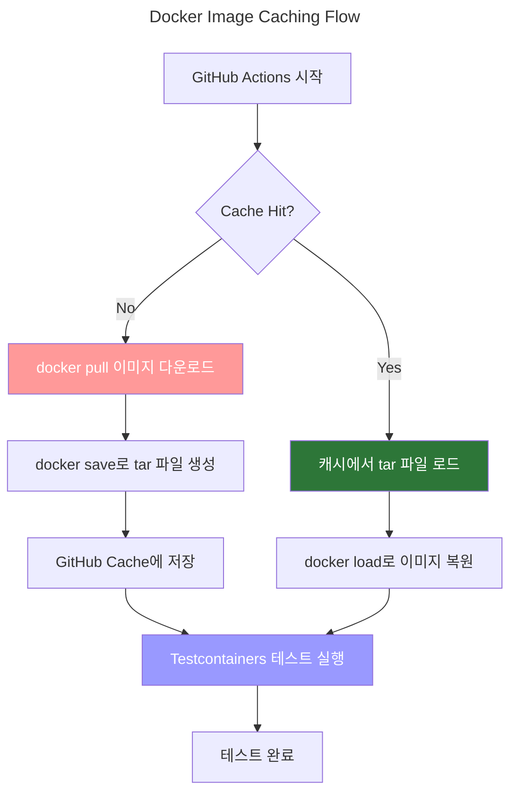

## 개요

Spring Boot 테스트에서 Testcontainers가 매번 Docker 이미지를 다운로드하는 문제를 GitHub Actions Cache로 해결하여 CI/CD 빌드 시간을 6분에서 3분으로 단축한 사례를 공유합니다.

- **대상 독자**: Testcontainers를 사용하는 개발팀, DevOps 엔지니어, CI/CD 파이프라인 최적화에 관심 있는 개발자
- **얻을 수 있는 것**: Docker 이미지 캐싱 구현 방법, GitHub Actions 빌드 시간 47% 단축 노하우, 실제 적용 가능한 YAML 설정 코드

## 환경

- **플랫폼**: AWS
- **Git 서버**: GitHub Enterprise Server 3.13
- **Actions Runner**: actions-runner pod v2.328.0-ubuntu-22.04
- **제약사항**: Public GitHub Cloud의 Actions를 사용할 수 없는 환경으로, 모든 Actions를 Private으로 동기화하여 구성

## 성능 개선 결과

Actions Runner가 testcontainers에서 사용하는 이미지 2개(mysql, valkey)를 actions cache로 바로 받아오는 경우 아래와 같이 총 테스트 빌드 시간이 단축됨

- Test Build #1: 6분 10초 → 3분 14초 **(47.6% 단축)**
- Test Build #2: 6분 10초 → 3분 7초 **(49.5% 단축)**

## 설정 방법

[Testcontainers](https://testcontainers.com/)는 실제 Docker 컨테이너를 사용하여 통합 테스트를 수행하는 Java 라이브러리로, 데이터베이스나 메시지 큐 같은 외부 의존성을 테스트 환경에서 쉽게 실행할 수 있게 해줍니다. 테스트가 시작될 때마다 필요한 Docker 이미지를 다운로드하고 컨테이너를 생성하는데, 이 과정이 CI/CD 파이프라인에서 상당한 시간을 차지합니다. 이러한 이미지들을 GitHub Actions Cache에 저장하면 매번 다운로드하는 시간을 절약할 수 있습니다.

코틀린 코드에 포함되어 있는 testcontainers 설정은 다음과 같습니다.

```java {hl_lines=[6,11]}
@Testcontainers
class PropertyOverrideContextInitializer: ApplicationContextInitializer<ConfigurableApplicationContext> {

    @Container
    @ServiceConnection
    var mysql: MySQLContainer<*> = MySQLContainer(DockerImageName.parse("my.ecr.com/mysql:8.0.39").asCompatibleSubstituteFor("mysql:8.0.39"))


    @Container
    @ServiceConnection
    var redis = RedisContainer(DockerImageName.parse("my.ecr.com/valkey:8.1.0-alpine").asCompatibleSubstituteFor("valkey:8.1.0-alpine"))

    // ... omitted for brevity ...
}
```

테스트에 mysql:8.0.39와 valkey:8.1.0-alpine 2개의 이미지를 사용하고 있습니다.

> ⚠️ **주의사항**: actions/cache@v3는 공식적으로 지원종료(Deprecated) 되었습니다. actions/cache@v4를 사용하세요.

GitHub Actions는 `docker pull`로 가져온 이미지를 직접 캐싱하는 것을 공식적으로 지원하지 않습니다. 따라서 `docker save`/`docker load` 명령을 사용한 tar 파일 방식으로 우회 구현해야 합니다. `/tmp/docker-cache` 디렉토리는 actions runner 이미지에 기본적으로 존재하지 않으므로 매번 생성해야 합니다.

```yaml
# .github/workflows/build-test.yml
jobs:
  test:
    steps:
      - name: Create cache directory
        run: mkdir -p /tmp/docker-cache

      - name: Cache ECR testcontainers images
        id: image-cache
        uses: actions/cache@v4
        with:
          path: /tmp/docker-cache
          key: ecr-testcontainers-images-${{ runner.os }}-v1
          restore-keys: |
            ecr-testcontainers-images-${{ runner.os }}-

      - name: Pull and save ECR images
        if: steps.image-cache.outputs.cache-hit != 'true'
        env:
          ECR_REGISTRY: my.ecr.com
        run: |
          docker pull ${{ env.ECR_REGISTRY }}/mysql:8.0.39
          docker save -o /tmp/docker-cache/mysql.tar ${{ env.ECR_REGISTRY }}/mysql:8.0.39
          docker pull ${{ env.ECR_REGISTRY }}/valkey:8.1.0-alpine
          docker save -o /tmp/docker-cache/valkey.tar ${{ env.ECR_REGISTRY }}/valkey:8.1.0-alpine

      - name: Load cached Docker images
        if: steps.image-cache.outputs.cache-hit == 'true'
        run: |
          docker load -i /tmp/docker-cache/mysql.tar
          docker load -i /tmp/docker-cache/valkey.tar
```

캐싱 동작 원리:

1. **최초 실행**: 캐시가 없으면 (`cache-hit != 'true'`) Docker 이미지를 pull하고 `docker save` 명령으로 tar 파일로 저장
2. **이후 실행**: 캐시가 존재하면 (`cache-hit == 'true'`) 저장된 tar 파일을 `docker load`로 불러와 이미지 다운로드 시간 단축
3. **Testcontainers 실행**: 로컬 Docker 데몬에 이미 이미지가 있으므로 Testcontainers가 별도 다운로드 없이 즉시 컨테이너 생성



## 관련자료

- [Testcontainers GitHub](https://github.com/testcontainers/testcontainers-java)
- [GitHub Actions: How can I cache the Docker images for Testcontainers?](https://stackoverflow.com/questions/71180135/github-actions-how-can-i-cache-the-docker-images-for-testcontainers): stack overflow
- [Notice of upcoming deprecations and changes in GitHub Actions services](https://github.blog/changelog/2024-09-16-notice-of-upcoming-deprecations-and-changes-in-github-actions-services/)

Github Discussion:

- [@actions/cache Package Deprecation Notice. Upgrade to the latest 4.0.0 or higher before February 1st 2025 #1890](https://github.com/actions/toolkit/discussions/1890)
