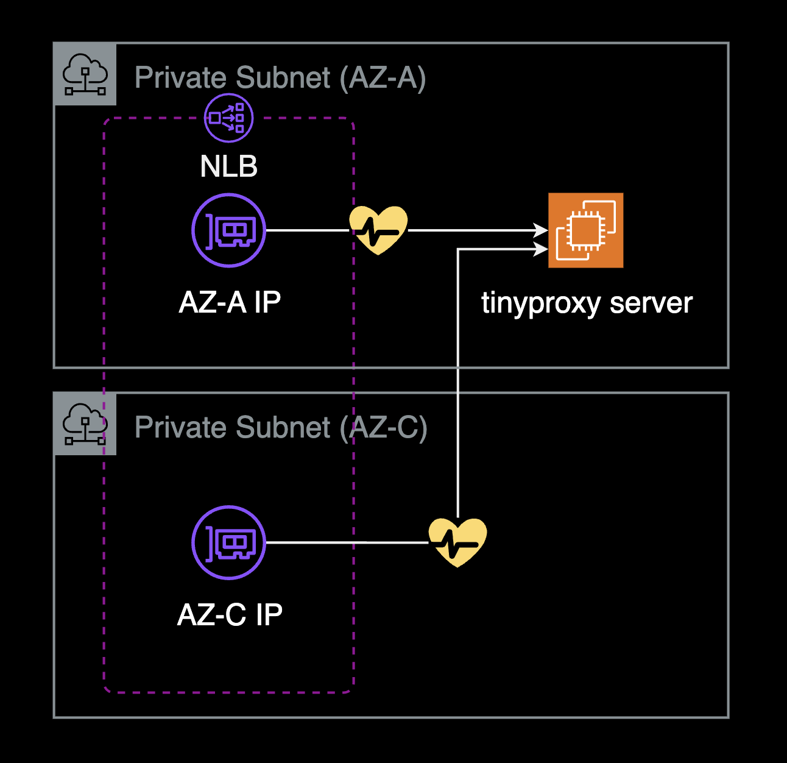

## 개요

EC2에서 tinyproxy v1.8.3에서 v1.11.2로 수동 설치를 통한 업그레이드 가이드.

&nbsp;


**tinyproxy**  
[tinyproxy](https://tinyproxy.github.io/)는 Linux, Unix 및 기타 POSIX 호환 운영 체제를 위한 경량 HTTP/HTTPS 프록시 데몬입니다. 빠르고 작은 크기로 설계되어 시스템 리소스가 제한적인 환경에서도 완전한 기능의 HTTP 프록시가 필요한 경우에 이상적인 솔루션입니다. 쿠버네티스 환경에서 Pod에서 Slack이나 인터넷으로의 아웃바운드 연결을 관리하는 데도 효과적으로 사용될 수 있습니다.

&nbsp;

## 배경지식

### 업그레이드 필요성

tinyproxy v1.8.3에는 다음과 같은 주요 이슈가 있습니다.

**간헐적 Hang 증상**  
프록시 서버가 예기치 않게 응답을 중단하는 문제가 발생할 수 있습니다. 모든 인바운드 연결에 대해 역방향 DNS 조회(Reverse DNS Lookup)를 수행하여 불필요한 지연이 발생할 수 있습니다.

&nbsp;

**NLB 헬스체크 문제**  
Network Load Balancer(NLB)의 헬스체크 요청을 제대로 처리하지 못해 서비스 안정성에 영향을 줄 수 있습니다.



[tinyproxy doesn't handle TCP health checks well and logs errors #438](https://github.com/tinyproxy/tinyproxy/issues/438)에서 tinyproxy 메인테이너의 설명에 따르면, 이는 실제 문제가 아닌 의도된 동작이라고 합니다. tinyproxy는 요청의 출처와 관계없이 모든 오류를 기록합니다. 근본적인 문제는 NLB의 "health-check" 데몬이 제대로 형식화된 HTTP 요청을 보내지 않고 연결을 즉시 끊는 데 있습니다. 

&nbsp;

이에 비해 Squid Proxy는 TCP 연결만으로도 헬스체크를 통과할 수 있어, NLB의 불완전한 HTTP 요청에 대해서도 문제가 발생하지 않습니다. 만약 이러한 에러 로그가 거슬린다면, NLB 헬스체크 패킷을 더 잘 처리하는 Squid Proxy를 대안으로 고려해볼 수 있습니다. Squid Proxy는 TCP 연결 수준에서 헬스체크를 처리할 수 있어, NLB의 불완전한 HTTP 요청에 대해서도 오류 로그를 생성하지 않습니다.

```bash
$ tail -f /var/log/tinyproxy/tinyproxy.log
CONNECT   Oct 02 06:31:38.698 [16213]: Connect (file descriptor: 6) x.x.x.37
ERROR     Oct 02 06:31:38.701 [16213]: read_request_line: Client (file descriptor: 6) closed socket before read.
... Two NLB IPs are alternately repeated ...
```

로그의 오류 메시지가 문제가 된다면, 헬스체크 데몬을 수정하여 적절한 HTTP 요청을 보내도록 하는 것이 좋습니다. 앞단에 NLB가 아닌 ALB를 사용한다면 헬스체크 경로를 지정할 수 있기 때문에 반드시 헬스체크 경로를 `/stats/`로 지정해서 헬스체크 요청을 tinyproxy가 에러로 감지되지 않도록 해야 합니다.

&nbsp;

**v1.11.x의 주요 개선사항**  
이러한 문제들을 해결하기 위해 `tinyproxy`를 `v1.8.3`에서 `v1.11.2`로 업그레이드하는 것을 강력히 권장합니다. v1.11.0부터 도입된 주요 개선 사항은 다음과 같습니다:

- **성능 향상**: 인바운드 연결에 대한 역방향 DNS 조회(Reverse DNS Lookup)를 기본적으로 수행하지 않아 더 빠르고 안정적인 성능을 제공합니다. 자세한 사항은 [Tinyproxy hangs at some point #383](https://github.com/tinyproxy/tinyproxy/issues/383#issuecomment-1887250882) 이슈를 참고합니다.
- **버그 수정**: 이전 버전에서 발생하던 여러 안정성 문제들이 해결되었습니다.

&nbsp;

이 가이드에서는 2024년 11월 기준으로 최신 버전인 v1.11.2로의 수동 설치 및 업그레이드 과정을 상세히 설명합니다.

> **참고**: 
> - 업그레이드 전 반드시 현재 환경을 백업하고, 테스트 환경에서 먼저 진행하는 것을 추천합니다.
> - 새 버전에서 설정 파일 구조나 옵션이 변경되었을 수 있으므로, 업그레이드 후 설정을 재검토하세요.

&nbsp;

## 환경

작업하게 될 tinyproxy 서버 정보:

- **플랫폼**: EC2
- **OS**: Ubuntu 16.04, amd64
- **어플리케이션 정보**: tinyproxy `v1.8.3`을 `v1.11.2`(최신)로 업그레이드

&nbsp;

## 수동 설치 가이드

### 다운로드 및 설치

모든 설치 및 설정 작업을 `root` 권한으로 수행하기 위해 먼저 `root` 사용자로 전환합니다. 이는 시스템 수준의 변경과 특정 디렉토리에 대한 접근 권한이 필요하기 때문입니다.

```bash
# NOTE: YOU NEED TO INSTALL TINYPROXY AS ROOT USER!
sudo -i
```

&nbsp;

먼저 필요한 빌드 도구와 의존성 패키지를 설치합니다. 이는 tinyproxy를 소스로부터 컴파일하고 빌드하는 데 필요합니다. 만약 이미 설치되어 있다면 이 설치과정을 건너뛰어도 됩니다.

> ⚠️ **패키지 관리자의 종류**: 현재 시나리오는 Ubuntu 16.04 운영체제에 `tinyproxy`를 설치하는 것이므로 패키지 관리자로 `apt-get`을 사용합니다. 다른 리눅스 배포판(Distribution)에서는 패키지 관리자가 `yum`, `dnf`, `apk` 등 다른 종류일 수 있습니다. 자신의 환경에 맞는 패키지 관리자를 사용하세요.

```bash
# Check your OS distribution and confirm the package manager
cat /etc/os-release

# Install build dependencies to compile tinyproxy from source
apt-get update
apt-get install build-essential
apt-get install autoconf 
```

- `build-essential`: C/C++ 컴파일러와 관련 라이브러리들을 포함하는 패키지 모음입니다. 소스 코드를 컴파일하는 데 필요한 기본 도구들을 제공합니다.
- `autoconf`: 소스 코드 패키지를 구성하는 데 사용되는 도구입니다. 이는 `configure` 스크립트를 생성하는 데 필요합니다.

&nbsp;

서버에 다운로드 받을 tinyproxy 버전을 [releases](https://github.com/tinyproxy/tinyproxy/releases) 페이지에서 확인한 후 `VERSION` 변수에 할당합니다.

```bash
# Optional: install jq to parse JSON
apt-get install jq
jq --version

# List all available versions
curl -s https://api.github.com/repos/tinyproxy/tinyproxy/releases \
  | jq '.[].tag_name' \
  | tr -d '"'
```

```bash
1.11.2
1.11.1
1.11.0
1.11.0-rc1
1.10.0
1.8.4
```

&nbsp;

최신 버전인 `1.11.2`를 설치하기 위해 `VERSION` 변수에 버전 정보를 할당합니다.

```bash
VERSION=1.11.2
```

&nbsp;

tinyproxy 소스 코드를 다운로드하고 압축을 해제합니다.

```bash
wget https://github.com/tinyproxy/tinyproxy/releases/download/${VERSION}/tinyproxy-${VERSION}.tar.bz2
tar -jxvf tinyproxy-${VERSION}.tar.bz2
cd tinyproxy-${VERSION}/
```

&nbsp;

tinyproxy를 소스 코드로부터 수동으로 빌드하고 설치합니다.

```bash
# Build tinyproxy manually
./configure
make
make install
```

&nbsp;

### tinyproxy 설정

설정 폴더인 `/usr/local/etc/tinyproxy`를 심볼릭 링크로 `/etc/tinyproxy` 디렉토리에 연결합니다.

```bash
$ ln -s /usr/local/etc/tinyproxy /etc/
$ ls -l /etc/ | grep tinyproxy
lrwxrwxrwx  1 root root         24 Apr  3 09:53 tinyproxy -> /usr/local/etc/tinyproxy
```

&nbsp;

`nobody` 사용자와 `nogroup` 그룹을 확인합니다.

```bash
$ cat /etc/passwd | grep nobody
nobody:x:65534:65534:nobody:/nonexistent:/usr/sbin/nologin
$ cat /etc/group | grep 65534
nogroup:x:65534:
```

&nbsp;

`nogroup` 그룹에 `nobody`가 할당되지 않았으므로 tinyproxy config의 `Group` 설정을 `nobody` 그룹에서 `nogroup`으로 변경합니다.

```bash
sed -i s/'Group nobody'/'Group nogroup'/g /etc/tinyproxy/tinyproxy.conf
```

&nbsp;

[공식문서](https://tinyproxy.github.io/#documentation)를 참고하여 tinyproxy 설정을 요구사항에 맞게 구성합니다.

`tinyproxy` 설치 직후의 기본 설정은 다음과 같습니다:

```bash
$ cat /etc/tinyproxy/tinyproxy.conf | egrep -v "^#|^$"
User nobody
Group nogroup
Port 8888
Timeout 600
DefaultErrorFile "/usr/local/share/tinyproxy/default.html"
StatFile "/usr/local/share/tinyproxy/stats.html"
LogLevel Info
MaxClients 100
Allow 127.0.0.1
Allow ::1
ViaProxyName "tinyproxy"
```

&nbsp;

사내 네트워크의 프록시 서버로 `tinyproxy`를 사용할 경우, 아래 예시와 같이 VLAN 대역의 IP 혹은 클라이언트가 위치한 VPC CIDR 대역을 허용하도록 설정합니다.

```bash
# /etc/tinyproxy/tinyproxy.conf
User nobody
Group nogroup
Port 8888
# ... omitted for brevity ...
Allow 127.0.0.1
Allow 172.10.10.0/24
Allow 10.200.0.0/16
Allow ::1
ViaProxyName "my-prd-tinyproxy"
```

`tinyproxy.conf` 설정파일의 원본은 [tinyproxy/etc/tinyproxy.conf.in](https://github.com/tinyproxy/tinyproxy/blob/master/etc/tinyproxy.conf.in) 파일에서 확인할 수 있습니다.

&nbsp;

`pid` 및 `log` 디렉토리를 생성하고 권한을 설정합니다.

```bash
mkdir /var/run/tinyproxy/
mkdir /var/log/tinyproxy/
chown -R nobody:nogroup /var/run/tinyproxy/
chown -R nobody:nogroup /var/log/tinyproxy/
```

&nbsp;

tinyproxy 설정파일에 pid 및 로그 매개변수 추가

```bash
$ cat /etc/tinyproxy/tinyproxy.conf | egrep "^(LogFile|PidFile)"
LogFile "/var/log/tinyproxy/tinyproxy.log"
PidFile "/var/run/tinyproxy/tinyproxy.pid"
```

&nbsp;

설치가 성공적으로 완료되었는지 확인하기 위해 tinyproxy 버전을 확인합니다.

```bash
$ tinyproxy -v
tinyproxy 1.11.2
```

이렇게 버전을 확인함으로써 tinyproxy가 성공적으로 업그레이드되었고, 시스템에서 새 버전을 인식하고 있음을 확실히 알 수 있습니다.

&nbsp;

커넥션 테스트:

tinyproxy가 제대로 설정되었는지 확인합니다.

```bash
tinyproxy -d -c /etc/tinyproxy/tinyproxy.conf
```

`tinyproxy` 명령어에서 `-d` 옵션은 디버그 모드로 실행합니다. `-c` 옵션은 설정 파일 경로를 지정합니다.

&nbsp;

이 테스트는 tinyproxy가 정상적으로 시작되고 HTTP 프록시 연결을 수신할 준비가 되었는지 보여줍니다.

```bash 
NOTICE    Apr 03 09:56:13.294 [8179]: Initializing tinyproxy ...
NOTICE    Apr 03 09:56:13.294 [8179]: Reloading config file
INFO      Apr 03 09:56:13.294 [8179]: Setting "Via" header to 'tinyproxy'
NOTICE    Apr 03 09:56:13.294 [8179]: Reloading config file finished
INFO      Apr 03 09:56:13.294 [8179]: listen_sock called with addr = '(NULL)'
INFO      Apr 03 09:56:13.294 [8179]: trying to listen on host[0.0.0.0], family[2], socktype[1], proto[6]
INFO      Apr 03 09:56:13.294 [8179]: listening on fd [3]
INFO      Apr 03 09:56:13.294 [8179]: trying to listen on host[::], family[10], socktype[1], proto[6]
INFO      Apr 03 09:56:13.294 [8179]: listening on fd [4]
INFO      Apr 03 09:56:13.294 [8179]: Now running as group "nogroup".
INFO      Apr 03 09:56:13.294 [8179]: Now running as user "nobody".
INFO      Apr 03 09:56:13.294 [8179]: Setting the various signals.
INFO      Apr 03 09:56:13.294 [8179]: Starting main loop. Accepting connections.

CTRL + C
```

위의 출력은 tinyproxy가 성공적으로 초기화되고, 설정을 로드하며, 지정된 포트에서 연결을 수신할 준비가 되었음을 나타냅니다. 테스트를 종료하려면 CTRL + C를 사용하세요.

&nbsp;

### 데몬 설정

`tinyproxy` 데몬 설정파일을 작성합니다.

```bash
vi /lib/systemd/system/tinyproxy.service
```

```bash
[Unit]
Description=Tinyproxy lightweight HTTP/HTTPS proxy daemon
Documentation=https://tinyproxy.github.io/
After=network.target
StartLimitIntervalSec=0

[Service]
Type=simple
Restart=on-failure
RestartSec=1
User=nobody
Group=nogroup
ExecStart=/usr/local/bin/tinyproxy -d -c /etc/tinyproxy/tinyproxy.conf

[Install]
WantedBy=multi-user.target
```

&nbsp;

tinyproxy 서비스를 시작하고 모든 것이 제대로 작동하는지 확인합니다.

```bash
systemctl enable tinyproxy.service
systemctl status tinyproxy.service
```

&nbsp;

포트 리스닝 상태를 확인하기 위해 `net-tools` 패키지를 설치합니다.

```bash
apt-get install net-tools
```

&nbsp;

리스닝 포트 상태를 확인합니다.

```bash
$ netstat -antpl | grep tinyproxy
tcp        0      0 0.0.0.0:8888            0.0.0.0:*               LISTEN      8236/tinyproxy
tcp6       0      0 :::8888                 :::*                    LISTEN      8236/tinyproxy
```

기본적으로 `tinyproxy`는 TCP 8888 포트를 리스닝합니다.

&nbsp;

OS 환경에서 `netstat` 명령어를 사용할 수 없는 경우, `lsof` 명령어를 사용하여 포트 리스닝 상태를 확인할 수 있습니다:

```bash
$ lsof -i:8888
COMMAND    PID   USER   FD   TYPE DEVICE SIZE/OFF NODE NAME
tinyproxy 8236 nobody    3u  IPv4  34119      0t0  TCP *:8888 (LISTEN)
tinyproxy 8236 nobody    4u  IPv6  34120      0t0  TCP *:8888 (LISTEN)
```

위 명령어들은 tinyproxy 프로세스가 8888 포트에서 IPv4와 IPv6 모두에 대해 리스닝하고 있음을 보여줍니다.

&nbsp;

`tinyproxy` 실행 이후 로그 특이사항도 없는지 검증합니다.

```bash
tail -f /var/log/tinyproxy/tinyproxy.log
```

설정 파일의 로그 경로는 `/etc/tinyproxy/tinyproxy.conf` 파일에서 직접 확인할 수 있습니다.

&nbsp;

## 관련자료

**Github**  
- [tinyproxy github](https://github.com/tinyproxy/tinyproxy): Github repository
- [tinyproxy doesn't handle TCP health checks well and logs errors #438](https://github.com/tinyproxy/tinyproxy/issues/438): Github issue
- [Tinyproxy hangs at some point #383](https://github.com/tinyproxy/tinyproxy/issues/383#issuecomment-1887250882): Github issue

**Stack Overflow**  

- [tinyproxy: How to manually install the most recent version 1.11.0 on Ubuntu? [closed]](https://stackoverflow.com/questions/71717463/tinyproxy-how-to-manually-install-the-most-recent-version-1-11-0-on-ubuntu): Question
