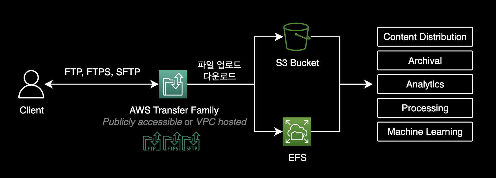
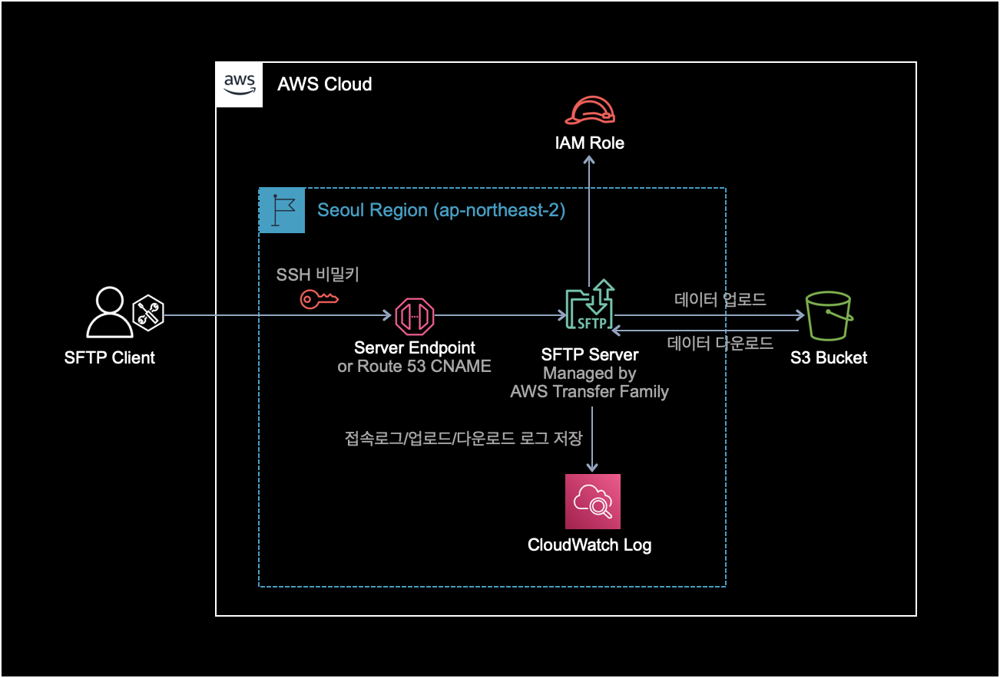
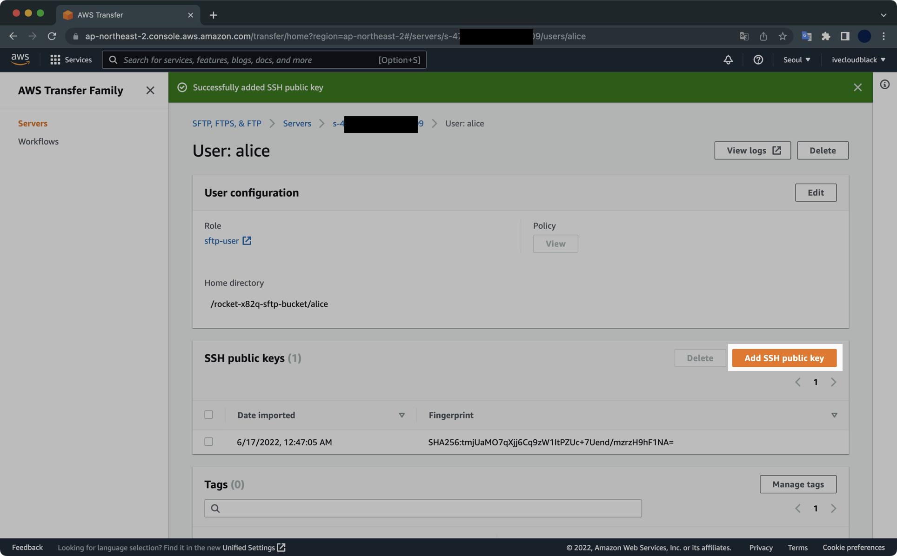
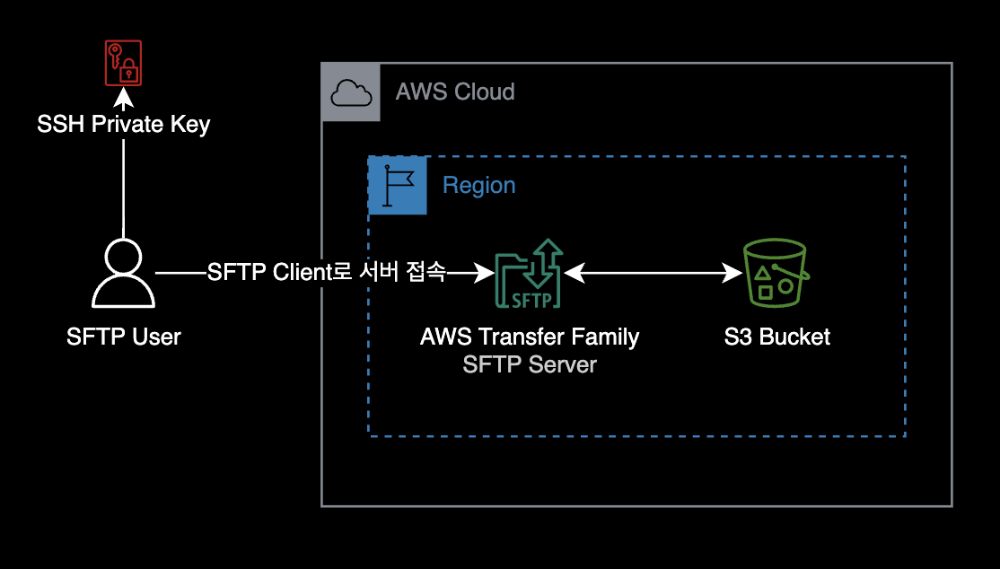
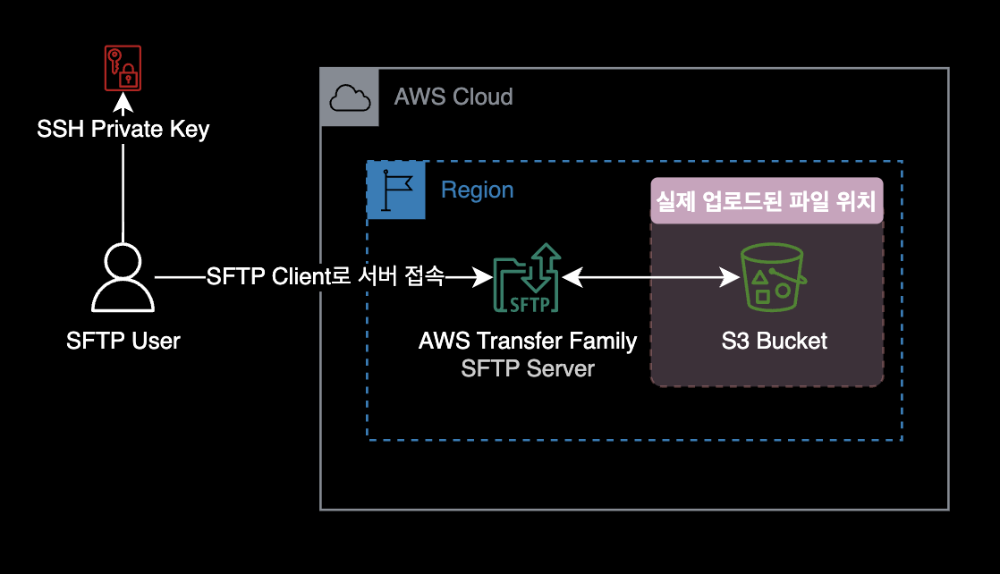

[terraform-code]: https://raw.githubusercontent.com/younsl/blog/main/content/blog/transfer-family-terraform/transfer-family.tar.gz

## 개요

테라폼을 사용해 AWS Transfer Family와 <abbr title="Simple Storage Service">S3</abbr>를 배포해서 서비스해보는 과정입니다.

&nbsp;

## 배경지식

### AWS Transfer Family

[AWS Transfer Family](https://aws.amazon.com/ko/aws-transfer-family/)는 FTP, FTPS, SFTP 서버의 관리형 서비스입니다.



&nbsp;

### AWS Transfer Family의 장단점

#### 장점

1. **관리형 서비스**: AWS Transfer Family는 완전히 관리되는 서비스이므로 서버 관리 및 인프라 구성에 대한 부담이 없습니다. 이로 인해 개발자는 파일 전송에 집중할 수 있습니다.

2. **확장성**: AWS Transfer Family는 트래픽 규모에 따라 자동으로 인프라가 확장되므로 대량의 파일 전송 작업에 대해서도 높은 성능과 안정성을 유지할 수 있습니다.

3. **다양한 프로토콜 지원**: AWS Transfer Family는 FTP(파일 전송 프로토콜), FTPS(암호화된 파일 전송 프로토콜), SFTP(SSH 파일 전송 프로토콜) 등 다양한 프로토콜을 지원합니다. 이는 기존에 사용하던 프로토콜을 그대로 유지하면서 AWS Transfer Family로 전환할 수 있음을 의미합니다.

4. **보안**: AWS Transfer Family는 AWS Identity and Access Management(IAM)과 통합되어 강력한 보안을 제공합니다. SFTP 프로토콜의 경우, 클라이언트 키 기반의 인증을 통해 보안을 강화할 수 있습니다.

&nbsp;

#### 단점

1. **가격**: AWS Transfer Family는 데이터 전송 및 저장에 대한 비용을 부과합니다. 파일 전송 작업의 규모나 빈도에 따라 비용이 증가할 수 있습니다. 특히 대규모 파일 전송 작업을 수행하는 경우, 비용이 높아질 수 있으므로 이를 고려해야 합니다.

2. **제한된 고급 기능**: AWS Transfer Family는 기본적인 파일 전송 요구 사항을 충족시키는 데에는 탁월합니다. 하지만 고급 기능이나 특정 사용자 정의 요구 사항을 처리하기에는 제한적일 수 있습니다. 예를 들어, 복잡한 데이터 전송 룰, 자동화된 작업 스케줄링, 고급 보안 요구사항 등을 처리해야 하는 경우 AWS Transfer Family의 기능만으로는 한계가 있을 수 있습니다. 이 경우에는 보다 커스텀화된 파일전송 솔루션을 고려해야 할 수 있습니다.

&nbsp;

테라폼으로 구성할 AWS 아키텍처는 다음과 같습니다.



Transfer Family 사용자가 SFTP 서버에 로그인할 때는 ID, Password 방식이 아닌 SSH 키페어 인증으로 로그인하게 됩니다.

&nbsp;

## 환경

### 로컬 환경

- **OS** : macOS Monterey 12.4 (M1 Pro)
- **Shell** : zsh + oh-my-zsh
- **Terraform** CLI v1.2.3
- **Terraform aws provider** v5.89.0
- **AWS CLI 2.7.7**

&nbsp;

## 준비사항

- 테라폼이 설치되어 있어야 합니다.
- 테라폼으로 AWS 리소스를 배포하기 위해서 AWS CLI에 충분한 권한이 부여되어 있어야 합니다.
- AWS CLI가 설치되어 있어야 합니다.

&nbsp;

## Transfer Family 구성하기

### 1. AWS CLI 권한 확인

`terraform init` 명령어를 실행하기 전에 AWS CLI에 Administrator 권한이 부여되어 있어야 합니다.

AWS CLI에서 현재 자신이 어떤 IAM User를 사용하고 있는지 확인합니다.

```bash
export AWS_PROFILE=<YOUR_PROFILE>
aws sts get-caller-identity
```

```bash
{
    "UserId": "AIDAXQOVWG6FYM3OPCLJX",
    "Account": "111111111111",
    "Arn": "arn:aws:iam::111111111111:user/tf-admin"
}
```

제가 사용할 IAM User인 tf-admin의 경우, AWS 관리형 정책인 [`AdministratorAccess`](https://docs.aws.amazon.com/ko_kr/IAM/latest/UserGuide/access_policies_job-functions.html#jf_administrator)이 부여되어 있습니다.

&nbsp;

### 2. 테라폼 코드 다운로드

AWS Transfer Family 리소스 생성에 필요한 [테라폼 코드][terraform-code] 전체를 다운로드 받습니다.

```bash
wget \
  -q --show-progress \
  -O transfer-family.tar.gz \
  https://raw.githubusercontent.com/younsl/blog/main/content/blog/transfer-family-terraform/transfer-family.tar.gz
```

```bash
transfer-family.tar.gz             100%[================================================================>]   2.13K  --.-KB/s    /  0s
```

2KB 크기의 [transfer-family.tar.gz][terraform-code] 파일을 다운로드 받았습니다.

&nbsp;

현재 경로에 다운로드 받은 [transfer-family.tar.gz][terraform-code] 파일을 압축해제합니다.

```bash
tar -zxvf transfer-family.tar.gz
```

&nbsp;

#### 코드 구조

다운로드 받은 [transfer-family][terraform-code] 디렉토리의 구조입니다.

```bash
$ tree transfer-family
transfer-family
├── README.md
├── outputs.tf            # Outputs
├── provider.tf           # AWS Provider
├── route53.tf            # Route 53 Public Hosted Zone and CNAME record
├── sftp-server-iam.tf    # IAM Role for SFTP Server
├── sftp-server.tf        # SFTP Server
├── transfer-user-iam.tf  # IAM Role for SFTP User
└── variables.tf          # Variables

1 directory, 8 files
```

디렉토리 안에는 Transfer Family와 관련된 모든 AWS 리소스에 대한 테라폼 코드가 포함되어 있습니다.

- SFTP Server (AWS Transfer Family)
- SFTP Server에서 사용할 IAM Role
- SFTP Server에 접속할 SFTP 사용자 계정
- SFTP 파일이 저장될 S3 Bucket
- Route 53 Public Hosted Zone
- Route 53 CNAME Record

&nbsp;

### 3. 테라폼 변수 설정

테라폼으로 AWS 리소스를 생성하기 전에 각자 환경에 맞게 variables.tf의 변수 값 3개를 수정합니다.

```terraform
# variables.tf
variable "region" {
  type        = string
  default     = "ap-northeast-2"
  description = "AWS Region"
}

variable "bucket_name" {
  type        = string
  default     = "rocket-x82q-sftp-bucket"
  description = "S3 bucket name"
}

variable "sftp_domain" {
  type        = string
  default     = "sftp.rocket.dev"
  description = "SFTP server custom hostname"
}
```

- **리전** (region): variable region 변수의 값을 변경합니다. SFTP 서버와 S3 버킷의 리전을 의미합니다.
- **S3 버킷 이름** (bucket_name): variable bucket_name 변수의 값을 변경합니다. S3 버킷의 이름을 의미합니다. 버킷 이름은 글로벌 환경에서 유니크한 이름을 가져야 합니다.
- **SFTP 서버 도메인** (sftp_domain): variable sftp_domain 변수의 값을 변경합니다. SFTP 서버의 도메인을 의미합니다. `sftp.rocket.dev` 대신 개인 도메인을 사용하고 싶다면 이 값을 변경합니다.

&nbsp;

### 4. 테라폼 초기화 (init)

충분한 AWS CLI의 권한이 부여된 상태에서 `transfer-family` 디렉토리로 이동합니다.

```bash
cd transfer-family
```

&nbsp;

테라폼 초기화를 실행합니다.

```bash
terraform init
```

`terraform init` 명령어에는 Terraform 구성 파일이 들어있는 작업 디렉토리를 초기화하고 Provider를 설치하는 등의 과정이 포함되어 있습니다.

&nbsp;

`terraform init` 명령어를 수행하면 생성되는 `.terraform.lock.hcl` 파일에서 설정된 Terraform Provider 버전 정보를 확인할 수 있습니다.

```bash
cat .terraform.lock.hcl
```

```terraform
# This file is maintained automatically by "terraform init".
# Manual edits may be lost in future updates.

provider "registry.terraform.io/hashicorp/aws" {
  version     = "5.89.0"
  constraints = "~> 5.0"
  ...
}
```

주의할 점은 로컬 환경에서 사용하는 AWS Provider의 버전이 4.35.0 이상이어야 합니다. AWS Transfer Family의 Custom Hostname 설정은 [aws_transfer_tag][aws_transfer_tag] 리소스를 사용해서 설정하는 데 이 리소스는 AWS Provider 버전 4.35.0 이상에서만 지원됩니다. 자세한 사항은 [aws_transfer_server custom hostname via alternate mechanism #18077](https://github.com/hashicorp/terraform-provider-aws/issues/18077#issuecomment-1273904488) 이슈를 참고해주세요.

&nbsp;

다음은 SFTP Transfer Family 서버 리소스를 생성하고 `sftp.rocket.dev` 도메인으로 커스텀 도메인을 설정하는 테라폼 코드 예시입니다.

```terraform
# sftp-server.tf
locals {
  username = "alice"
}

#---------------------------------------------
# SFTP Server
#---------------------------------------------
resource "aws_transfer_server" "service_managed_sftp" {
  protocols              = ["SFTP"]
  identity_provider_type = "SERVICE_MANAGED"
  endpoint_type          = "PUBLIC"
  logging_role           = aws_iam_role.sftp_logging.arn

  domain = "S3"
}

# `aws_transfer_tag` resource only supports aws provider v4.35.0 and higher.
resource "aws_transfer_tag" "zone_id" {
  resource_arn = aws_transfer_server.service_managed_sftp.arn
  key          = "aws:transfer:route53HostedZoneId"
  value        = "/hostedzone/${aws_route53_zone.sftp_rocket_dev.zone_id}"
}

# `aws_transfer_tag` resource only supports aws provider v4.35.0 and higher.
resource "aws_transfer_tag" "hostname" {
  resource_arn = aws_transfer_server.service_managed_sftp.arn
  key          = "aws:transfer:customHostname"
  value        = var.sftp_domain
}
```

AWS Transfer Family를 AWS 콘솔이 아닌 Terraform에서 생성할 때에는 커스텀 도메인을 설정하기 위해 생성 시점에 약속된 AWS 관리형 태그 2개를 추가해야 합니다. AWS Management Console을 사용하여 Transfer Family 서버를 생성하는 경우 태깅이 자동으로 수행됩니다.

- `aws:transfer:route53HostedZoneId`: Route 53 Public Hosted Zone의 ID
- `aws:transfer:customHostname`: `sftp.rocket.dev` 형식의 커스텀 도메인

자세한 사항은 [Transfer Family 공식문서: 사용자 지정 호스트 이름으로 작업](https://docs.aws.amazon.com/ko_kr/transfer/latest/userguide/requirements-dns.html#tag-custom-hostname-cdk) 문서를 참고해주세요.

&nbsp;

### 5. 테라폼 실행계획 확인 (plan)

`terraform plan` 명령어를 실행해서 미리 생성될 리소스들의 정보를 확인합니다.

```bash
terraform plan
```

Transfer Server, S3 Bucket, Route 53 Public Hosted Zone, Route 53 CNAME Record, IAM Role, IAM User와 같은 여러 개의 리소스가 생성되게 됩니다.

&nbsp;

### 6. 테라폼 생성 (apply)

이후 apply 명령어로 리소스 생성을 진행합니다.

```bash
terraform apply
```

&nbsp;

리소스 생성이 완료되면 다음과 같은 메세지가 출력됩니다.

```bash
...

Apply complete! Resources: 13 added, 0 changed, 0 destroyed.

Outputs:

bucket_name = "rocket-x82q-sftp-bucket"
sftp_server_endpoint = "s-993ae220554f4c50a.server.transfer.ap-northeast-2.amazonaws.com"
sftp_server_id = "s-993ae220554f4c50a"
sftp_username = "alice"
```

13개의 AWS 리소스를 문제없이 생성했습니다.

Route 53에 개인 소유 도메인이 없는 분들은 아쉽게도 도메인 대신 `sftp_server_endpoint` 값으로 SFTP 서버에 로그인해야 합니다.

&nbsp;

### 7. SSH 키 생성 및 등록

테라폼으로 리소스 생성이 완료된 이후, SFTP Transfer 유저가 접속에 사용할 SSH 키페어를 생성합니다.

```bash
ssh-keygen -f sftp-alice
```

```bash
Generating public/private rsa key pair.
Enter passphrase (empty for no passphrase):
Enter same passphrase again:
Your identification has been saved in sftp-alice
Your public key has been saved in sftp-alice.pub
The key fingerprint is:
...
```

passphrase는 빈칸으로 입력 후 Enter 키를 눌러 키 페어를 생성합니다.

&nbsp;

생성된 SSH 키 파일을 확인합니다.

```bash
$ ls sftp-alice*
sftp-alice     sftp-alice.pub
```

비밀키 `sftp-alice`와 공개키 `sftp-alice.pub`이 생성된 걸 확인할 수 있습니다.

&nbsp;

SFTP 유저가 서버에 접속하려면 SSH 키페어 중 공개키를 Transfer Server에 미리 등록해야 합니다.


공개키의 내용을 확인하고 복사합니다.

```bash
$ cat sftp-alice.pub
ssh-rsa AAAAB3NzaC1yc2EAAAADAQABAAABgQCpmWwof7SgjqepEgFYkHEZEfR84Za7WBKM2b5wvWvPN4u/RcksOXXmn9LMEvLH6ZMx27tBq1Lh/fJet/QKLtntYBjS9WIwsgI2szJRYoiTxpbJOz6vuh13XIO8YUeirb4KLkpMbnj7vkAuU6BGJ5WHgTcVgzM1sPgqNLVxOHy4p2EmKkz1z3EDMolhUm9v0COMw4+8YW78HBizuBdLmIP23o9pNfnKBTtnNHtaIFhJi9f1OK4IvMM+n+sBikrA8mtmMPoTS+agsSFi+LIcqdj00cbm8KAcMtYImQSIjhcUGG+0aPjePOI0Qkj0D0+00GdIxGhJsgbRt+chDHfs1jWQ6ha0SK6Pl3ceQHLtb4mskhQQu78ObTVbt0VNsoRnzhdHVxgisVZGqGsJhY1ahbr0BZn//XrN7zfzRCU203qlbJc76GMWVM+SLNi3zOJYF/rbDJgpIoIwEvqppSrWQUfcPQo0VRxJY1suVd0ms0xeoWjd0sSbIhowBIcASJxQ0X0= xxxxx@xxxxxui-MacBookPro.local
```

&nbsp;

AWS Management Console로 돌아가서 아까 생성한 SSH 공개키(`sftp-alice.pub`)를 Transfer User에 등록합니다.



&nbsp;

공개키 `sftp-alice.pub`의 내용을 그대로 복사해서 넣어주세요. 그 후 [Add key] 버튼을 눌러 SSH 공개키를 등록합니다.


SFTP 서버 세팅이 끝났습니다.

&nbsp;

### 8. SFTP 접속

이제 SFTP 사용자가 로컬 환경에 설치된 SFTP Client 프로그램을 사용해 서버에 접근하면 됩니다.



&nbsp;

SFTP 서버에는 두 가지 방법으로 접속할 수 있습니다.

1. 비밀키를 사용해서 도메인으로 접속
2. 비밀키를 사용해서 Server Endpoint로 접속 (`server.transfer.ap-northeast-2.amazonaws.com` 형식을 가지고 있는 주소)

&nbsp;

도메인을 사용해서 접속하는 방법은 다음과 같습니다.

```bash
sftp -i PRIVATE_KEY_FILENAME USERNAME@<YOUR.DOMAIN.COM>
```

테라폼 코드를 실행하면 Route 53의 Zone과 Transfer Server로 연결될 CNAME Record가 생성됩니다.

&nbsp;

제 경우는 개인 소유의 도메인이 없어서 SFTP에 접속할 때 도메인 대신 Server Endpoint로 접속하게 되었습니다. 제 환경에서 실제 실행한 명령어는 아래와 같습니다.

```bash
sftp -i sftp-alice alice@s-4798bd8d19d646609.server.transfer.ap-northeast-2.amazonaws.com
```

&nbsp;

Server Endpoint 주소는 `terraform apply`로 생성한 이후 마지막 라인 `Outputs`에 자동 출력됩니다.

```bash
sftp_server_endpoint = "s-993ae220554f4c50a.server.transfer.ap-northeast-2.amazonaws.com"
```

&nbsp;

SFTP 서버에 정상적으로 로그인하면 다음과 같은 메세지가 출력되면서 프롬프트가 `sftp>`로 변경됩니다.

```bash
Connected to s-4798bd8d19d646609.server.transfer.ap-northeast-2.amazonaws.com.
sftp>
```

&nbsp;

SFTP 사용자가 최초 로그인했을 때 위치한 디렉토리 경로는 각 유저의 홈 디렉토리인 걸 확인할 수 있습니다.

```bash
sftp> pwd
Remote working directory: /rocket-x82q-sftp-bucket/alice
```

&nbsp;

`help` 명령어를 실행해서 전체 SFTP 명령어 리스트를 확인할 수 있습니다.

```bash
sftp> help
Available commands:
bye                                Quit sftp
cd path                            Change remote directory to 'path'
chgrp [-h] grp path                Change group of file 'path' to 'grp'
chmod [-h] mode path               Change permissions of file 'path' to 'mode'
chown [-h] own path                Change owner of file 'path' to 'own'
df [-hi] [path]                    Display statistics for current directory or
                                   filesystem containing 'path'
exit                               Quit sftp
get [-afpR] remote [local]         Download file
help                               Display this help text
lcd path                           Change local directory to 'path'
lls [ls-options [path]]            Display local directory listing
lmkdir path                        Create local directory
ln [-s] oldpath newpath            Link remote file (-s for symlink)
lpwd                               Print local working directory
ls [-1afhlnrSt] [path]             Display remote directory listing
lumask umask                       Set local umask to 'umask'
mkdir path                         Create remote directory
progress                           Toggle display of progress meter
put [-afpR] local [remote]         Upload file
pwd                                Display remote working directory
quit                               Quit sftp
reget [-fpR] remote [local]        Resume download file
rename oldpath newpath             Rename remote file
reput [-fpR] local [remote]        Resume upload file
rm path                            Delete remote file
rmdir path                         Remove remote directory
symlink oldpath newpath            Symlink remote file
version                            Show SFTP version
!command                           Execute 'command' in local shell
!                                  Escape to local shell
?                                  Synonym for help
```

&nbsp;

### 9. 파일 업로드 테스트

S3에 업로드를 테스트하기 위한 샘플 파일을 생성합니다.

```bash
echo "hello world." >> helloworld.txt
```

&nbsp;

SFTP 서버에 다시 접속합니다.  
로컬 파일시스템의 현재 경로에 있는 파일 목록을 조회합니다.

```bash
sftp> lls .
helloworld.txt
```

&nbsp;

방금 로컬에 생성한 `helloworld.txt` 파일을 SFTP 서버에 업로드합니다.

```bash
sftp> put helloworld.txt helloworld.txt
Uploading helloworld.txt to /rocket-x82q-sftp-bucket/alice/helloworld.txt
helloworld.txt                                                                                                                                                                      100%   13     1.0KB/s   00:00
```

위와 같이 `100%` 출력이 되며 파일 업로드가 완료됩니다.

&nbsp;

실제 파일이 저장되는 장소는 백엔드 스토리지인 S3 버킷이라는 사실을 명심해야 합니다.



&nbsp;

`ls` 명령어로 파일이 S3에 업로드된 걸 확인할 수 있습니다.

```bash
sftp> ls
helloworld.txt  
```

&nbsp;

SFTP 서버를 빠져나온 다음, AWS CLI에서 S3 버킷 안에 들어있는 오브젝트를 확인합니다.

```bash
sftp> exit
```

```bash
$ aws s3 ls s3://rocket-x82q-sftp-bucket/alice/
2022-06-17 03:10:51         13 helloworld.txt
```

S3 버킷에 파일이 업로드된 걸 확인할 수 있습니다.

&nbsp;

### 10. 실습환경 정리

#### terraform destroy

실습이 종료된 후에는 비용 청구가 발생하는 걸 방지하기 위해 테라폼으로 생성한 리소스를 모두 삭제합니다.

```bash
terraform state list
terraform destroy
```

AWS Transfer Family의 SFTP 서버가 저렴한 비용은 아닙니다.  
실습이 끝난 후에는 **반드시** 테라폼으로 생성한 모든 AWS 리소스를 삭제해주세요.

&nbsp;

## 더 나아가서

### Transfer Family 테라폼 모듈 사용하기

이 포스트에서는 테라폼 리소스로 AWS Transfer Family의 SFTP 서버를 생성하는 방법을 설명했습니다. 테라폼 모듈은 여러 개의 테라폼 리소스를 묶어서 쉽게 재사용할 수 있는 기능을 제공합니다.

[AWS](https://github.com/terraform-aws-modules)에서는 AWS Transfer Family에 대한 테라폼 모듈을 공식적으로 제공하지 않으므로, cloudposse의 [terraform-aws-transfer-sftp 테라폼 모듈](https://github.com/cloudposse/terraform-aws-transfer-sftp)을 사용해서 AWS Transfer Family를 구성할 수 있습니다.

&nbsp;

## 참고자료

AWS Transfer Family:

- [AWS Transfer Family 리소스](https://aws.amazon.com/ko/aws-transfer-family/resources/?nc=sn&loc=5&whats-new-cards.sort-by=item.additionalFields.postDateTime&whats-new-cards.sort-order=desc)
- [AWS Transfer Family 요금](https://aws.amazon.com/ko/aws-transfer-family/pricing/): SFTP 엔드포인트 비용이 1시간당 $0.30 입니다. 굉장히 부담스러운 가격입니다.
- [사용자 지정 호스트 이름으로 작업](https://docs.aws.amazon.com/ko_kr/transfer/latest/userguide/requirements-dns.html#tag-custom-hostname-cdk): AWS Transfer Family 공식문서

Terraform:

- **2025년 3월 2일 업데이트** [aws_transfer_tag 리소스][aws_transfer_tag]: AWS 프로바이더 4.35.0 버전부터는 null resource 없이 AWS Transfer Family의 커스텀 도메인을 테라폼 리소스로 자체 지원하므로 구성 방법이 더 간단해졌습니다.

[aws_transfer_tag]: https://registry.terraform.io/providers/hashicorp/aws/latest/docs/resources/transfer_tag