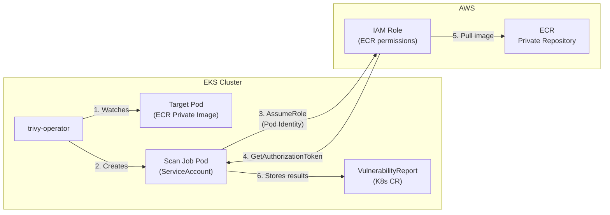

## Overview

[trivy-operator](https://github.com/aquasecurity/trivy-operator) automatically scans vulnerabilities in workloads running on Kubernetes clusters. To scan images from Private Registries (ECR, Harbor, etc.), additional authentication configuration is required.

> **trivy-operator natively supports [EKS Pod Identity](https://docs.aws.amazon.com/eks/latest/userguide/pod-identities.html)** for authenticating with AWS services. No additional configuration in Helm values is required for Pod Identity - simply create the Pod Identity Association and the operator will automatically use it.

This guide covers how to configure trivy-operator to scan Amazon ECR Private images using [EKS Pod Identity](https://docs.aws.amazon.com/eks/latest/userguide/pod-identities.html).

## Background

### How trivy-operator works

trivy-operator does not scan images by itself. When a new Pod is created, the operator creates a **Scan Job Pod** to do the actual scanning. The Scan Job Pod pulls the image, runs Trivy, saves the results as a VulnerabilityReport, and then gets deleted.

Because of this, ECR access must be given to the Scan Job Pods. Scan Job Pods use the same ServiceAccount as trivy-operator, so the Pod Identity Association should be set up for the `trivy-operator` ServiceAccount.

### Standalone EC2

For standalone EC2 without Kubernetes, use the [Trivy CLI](https://github.com/aquasecurity/trivy) directly. Run `aws ecr get-login-password` to log in to ECR, then run `trivy image <image-uri>` to scan.

## Environment

- **EKS**: v1.32
- **trivy-operator**: v0.29.0
- **Authentication**: [EKS Pod Identity](https://docs.aws.amazon.com/eks/latest/userguide/pod-identities.html)

## Architecture



**How it works:**

1. **trivy-operator** watches for new Pods and identifies container images to scan
2. The operator creates a **Scan Job Pod** to perform the actual vulnerability scan
3. The Scan Job's **ServiceAccount** is linked to an IAM Role via **EKS Pod Identity**
4. The Scan Job calls **AssumeRole** to obtain temporary AWS credentials
5. Using the IAM Role's permissions, it calls `ecr:GetAuthorizationToken` for ECR authentication
6. The Scan Job pulls image layers from **ECR Private Repository** and runs Trivy scanner
7. Scan results are stored as **VulnerabilityReport** custom resources in the cluster
8. The Scan Job Pod is deleted after completion

## Configuration

### 1. Create IAM Policy

Permissions required for trivy-operator to pull and scan images from ECR.

```json
{
    "Version": "2012-10-17",
    "Statement": [
        {
            "Sid": "ECRReadOnly",
            "Effect": "Allow",
            "Action": [
                "ecr:GetAuthorizationToken",
                "ecr:BatchCheckLayerAvailability",
                "ecr:GetDownloadUrlForLayer",
                "ecr:BatchGetImage"
            ],
            "Resource": "*"
        }
    ]
}
```

> ⚠️ **Note**: `ecr:GetAuthorizationToken` requires Resource to be `*`. This is the minimum permission set required for image scanning.

### 2. Create IAM Role

Configure the Trust Policy for [EKS Pod Identity](https://docs.aws.amazon.com/eks/latest/userguide/pod-identities.html).

```json
{
    "Version": "2012-10-17",
    "Statement": [
        {
            "Sid": "AllowEksAuthToAssumeRoleForPodIdentity",
            "Effect": "Allow",
            "Principal": {
                "Service": "pods.eks.amazonaws.com"
            },
            "Action": [
                "sts:AssumeRole",
                "sts:TagSession"
            ]
        }
    ]
}
```

### 3. Create Pod Identity Association

Create the Pod Identity Association using AWS CLI or Terraform.

**AWS CLI:**

```bash
aws eks create-pod-identity-association \
    --cluster-name <CLUSTER_NAME> \
    --namespace trivy-system \
    --service-account trivy-operator \
    --role-arn arn:aws:iam::<ACCOUNT_ID>:role/<ROLE_NAME>
```

**Terraform:**

```hcl
resource "aws_eks_pod_identity_association" "trivy_operator" {
  cluster_name    = aws_eks_cluster.this.name
  namespace       = "trivy-system"
  service_account = "trivy-operator"
  role_arn        = aws_iam_role.trivy_operator.arn
}
```

### 4. Configure trivy-operator Helm Values

```yaml
# values.yaml
trivy:
  # Configuration for ECR Private Registry authentication
  ignoreUnfixed: true

operator:
  # Target namespaces for scanning (empty for all)
  targetNamespaces: ""
  # Namespaces to exclude
  excludeNamespaces: "kube-system,trivy-system"

serviceAccount:
  # -- Specifies whether a service account should be created.
  create: true
  annotations: {}
  # -- name specifies the name of the k8s Service Account. If not set and create is
  # true, a name is generated using the fullname template.
  name: ""
```

EKS Pod Identity does not require `eks.amazonaws.com/role-arn` annotation on the ServiceAccount. This annotation is only needed for IRSA.

### 5. Install with Helm

```bash
helm repo add aqua https://aquasecurity.github.io/helm-charts/
helm repo update

helm upgrade --install trivy-operator aqua/trivy-operator \
    --namespace trivy-system \
    --create-namespace \
    -f values.yaml
```

## Verification

### Check VulnerabilityReports

```bash
# List vulnerability reports
kubectl get vulnerabilityreports -A

# Check specific report details
kubectl describe vulnerabilityreport -n <namespace> <report-name>
```

### Check trivy-operator Logs

```bash
kubectl logs -n trivy-system -l app.kubernetes.io/name=trivy-operator -f
```

Expected logs on success:

```
{"level":"info","msg":"Reconciling VulnerabilityReport","controller":"vulnerabilityreport"}
{"level":"info","msg":"Successfully scanned image","image":"<ACCOUNT_ID>.dkr.ecr.<REGION>.amazonaws.com/app:v1.0.0"}
```

### Authentication Error Logs

```
{"level":"error","msg":"Failed to scan image","error":"GET https://...ecr...: UNAUTHORIZED"}
```

If you see this error, check the following:
1. Pod Identity Association is correctly created
2. IAM Role has ECR permissions
3. trivy-operator Pod has been restarted

## Troubleshooting

### ECR Authentication Token Expiration

ECR authentication tokens expire every 12 hours. trivy-operator automatically refreshes tokens, but if issues occur, restart the Pod.

```bash
kubectl rollout restart deployment -n trivy-system trivy-operator
```

### Cross-Account ECR Access

When accessing ECR in another AWS account:

1. **Source Account (ECR owner)**: Add target account to ECR Repository Policy
2. **Target Account (EKS owner)**: Add Cross-Account permissions to IAM Role

```json
{
    "Sid": "CrossAccountECR",
    "Effect": "Allow",
    "Action": [
        "ecr:GetAuthorizationToken",
        "ecr:BatchCheckLayerAvailability",
        "ecr:GetDownloadUrlForLayer",
        "ecr:BatchGetImage"
    ],
    "Resource": "arn:aws:ecr:<REGION>:<SOURCE_ACCOUNT_ID>:repository/*"
}
```

## References

- [trivy-operator Official Documentation](https://aquasecurity.github.io/trivy-operator/)
- [EKS Pod Identity Documentation](https://docs.aws.amazon.com/eks/latest/userguide/pod-identities.html)
- [ECR Private Registry Authentication](https://docs.aws.amazon.com/AmazonECR/latest/userguide/registry_auth.html)
