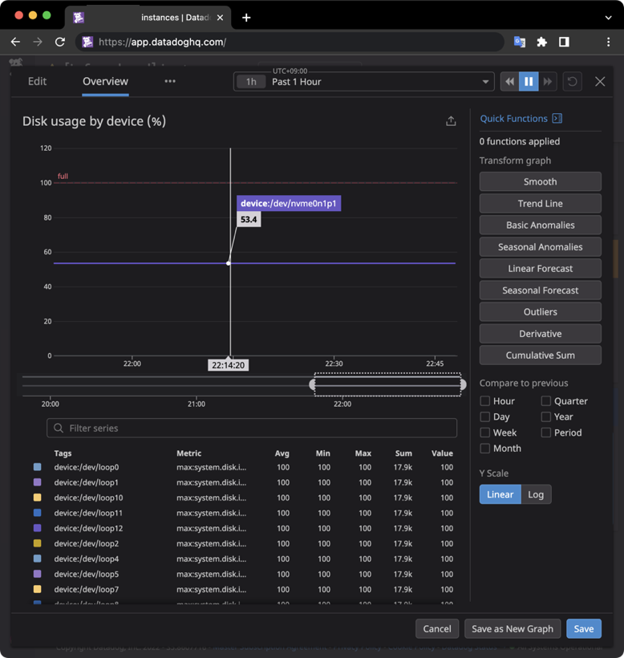
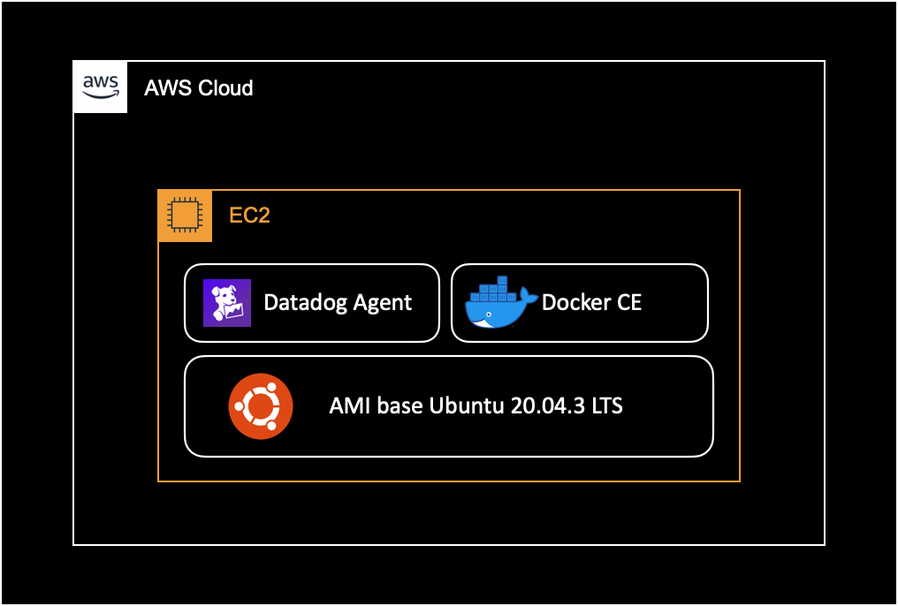

## 개요

EC2 인스턴스에 설치된 데이터독 에이전트에서 `Unable to get disk metrics ... [Error 13] Permission denied` 에러가 지속 발생할 때 해결하는 방법을 소개합니다.

&nbsp;

## 증상

EC2 인스턴스에서 데이터독 에이전트 v7.37.1 를 사용중입니다.  
도커 컨테이너의 디스크 메트릭 관련 에러 로그가 지속 발생하는 증상입니다.

&nbsp;

**데이터독 에이전트 로그**  
증상이 발생할 때 출력되는 데이터독 에이전트의 로그 내용은 다음과 같습니다.

문제되는 로그의 레벨은 `Warning`이고, 데이터독 대시보드에 보이는 메트릭 수집 자체에는 영향을 주지 않지만, 어드민 관점에서 불필요하게 반복 발생하는 로그는 필수 제거 대상입니다.

```bash
$ tail -10 agent.log
2022-06-30 01:51:38 UTC | CORE | WARN | (pkg/collector/python/datadog_agent.go:124 in LogMessage) | disk:e1dffb2bef34567f | (disk.py:135) | Unable to get disk metrics for /var/lib/docker/containers/471a5aa5d8266ade61d358c1024d704a6b0a3eb7d75f442a01aee362c38cc5dd/mounts/shm: [Errno 13] Permission denied: '/var/lib/docker/containers/471a5aa5d8266ade61d358c1024d704a6b0a3eb7d75f442a01aee362c38cc5dd/mounts/shm'. You can exclude this mountpoint in the settings if it is invalid.
2022-06-30 01:51:38 UTC | CORE | WARN | (pkg/collector/python/datadog_agent.go:124 in LogMessage) | disk:e1dffb2bef34567f | (disk.py:135) | Unable to get disk metrics for /run/docker/netns/0f39da799d9d: [Errno 13] Permission denied: '/run/docker/netns/0f39da799d9d'. You can exclude this mountpoint in the settings if it is invalid.
2022-06-30 01:51:38 UTC | CORE | WARN | (pkg/collector/python/datadog_agent.go:124 in LogMessage) | disk:e1dffb2bef34567f | (disk.py:135) | Unable to get disk metrics for /var/lib/docker/containers/0c3c6d543bfe9dc3bde28599abc0e06e599775a720bc5b8b999a0154b413100d/mounts/shm: [Errno 13] Permission denied: '/var/lib/docker/containers/0c3c6d543bfe9dc3bde28599abc0e06e599775a720bc5b8b999a0154b413100d/mounts/shm'. You can exclude this mountpoint in the settings if it is invalid.
2022-06-30 01:51:38 UTC | CORE | WARN | (pkg/collector/python/datadog_agent.go:124 in LogMessage) | disk:e1dffb2bef34567f | (disk.py:135) | Unable to get disk metrics for /run/docker/netns/de516beeee44: [Errno 13] Permission denied: '/run/docker/netns/de516beeee44'. You can exclude this mountpoint in the settings if it is invalid.
```

위와 같은 에러 메세지가 끊임없이 반복 발생하는 증상입니다.

그러나 데이터독 대시보드에 접속해서 해당 인스턴스를 확인해보면 디스크 메트릭을 포함한 모든 메트릭을 정상적으로 수집해오고 있는 상황이었습니다.



&nbsp;

## 환경

문제가 발생한 EC2 Instance의 환경은 다음과 같습니다.



EC2 인스턴스 내부에서 여러 개의 Docker 컨테이너가 동작하고 있습니다.

- **Docker** : Docker CE 20.10.7 (linux/amd64)
- **OS** : Ubuntu 20.04.3 LTS
- **Datadog Agent** : 7.37.1

&nbsp;

## 원인

EC2 안에서 돌고있는 도커 컨테이너에 디스크 메트릭을 수집하려고 계속 시도하면서 에러 메세지가 발생합니다.

&nbsp;

## 해결방법

데이터독 에이전트 설정에서 도커 컨테이너 관련 파일시스템과 마운트 포인트를 명시적으로 제외하면 해결됩니다.

&nbsp;

## 상세 해결방법

### 설정파일 확인

데이터독 에이전트의 설정파일 경로를 확인합니다.

```bash
$ datadog-agent configcheck
```

중간에 `disk check` 부분에서 Config 경로를 확인할 수 있습니다.  
설정파일의 기본경로는 다음과 같습니다.

```bash
...
=== disk check ===
Configuration provider: file
Configuration source: file:/etc/datadog-agent/conf.d/disk.d/conf.yaml
...
~
===
...
```

&nbsp;

디스크 메트릭 설정파일의 내용을 확인합니다.

```bash
$ cat /etc/datadog-agent/conf.d/disk.d/conf.yaml
```

기본적으로 아래와 같이 설정되어 있습니다.

```yaml
...

init_config:
    ...
    ...

instances:
  - use_mount: false
    excluded_filesystems:
      - autofs
      - /proc/sys/fs/binfmt_misc
      - /host/proc/sys/fs/binfmt_misc

    # mount_point_exclude:
    #   - /proc/sys/fs/binfmt_misc
    #   - /dev/sde
    #   - '[FJ]:'
```

&nbsp;

### 설정파일 변경

디스크 메트릭 설정파일을 변경합니다.

```yaml
$ vi /etc/datadog-agent/conf.d/disk.d/conf.yaml
```

&nbsp;

변경내용은 다음과 같습니다.

- `excluded_filesystems`에 `none`, `shm`, `nsfs`를 추가합니다.
- `mount_point_exclude` 부분을 주석해제합니다.
- `mount_point_exclude`에 도커 관련 마운트 포인트를 추가해서 디스크 메트릭 수집에서 제외시킵니다.

```yaml
init_config:
    ...
    ...

instances:
  - use_mount: false
    excluded_filesystems:
      # Add configs to solve error log
      # `Unable to get disk metrics`
      # [Error 13] Permission denied.
      # == Additional config start ==
      - none
      - shm
      - nsfs
      # == Additional config end ==
      - autofs
      - /proc/sys/fs/binfmt_misc
      - /host/proc/sys/fs/binfmt_misc

    mount_point_exclude:
      # Add configs to solve error log
      # `Unable to get disk metrics`
      # [Error 13] Permission denied.
      # == Additonal config start ==
      - /var/lib/docker/(containers|overlay2)/
      - /run/docker/
      - /sys/kernel/debug/
      - /run/user/1000/
      # == Additional config end ==
      - /proc/sys/fs/binfmt_misc
      - /dev/sde
      - '[FJ]:'
```

작성할 때 `#` 주석 부분은 안 넣으셔도 됩니다.

&nbsp;

### 에이전트 재시작

변경된 설정을 적용하기 위해 데이터독 에이전트를 재시작합니다.

```bash
$ systemctl restart datadog-agent
```

&nbsp;

재시작 이후 데이터독 에이전트의 상태를 확인합니다.

```bash
$ systemctl status datadog-agent
```

&nbsp;

### 테스트

추가한 디스크 메트릭 설정이 잘 적용되었는지 점검합니다.

```bash
$ datadog-agent configcheck
...
=== disk check ===
Configuration provider: file
Configuration source: file:/etc/datadog-agent/conf.d/disk.d/conf.yaml
...
excluded_filesystems:
- none
- shm
- nsfs
- autofs
- /proc/sys/fs/binfmt_misc
- /host/proc/sys/fs/binfmt_misc
mount_point_exclude:
- /var/lib/docker/(containers|overlay2)/
- /run/docker/
- /sys/kernel/debug/
- /run/user/1000/
- /proc/sys/fs/binfmt_misc
- /dev/sde
- '[FJ]:'
use_mount: false
~
===
...
```

정상적으로 적용된 걸 확인할 수 있습니다.

&nbsp;

다시 데이터독 에이전트의 로그를 확인합니다.

```bash
$ tail -f /var/log/datadog/agent.log
2022-06-30 02:16:39 UTC | CORE | INFO | (pkg/collector/worker/check_logger.go:38 in CheckStarted) | check:io | Running check...
2022-06-30 02:16:39 UTC | CORE | INFO | (pkg/collector/worker/check_logger.go:57 in CheckFinished) | check:io | Done running check, next runs will be logged every 500 runs
2022-06-30 02:16:40 UTC | CORE | INFO | (pkg/collector/worker/check_logger.go:38 in CheckStarted) | check:cpu | Running check...
2022-06-30 02:16:40 UTC | CORE | INFO | (pkg/collector/worker/check_logger.go:57 in CheckFinished) | check:cpu | Done running check, next runs will be logged every 500 runs
2022-06-30 02:16:45 UTC | CORE | INFO | (pkg/collector/worker/check_logger.go:38 in CheckStarted) | check:network | Running check...
2022-06-30 02:16:45 UTC | CORE | INFO | (pkg/collector/worker/check_logger.go:57 in CheckFinished) | check:network | Done running check, next runs will be logged every 500 runs
2022-06-30 02:16:46 UTC | CORE | INFO | (pkg/collector/worker/check_logger.go:38 in CheckStarted) | check:load | Running check...
2022-06-30 02:16:46 UTC | CORE | INFO | (pkg/collector/worker/check_logger.go:57 in CheckFinished) | check:load | Done running check, next runs will be logged every 500 runs
2022-06-30 02:16:47 UTC | CORE | INFO | (pkg/collector/worker/check_logger.go:38 in CheckStarted) | check:file_handle | Running check...
2022-06-30 02:16:47 UTC | CORE | INFO | (pkg/collector/worker/check_logger.go:57 in CheckFinished) | check:file_handle | Done running check, next runs will be logged every 500 runs
2022-06-30 02:16:47 UTC | CORE | INFO | (pkg/collector/worker/check_logger.go:57 in CheckFinished) | check:file_handle | Done running check, next runs will be logged every 500 runs

... 4 minutes later ...

2022-06-30 02:20:31 UTC | CORE | INFO | (pkg/serializer/serializer.go:388 in sendMetadata) | Sent metadata payload, size (raw/compressed): 1802/496 bytes.
2022-06-30 02:20:33 UTC | CORE | INFO | (pkg/serializer/serializer.go:412 in SendProcessesMetadata) | Sent processes metadata payload, size: 1458 bytes.
```

디스크 메트릭 제외 설정을 추가로 적용한 이후부터 디스크 메트릭 수집 관련 에러로그가 사라진 걸 확인할 수 있습니다.

&nbsp;

## 참고자료

제 경우는 아래 솔루션을 그대로 적용해서 문제를 해결했습니다.

[DataDog/dd-agent Issue#2932](https://github.com/DataDog/dd-agent/issues/2932#issuecomment-647088933)
