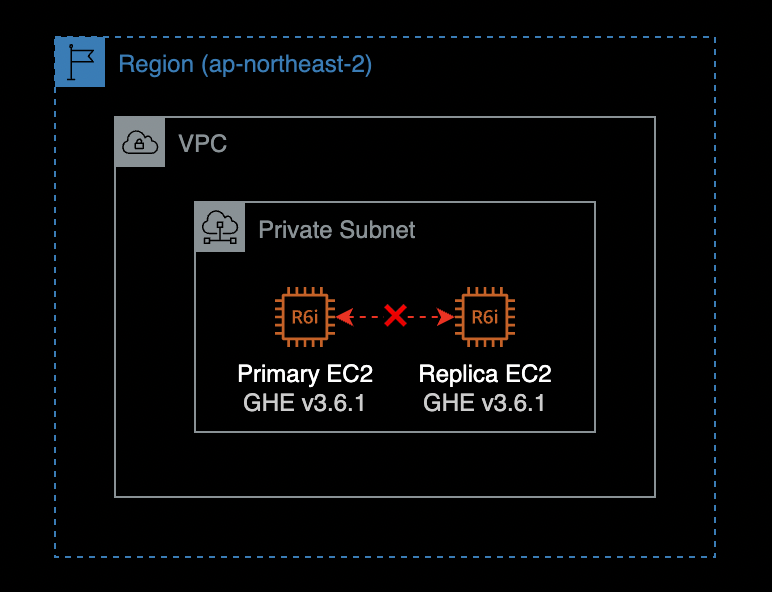
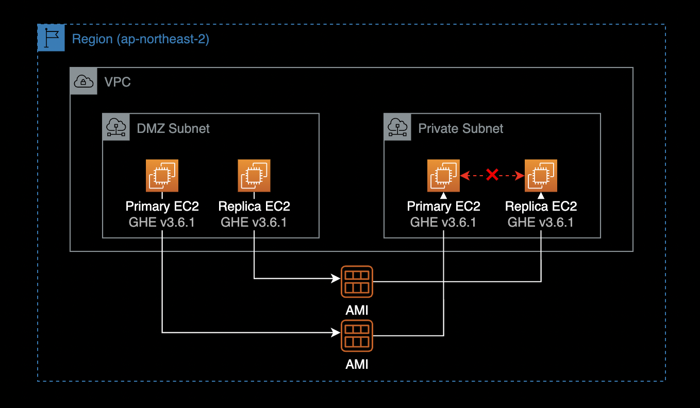
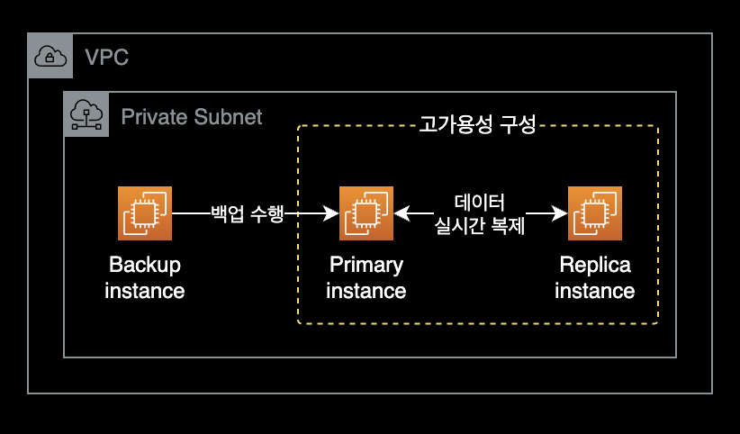

## 개요

Github Enterprise Server를 사용하던 중 MSSQL 컴포넌트의 이중화<sup>Replication</sup> 실패 문제가 발생했습니다.

GHE 운영 중 발생한 MSSQL 복제 실패 문제를 해결한 기록입니다.

&nbsp;

## 환경

2대의 EC2 인스턴스로 Github Enterprise를 이중화 구성 했습니다.



- **인프라 구성** : Amazon EC2 x 2대를 사용하여 서버 이중화 구성
  - **인스턴스 타입** : [r6i.2xlarge](https://aws.amazon.com/ko/ec2/instance-types/r6i/)
    - Primary와 Replica의 인스턴스 타입은 동일합니다.
  - **OS** : Debian 10
- **GHE Version** : Github Enterprise Server v3.6.1

&nbsp;

## 발단

기존에 Primary - Replica 구조로 2대의 Github Enterprise Server를 운영중이었습니다.

&nbsp;

그러나 금융 컴플라이언스 규제를 준수하기 위해, 기존에 잘 돌아가던 GHE 서버를 이사해야 하는 일이 발생했습니다.

서버를 중지하고, AMI를 생성한 다음, 그 AMI를 활용해 다른 서브넷에 새로 GHE EC2를 생성하여 옮긴 후에 MSSQL 이중화 문제가 발생했습니다.



Github Enterprise 서버 2대를 다른 서브넷으로 이동시키기 전에는 모든 컴포넌트의 이중화<sup>Replication</sup>가 문제 없이 동작했었습니다.

&nbsp;

아래는 다른 서브넷으로 인스턴스를 옮긴 후 Replica 서버에서 확인한 Github Enterprise 이중화 상태입니다.

```bash
# On replica instance.
$ ghe-repl-status
```

```bash
OK: mysql replication is in sync
CRITICAL: Synchronization delay could not be determined: Msg8169,Level16,State2,Serveryour-ghedomain-com-primary,Line19Conversionfailedwhenconvertingfromacharacterstringtouniqueidentifier.
OK: redis replication is in sync
OK: elasticsearch cluster is in sync (0 shards initializing, 0 shards unassigned)
OK: git replication is in sync
OK: pages replication is in sync
OK: alambic replication is in sync
OK: git-hooks replication is in sync
OK: consul replication is in sync
```

현재 MSSQL 관련하여 `CRITICAL` 알람이 들어와 있는 걸 확인할 수 있습니다.

&nbsp;

이중화 상태를 더 상세하게 확인한 결과입니다.

```bash
# On replica instance.
$ ghe-repl-status -v
```

```bash
OK: mysql replication is in sync
  | IO running: Yes, SQL running: Yes, Delay: 0

CRITICAL: Synchronization delay could not be determined: Msg8169,Level16,State2,Serveryour-ghedomain-com-primary,Line19Conversionfailedwhenconvertingfromacharacterstringtouniqueidentifier.
  | Token_Configuration State: SYNCHRONIZING, Health: HEALTHY, Delay: 0ms, Replica ID: 89C7EA2B-4F66-4764-8EDF-93D4456E50E8, Database ID: 12
  | Pipelines_Configuration State: SYNCHRONIZING, Health: HEALTHY, Delay: 0ms, Replica ID: 89C7EA2B-4F66-4764-8EDF-93D4456E50E8, Database ID: 11
  | CRITICAL: Synchronization delay could not be determined: Msg8169,Level16,State2,Serveryour-ghedomain-com-primary,Line19Conversionfailedwhenconvertingfromacharacterstringtouniqueidentifier.

OK: redis replication is in sync
  | master_host:your-ghedomain-com-primary
  | master_port:6379
  | master_link_status:up
  | master_last_io_seconds_ago:0
  | master_sync_in_progress:0
  | master_replid:cdcfe93471d9efc7c38e6e81b9708e22c3fd1e9c
  | master_replid2:0000000000000000000000000000000000000000
  | master_repl_offset:2799127571

OK: elasticsearch cluster is in sync (0 shards initializing, 0 shards unassigned)
  | {
  |   "cluster_name" : "github-enterprise",
  |   "status" : "green",
  |   "timed_out" : false,
  |   "number_of_nodes" : 2,
  |   "number_of_data_nodes" : 2,
  |   "active_primary_shards" : 53,
  |   "active_shards" : 106,
  |   "relocating_shards" : 0,
  |   "initializing_shards" : 0,
  |   "unassigned_shards" : 0,
  |   "delayed_unassigned_shards" : 0,
  |   "number_of_pending_tasks" : 0,
  |   "number_of_in_flight_fetch" : 0,
  |   "task_max_waiting_in_queue_millis" : 0,
  |   "active_shards_percent_as_number" : 100.0
  | }

OK: git replication is in sync
  | Git replication is in sync

OK: pages replication is in sync
  | Pages replication is in sync

OK: alambic replication is in sync
  | Alambic replication is in sync

OK: git-hooks replication is in sync
  | git-hooks replication is in sync

OK: consul replication is in sync
  | Active: active (running) since Fri 2022-11-25 15:35:21 UTC; 1 weeks 2 days ago
```

&nbsp;

Primary 인스턴스와 Replica 인스턴스에서 아래 명령어를 실행해 MSSQL의 데이터베이스 크기를 확인할 수 있습니다.

```bash
sudo du -h --time /data/user/mssql/data
```

&nbsp;

실제 Primary, Replica 인스턴스에서 MSSQL DB 크기를 확인한 결과입니다.

```bash
# On primary instance.
$ sudo du -h --time /data/user/mssql/data
40G 2022-12-18 11:58  /data/user/mssql/data
```

```bash
# On replica instance.
$ sudo du -h --time /data/user/mssql/data
34G 2022-12-18 11:58  /data/user/mssql/data
```

- **Primary** 인스턴스 데이터베이스 크기 : 40GB
- **Replica** 인스턴스의 데이터베이스 크기 : 34GB

&nbsp;

## 해결방안

결과적으로 Github Support 팀이 알려준 해결방안을 적용해서 문제를 해결했습니다.

1. MSSQL의 복제를 중지합니다.  
   _Primary 서버에서 실행_

2. 트랜잭션 로그의 크기를 줄이기 위해 MSSQL 데이터베이스를 백업합니다.  
   이 과정에서는 MSSQL 데이터베이스가 잠시 중단되므로 미리 공지를 한 후 작업하도록 합니다.  
   _Primary 서버에서 실행_

3. MSSQL 복제를 다시 시작합니다.  
   _Primary 서버에서 실행_

&nbsp;

## 상세 조치방법

> **중요**  
> 반드시 Primary 서버에 SSH 또는 SSM Session Manager로 접속한 후 아래의 모든 명령을 실행합니다.

&nbsp;

### MSSQL 이중화 중지

먼저 MSSQL 복제를 중지합니다.

```bash
# On primary instance.
ghe-cluster-each --replica '/usr/local/share/enterprise/ghe-repl-stop-mssql'
```

&nbsp;

복제를 중지한 다음에는 복제 가용성 그룹을 삭제해 보겠습니다.

```bash
# On primary instance.
ghe-mssql-console -y -n -q "DROP AVAILABILITY GROUP ha"
```

&nbsp;

### MSSQL 백업

위 두 명령을 수행한 후에는 MSSQL 백업을 실행하여 트랜잭션 로그를 잘라야 합니다.

GitHub 엔터프라이즈 서버 백업 유틸리티를 사용하여 전체 백업을 수행하거나 다음 명령을 사용하여 MSSQL의 로컬 백업만 수행하여 이 작업을 수행할 수 있습니다.

```bash
# On primary instance.
ghe-export-mssql
```

&nbsp;

`ghe-export-mssql` 명령어가 정상적으로 실행되면 터미널에 다음과 같은 결과가 출력됩니다.

```bash
Removing old backup files
Backing up the following databases:
    ArtifactCache_Configuration
    ArtifactCache_1359a2c4-19f5-45ec-9528-9878b787a9d4
    Pipelines_Configuration
    Pipelines_c99f0578-ad92-47d9-a6d9-3dd3784c8ec8
    Mps_Configuration
    Mps_968bc9d8-9588-401d-ab3f-a2cf3136580e
    Token_Configuration
    Token_1d234f5b-c111-111d-1111-11b11111f111

...

Processed 28968 pages for database 'Token_1d234f5b-c111-111d-1111-11b11111f111', file 'Token_1d234f5b-c111-111d-1111-11b11111f111_log' on file 1.
BACKUP LOG successfully processed 28968 pages in 3.310 seconds (68.371 MB/sec).
```

&nbsp;

### 로그 축소

백업을 수행한 후 다음 명령을 실행하여 트랜잭션 로그를 축소합니다.

```bash
# On primary instance.
/usr/local/share/enterprise/ghe-mssql-shrinkfile
```

&nbsp;

위의 모든 명령이 실행되면 다음 명령을 실행하여 MSSQL 복제<sup>Replication</sup>를 다시 시작합니다.

```bash
# On primary instance.
. /usr/local/share/enterprise/ghe-mssql-lib
set +e
restart-mssql-global

ghe-cluster-each --replica '/usr/local/share/enterprise/ghe-repl-start-mssql'
ghe-cluster-each --replica 'ghe-repl-status'
ghe-mssql-health-check -y
```

&nbsp;

### 이중화 상태 확인

Primary 서버에서 `ghe-repl-status`를 통해 이중화 상태를 확인합니다.

```bash
# On primary instance.
$ ghe-cluster-each --replica 'ghe-repl-status'
```

```bash
gh-greenlabsfin-com-replica: OK: mysql replication is in sync
gh-greenlabsfin-com-replica: OK: mssql replication is in sync
gh-greenlabsfin-com-replica: OK: redis replication is in sync
gh-greenlabsfin-com-replica: OK: elasticsearch cluster is in sync (0 shards initializing, 0 shards unassigned)
gh-greenlabsfin-com-replica: OK: git replication is in sync
gh-greenlabsfin-com-replica: OK: pages replication is in sync
gh-greenlabsfin-com-replica: OK: alambic replication is in sync
gh-greenlabsfin-com-replica: OK: git-hooks replication is in sync
gh-greenlabsfin-com-replica: OK: consul replication is in sync
```

MSSQL 복제가 정상적으로 동기화<sup>in sync</sup>중인 것을 확인할 수 있습니다.

&nbsp;

Replica 서버에서도 이중화 상태를 확인합니다.

```bash
# On replica instance.
$ ghe-repl-status
```

```bash
OK: mysql replication is in sync
OK: mssql replication is in sync
OK: redis replication is in sync
OK: elasticsearch cluster is in sync (0 shards initializing, 0 shards unassigned)
OK: git replication is in sync
OK: pages replication is in sync
OK: alambic replication is in sync
OK: git-hooks replication is in sync
OK: consul replication is in sync
```

MSSQL 복제가 정상적으로 동기화중임을 확인할 수 있습니다.

&nbsp;

## 개선방법

### backup-utils 인스턴스

처음 문제가 발생한 시점에 mssql 데이터베이스는 여전히 주 데이터베이스에서 복제 중이었으며, 이를 위해서는 백업이 필요하므로 트랜잭션 로그가 잘리지 않기 때문에 데이터베이스가 필요한 것보다 훨씬 큰 게 문제였습니다.

&nbsp;

이러한 MSSQL 복제 이슈를 방지하기 위해서는 별도 리눅스 서버를 만들고, 깃허브에서 공식 제공하는 [backup-utils](https://github.com/github/backup-utils)를 설치하고 주기적으로 하루에 한 번 스케줄 백업을 구성하는 게 확실한 해결 방안입니다.



Github에서는 공식적으로 Primary Replica를 이용한 HA 구성과 backup-utils를 같이 사용하는 것을 권장하고 있습니다.  
[backup-utils 공식문서](https://github.com/github/backup-utils/blob/master/docs/faq.md#how-does-backup-utilities-differ-from-a-high-availability-replica)

단, backup만을 수행하기 위한 Primary와 Replica 외에 EC2 인스턴스가 1대 더 필요합니다.

GitHub Enterprise Server 3.6.1용 [backup-utils](https://github.com/github/backup-utils/releases/tag/v3.6.0)를 다운로드할 수 있습니다.

&nbsp;

### AWS Backup vs backup-utils

Github Enterprise에서는 공식적으로 메인 백업 시스템으로 AWS 관리형 백업 서비스인 AWS Backup 보다는 GitHub Enterprise Backup Utilities를 사용하는 걸 권장하고 있습니다.

이는 Github Enterprise에서 제공하는 backup-utils가 백업의 최대 무결성을 보장하기 때문입니다. AWS Backup을 사용하는 경우, 인스턴스가 종료되거나 유지보수 모드로 설정되지 않는 한 완전한 백업을 보장하지 못할 수 있습니다.

Github Enterprise 팀 권장사항으로는 크게 2가지가 백업 구성 방법이 있습니다.  
2가지 선택지 중 자신의 시스템 환경에 맞게 구성하면 됩니다.

1. Github Enterprise의 backup-utils(메인)만 사용
2. backup-utils(메인) + AWS Backup(보조)

&nbsp;

### Backup-utils 관련자료

[backup-utils Github](https://github.com/github/backup-utils)  

[backup-utils v3.6.0 릴리즈](https://github.com/github/backup-utils/releases/tag/v3.6.0)

[backup-utils requirements](https://github.com/github/backup-utils/blob/master/docs/requirements.md)  
GHE 백업 전용 서버의 필요조건
