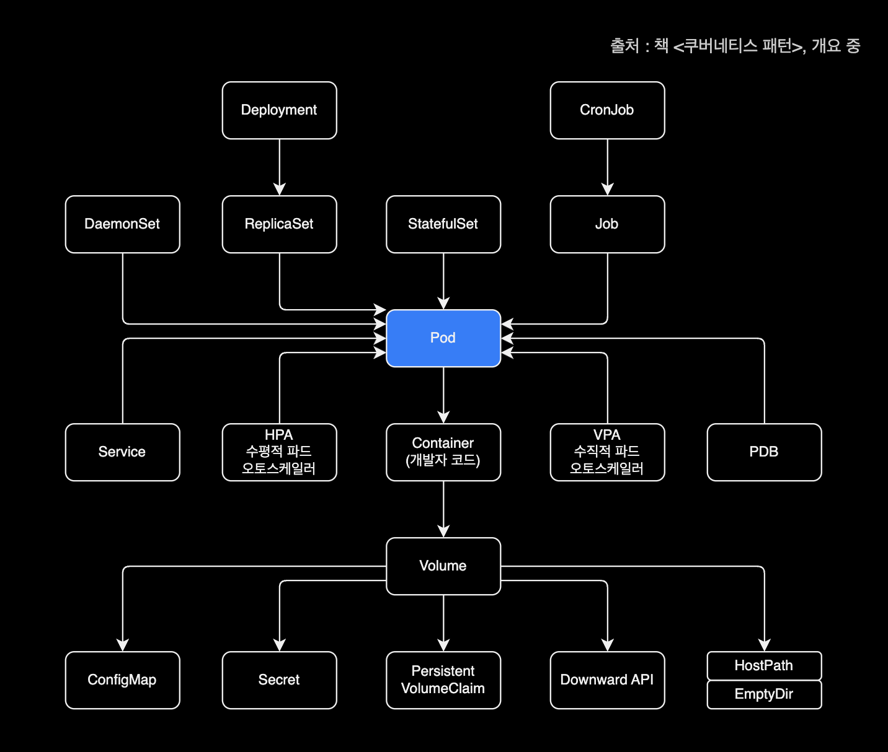
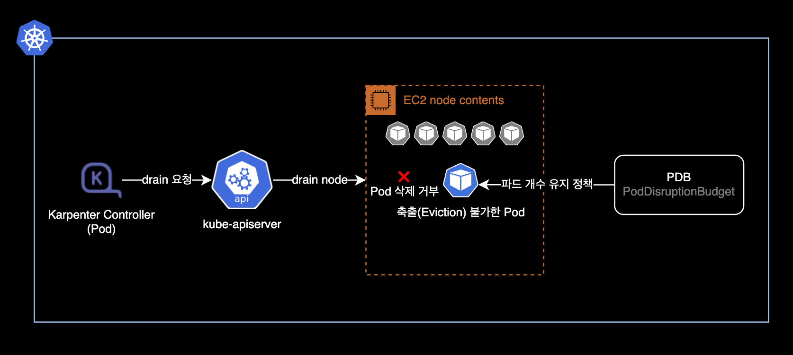

## 개요

Karpenter Controller가 불필요 노드를 자동 정리하지 못하는 문제가 발생한 경우 해결방법 기록

&nbsp;

## 환경

### 클러스터 환경

- **Cluster** : EC2 기반의 EKS 클러스터
- **Kubernetes** : v1.24
- **Cluster Autoscaler** : Karpenter `v0.26.0`를 헬름 차트 배포해서 사용중

&nbsp;

### 로컬 환경

- **OS** : macOS 13.2.1 (Ventura)
- **Helm** : v3.11.1
- **Shell** : zsh + oh-my-zsh

&nbsp;

## 배경지식

### Karpenter Consolidation

현재 EKS 클러스터에서 운영중인 Karpenter는 provisioners 리소스에 [Consolidation](https://karpenter.sh/preview/concepts/provisioners/#specconsolidation) 설정이 활성화되어 있습니다.

&nbsp;

아래는 provisioners CRD를 배포하는 `crds.yaml` 파일의 일부 내용입니다.

```yaml
---
# Reference:
# https://karpenter.sh/v0.26.0/concepts/provisioners/
apiVersion: karpenter.sh/v1alpha5
kind: Provisioner
metadata:
  name: default
  labels:
    app: karpenter
    version: v0.26.0
    maintainer: younsung.lee
spec:
  # Enables consolidation which attempts to reduce cluster cost by both removing un-needed nodes and down-sizing those
  # that can't be removed.  Mutually exclusive with the ttlSecondsAfterEmpty parameter.
  consolidation:
    enabled: true
  
  ...
```

위와 같이 `spec.consolidation.enabled` 값이 `true`이면 [Consolidation](https://karpenter.sh/preview/concepts/deprovisioning/#consolidation) 기능을 사용한다는 의미입니다.

`spec.consolidation.enabled` 값에 대한 설정이 없으면 Karpenter는 Consolidation 기능을 사용하지 않습니다. 이 경우에는 Karpenter가 한 번 노드를 생성하면 해당 노드가 비어있고 불필요한 상태가 되더라도 삭제하지 않고 계속 남아있게 됩니다.

Consolidation 설정이 활성화되어 있는 경우, Karpenter Controller는 자동으로 비어있는 노드를 정리<sup>delete</sup>하거나 합치는 등의 교체<sup>replace</sup> 작업을 수행하며 전체 노드들을 자동 관리합니다.

&nbsp;

### Pod와 PDB의 관계

Pod에 PDB<sup>Pod Disruption Budget</sup>이 붙는 형태라고 이해하면 쉽습니다.

아래는 개발자를 위한 쿠버네티스 리소스 간 관계도입니다.



&nbsp;

## 문제점

Karpenter Controller에서 노드를 자동 정리<sup>deprovisioning</sup>하지 못하는 문제가 발생했습니다.

```bash
$ kubectl get node
NAME                                                STATUS                     ROLES    AGE     VERSION
ip-xx-xxx-xxx-176.ap-northeast-2.compute.internal   Ready                      <none>   9h      v1.24.9-eks-49d8fe8
ip-xx-xxx-xxx-178.ap-northeast-2.compute.internal   Ready                      <none>   8m27s   v1.24.10-eks-48e63af
ip-xx-xxx-xxx-222.ap-northeast-2.compute.internal   Ready,SchedulingDisabled   <none>   2d6h    v1.24.10-eks-48e63af
ip-xx-xxx-xxx-91.ap-northeast-2.compute.internal    Ready                      <none>   4m4s    v1.24.10-eks-48e63af
ip-xx-xxx-xxx-236.ap-northeast-2.compute.internal   Ready                      <none>   9h      v1.24.9-eks-49d8fe8
ip-xx-xxx-xxx-65.ap-northeast-2.compute.internal    Ready                      <none>   62m     v1.24.10-eks-48e63af
```

Karpenter가 노드를 정리할 때에는 `SchedulingDisabled`된 이후 drain, Terminating 되며 노드가 자동 정리됩니다.  
하지만 현재 해당 `222`번 노드는 `SchedulingDisabled`에 멈춰있는 상태입니다.

&nbsp;

문제가 발생한 노드의 상세 정보를 확인합니다.

```bash
$ kubectl describe node ip-xx-xxx-xxx-222.ap-northeast-2.compute.internal
```

&nbsp;

`Events` 정보를 확인합니다.

```bash
...
Events:
  Type     Reason               Age                   From       Message
  ----     ------               ----                  ----       -------
  Warning  FailedDraining       4m33s (x30 over 62m)  karpenter  Failed to drain node, 3 pods are waiting to be evicted
  Warning  FailedInflightCheck  2m40s (x7 over 62m)   karpenter  Can't drain node, PDB istio-system/istiod is blocking evictions
```

Karpenter Controller는 노드를 정리하기 전에 drain 과정을 통해 해당 노드에서 구동중인 모든 파드를 다른 노드로 옮깁니다.  
그러나 PDB(PodDisruptionBudget)에 의해 거부되고 있습니다.

&nbsp;

## 원인

PodDisruptionBudget 정책으로 인해 1개로만 운영중인 `istiod` 파드를 중지할 수 없어 노드 Draining이 거부된 상황입니다.



&nbsp;

`istiod`의 `poddisruptionbudget` 정보를 확인합니다.

```bash
$ kubectl get poddisruptionbudget \
    -n istio-system istiod
```

```bash
NAME     MIN AVAILABLE   MAX UNAVAILABLE   ALLOWED DISRUPTIONS   AGE
istiod   1               N/A               0                     21d
```

항상 최소 1개의 `istiod` 파드가 유지되도록 PDB<sup>PodDisruptionBudget</sup> 정책이 설정되어 있습니다.

&nbsp;

Karpenter Controller의 최근 로그도 같이 확인합니다.

```bash
$ kubectl logs \
    -n karpenter \
    -c controller \
    -l app.kubernetes.io/name=karpenter
    --tail 100
```

&nbsp;

노드가 Draining 실패하는 자세한 원인은 Karpenter 컨트롤러 로그의 `inflightchecks` 항목에서 확인할 수 있습니다.

```bash
2023-03-02T16:24:20.089Z  INFO  controller.inflightchecks Inflight check failed for node, Can't drain node, PDB istio-system/istiod is blocking evictions {"commit": "39b48fe", "node": "ip-xx-xxx-xxx-222.ap-northeast-2.compute.internal"}
2023-03-02T16:34:20.089Z  INFO  controller.inflightchecks Inflight check failed for node, Can't drain node, PDB istio-system/istiod is blocking evictions {"commit": "39b48fe", "node": "ip-xx-xxx-xxx-222.ap-northeast-2.compute.internal"}
2023-03-02T16:44:20.090Z  INFO  controller.inflightchecks Inflight check failed for node, Can't drain node, PDB istio-system/istiod is blocking evictions {"commit": "39b48fe", "node": "ip-xx-xxx-xxx-222.ap-northeast-2.compute.internal"}
2023-03-02T16:54:20.090Z  INFO  controller.inflightchecks Inflight check failed for node, Can't drain node, PDB istio-system/istiod is blocking evictions {"commit": "39b48fe", "node": "ip-xx-xxx-xxx-222.ap-northeast-2.compute.internal"}
2023-03-02T17:04:20.092Z  INFO  controller.inflightchecks Inflight check failed for node, Can't drain node, PDB istio-system/istiod is blocking evictions {"commit": "39b48fe", "node": "ip-xx-xxx-xxx-222.ap-northeast-2.compute.internal"}
```

&nbsp;

### 해결방법

문제 해결방법은 다음 순서대로 진행합니다.

1. 노드 `drain`을 거부하고 있는 문제원인 Pod를 1개에서 2개로 스케일 아웃합니다.
2. PDB<sup>PodDisruptionBudget</sup>이 최소 1개 파드를 유지하도록 설정되어 있으므로, 이제 Karpenter가 2개 파드 중 1개 파드를 삭제해도 통과합니다.
3. 정리할 노드는 파드가 없이 빈 상태가 됩니다.
4. Karpenter Controller가 자동으로 비어있는 노드를 삭제(Terminate)합니다.

&nbsp;

### 상세 해결방법

현재 클러스터 노드 관리 에드온으로 Cluster Autoscaler 대신 Karpenter를 사용중입니다.

```bash
$ helm list -n karpenter
NAME       NAMESPACE  REVISION  UPDATED                               STATUS    CHART              APP VERSION
karpenter  karpenter  3         2023-03-03 01:13:11.505177 +0900 KST  deployed  karpenter-v0.26.0  0.26.0
```

헬름 차트 형태로 Karpenter `v0.26.0` 버전이 클러스터에 배포되어 있습니다.

&nbsp;

Karpenter Controller Pod가 정상적으로 동작하고 있는지 확인합니다.

```bash
$ kubectl get pod -n karpenter
NAME                         READY   STATUS    RESTARTS   AGE
karpenter-86b577fd9f-69rxc   1/1     Running   0          9h
karpenter-86b577fd9f-s9gj5   1/1     Running   0          9h
```

&nbsp;

일반적인 경우와 마찬가지로 `istiod` Pod는 `istiod` Deployment에 의해 컨트롤 되고 있습니다.

```bash
$ kubectl get deploy,pod \
    -n istio-system \
    -l app=istiod
```

```bash
NAME                     READY   UP-TO-DATE   AVAILABLE   AGE
deployment.apps/istiod   1/1     1            1           21d

NAME                          READY   STATUS    RESTARTS   AGE
pod/istiod-59b4475f45-zg2sm   1/1     Running   0          9h
```

&nbsp;

`istiod` Pod 개수를 1개에서 2개로 늘립니다.

```bash
$ kubectl scale deploy \
    --replicas 2 \
    -n istio-system istiod
```

```bash
deployment.apps/istiod scaled
```

&nbsp;

`istiod` deploy 상태를 확인합니다.

```bash
$ kubectl get deploy -n istio-system istiod
```

&nbsp;

2대의 파드가 Ready 상태로 운영중입니다.

```bash
NAME     READY   UP-TO-DATE   AVAILABLE   AGE
istiod   2/2     2            2           21d
```

&nbsp;

전체 워커노드 리스트를 다시 확인합니다.

```bash
$ kubectl get node
```

&nbsp;

Karpenter Controller가 PodDisruptionBudget 정책을 통과했으므로 `222`번 노드를 삭제했습니다.

```bash
NAME                                                STATUS   ROLES    AGE   VERSION
ip-xx-xxx-xxx-176.ap-northeast-2.compute.internal   Ready    <none>   18h   v1.24.9-eks-49d8fe8
ip-xx-xxx-xxx-178.ap-northeast-2.compute.internal   Ready    <none>   8h    v1.24.10-eks-48e63af
ip-xx-xxx-xxx-91.ap-northeast-2.compute.internal    Ready    <none>   8h    v1.24.10-eks-48e63af
ip-xx-xxx-xxx-236.ap-northeast-2.compute.internal   Ready    <none>   18h   v1.24.9-eks-49d8fe8
ip-xx-xxx-xxx-65.ap-northeast-2.compute.internal    Ready    <none>   9h    v1.24.10-eks-48e63af
```

&nbsp;

Karpenter Controller 로그를 다시 확인해봅니다.

```bash
$ kubectl logs -f \
    -n karpenter \
    -c controller \
    -l app.kubernetes.io/name=karpenter
```

```bash
2023-03-02T17:18:57.644Z  INFO  controller.termination  deleted node  {"commit": "39b48fe", "node": "ip-xx-xxx-xxx-222.ap-northeast-2.compute.internal"}
```

문제가 발생했던 `222`번 EC2 노드를 삭제 완료한 기록을 확인할 수 있습니다.

&nbsp;

이제 Karpenter가 노드를 자동 정리(Terminate)하지 못하는 문제가 해결되었습니다.

&nbsp;

## 참고자료

[Karpenter - Disruption budgets](https://karpenter.sh/preview/troubleshooting/#disruption-budgets)  
Karpenter 공식문서
