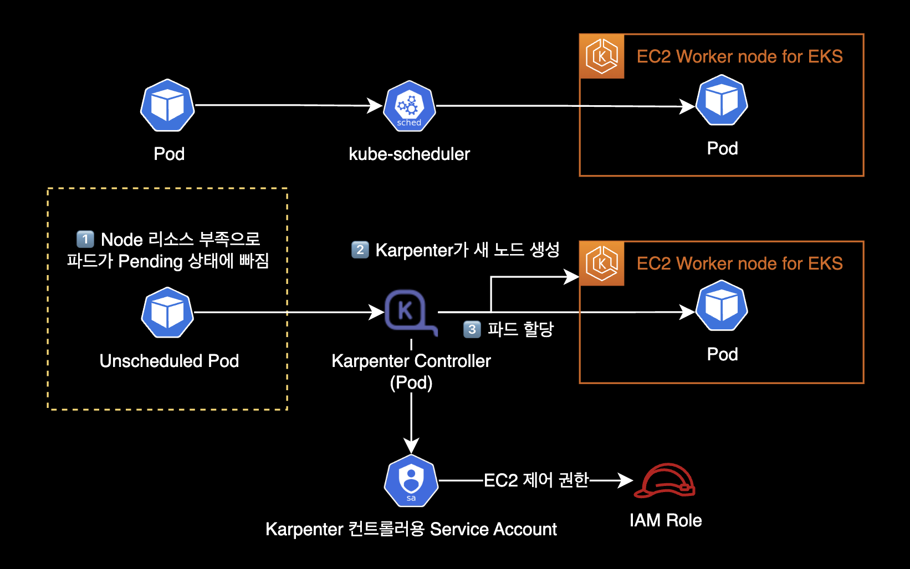
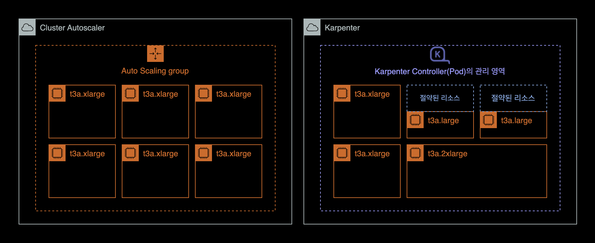
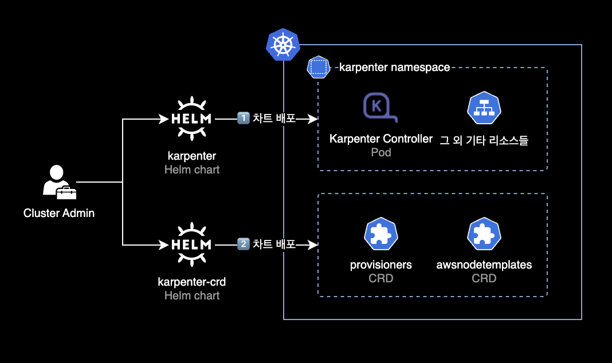
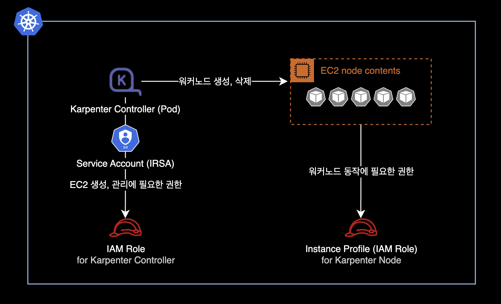

## Announcement

⚠️ This is a Karpenter Helm chart upgrade guide for v0.26.0 to v0.26.1, which are now deprecated. Use this only as a reference.

## Overview

This guide shows how to upgrade Karpenter from v0.26.0 to v0.26.1 on an EKS cluster using Helm.

## Important notes

This guide assumes you already have an older version of Karpenter installed on your EKS cluster.

This is not a fresh install. We are upgrading from Karpenter v0.26.0 to v0.26.1.

## Background

### Karpenter

Karpenter is an open source cluster autoscaler. It detects pods that cannot be scheduled and creates new nodes automatically.



Unlike Kubernetes Cluster Autoscaler which uses ASG<sup>Auto Scaling Group</sup>, Karpenter Controller (Pod) creates and deletes EC2 instances directly.



Here are the benefits of Karpenter:

- Karpenter manages instances directly without ASG. This makes node creation and deletion faster.
- Karpenter does not use node groups or auto scaling groups. This makes cluster node management easier.
- Karpenter calculates CPU and memory needs for pending pods. It picks the right mix of instance types. This saves EC2 costs and allows flexible scaling.

### Karpenter charts



Helm chart is the recommended way to install Karpenter in most cases. Karpenter uses two Helm charts:

- [karpenter](https://github.com/aws/karpenter-provider-aws/tree/main/charts/karpenter): Karpenter Controller. Deployed via Helm chart.
- [karpenter-crd](https://github.com/aws/karpenter-provider-aws/tree/main/charts/karpenter-crd): Karpenter CRDs. Deployed via Helm chart.

After deploying both charts, you need to create `provisioners` and `awsnodetemplates` resources using `kubectl apply`. The Karpenter Controller uses these resources.

## Environment

### Cluster environment

- **EKS v1.24**
- **Node CPU architecture**: AMD64 (x86_64)
- **Karpenter**: v0.26.0 → v0.26.1
  - Install and upgrade via Helm chart
  - Karpenter CRD also upgrades from v0.26.0 to v0.26.1

### Local environment

- **OS**: macOS 13.2.1 (Ventura)
- **Helm**: v3.11.1

## Upgrade steps

### 1. Set environment variable

Set the Karpenter version in your terminal.

```bash
KARPENTER_VERSION=v0.26.1
```

You can find all versions on the [Karpenter Github Releases](https://github.com/aws/karpenter/releases) page.

### 2. Install Karpenter Controller

#### Write Karpenter Controller values

- This guide assumes you have an older Karpenter Helm chart already deployed on your cluster.

- You need IAM roles for the Karpenter Controller and Instance Profile for nodes. See the [Karpenter initial install](/blog/karpenter/) guide for setup steps.



- Creating IAM roles is outside the scope of this guide.

##### Download chart (optional)

To check the default values file or template structure, download the chart locally with `helm pull`. Use `--untar` to get the chart directory instead of a `.tgz` file.

```bash
helm pull oci://public.ecr.aws/karpenter/karpenter \
    --version ${KARPENTER_VERSION} \
    --untar
```

After download, you will see a `karpenter/` directory. Inside, you can check the `values.yaml` file and template structure.

##### values.yaml example

I wrote a `values.yaml` file for the Karpenter Controller.
This deploys Karpenter version `v0.26.1`.

```yaml
# -- Overrides the chart's name.
nameOverride: ""
# -- Overrides the chart's computed fullname.
fullnameOverride: ""
# -- Additional labels to add into metadata.
additionalLabels: {
  app: karpenter
}

# -- Additional annotations to add into metadata.
additionalAnnotations: {}
# -- Image pull policy for Docker images.
imagePullPolicy: IfNotPresent
# -- Image pull secrets for Docker images.
imagePullSecrets: []
serviceAccount:
  # -- Specifies if a ServiceAccount should be created.
  create: true
  # -- The name of the ServiceAccount to use.
  # If not set and create is true, a name is generated using the fullname template.
  name: "karpenter"
  # -- Additional annotations for the ServiceAccount.
  annotations: {
    eks.amazonaws.com/role-arn: "arn:aws:iam::111122223333:role/KarpenterControllerRole-<YOUR_CLUSTER_NAME_HERE>"
  }
# -- Specifies additional rules for the core ClusterRole.
additionalClusterRoleRules: []
serviceMonitor:
  # -- Specifies whether a ServiceMonitor should be created.
  enabled: false
  # -- Additional labels for the ServiceMonitor.
  additionalLabels: {}
  # -- Endpoint configuration for the ServiceMonitor.
  endpointConfig: {}
# -- Number of replicas.
replicas: 2
# -- The number of old ReplicaSets to retain to allow rollback.
revisionHistoryLimit: 10
# -- Strategy for updating the pod.
strategy:
  rollingUpdate:
    maxUnavailable: 1
# -- Additional labels for the pod.
podLabels: {}
# -- Additional annotations for the pod.
podAnnotations: {}
podDisruptionBudget:
  name: karpenter
  maxUnavailable: 1
# -- SecurityContext for the pod.
podSecurityContext:
  fsGroup: 1000
# -- PriorityClass name for the pod.
priorityClassName: system-cluster-critical
# -- Override the default termination grace period for the pod.
terminationGracePeriodSeconds:
# -- Bind the pod to the host network.
# This is required when using a custom CNI.
hostNetwork: false
# -- Configure the DNS Policy for the pod
dnsPolicy: Default
# -- Configure DNS Config for the pod
dnsConfig: {}
#  options:
#    - name: ndots
#      value: "1"
# -- Node selectors to schedule the pod to nodes with labels.
nodeSelector:
  kubernetes.io/os: linux
# -- Affinity rules for scheduling the pod.
affinity:
  nodeAffinity:
    requiredDuringSchedulingIgnoredDuringExecution:
      nodeSelectorTerms:
        - matchExpressions:
            - key: karpenter.sh/provisioner-name
              operator: DoesNotExist
        - matchExpressions:
            - key: eks.amazonaws.com/nodegroup
              operator: In
              values:
              # Deploy Karpenter Controller (Pod) to existing node group via nodeAffinity
              - <YOUR_NODEGROUP_NAME_HERE>
  podAntiAffinity:
    preferredDuringSchedulingIgnoredDuringExecution:
    - weight: 100
      podAffinityTerm:
        labelSelector:
          matchExpressions:
          - key: app.kubernetes.io/instance
            operator: In
            values:
            - karpenter
        topologyKey: "kubernetes.io/hostname"
# -- topologySpreadConstraints to increase the controller resilience
topologySpreadConstraints:
  - maxSkew: 1
    topologyKey: topology.kubernetes.io/zone
    whenUnsatisfiable: ScheduleAnyway
# -- Tolerations to allow the pod to be scheduled to nodes with taints.
tolerations:
  - key: CriticalAddonsOnly
    operator: Exists
# -- Additional volumes for the pod.
extraVolumes: []
# - name: aws-iam-token
#   projected:
#     defaultMode: 420
#     sources:
#     - serviceAccountToken:
#         audience: sts.amazonaws.com
#         expirationSeconds: 86400
#         path: token

# -- Array of extra K8s manifests to deploy 
extraObjects: []
#- apiVersion: karpenter.k8s.aws/v1alpha1
#  kind: AWSNodeTemplate
#  metadata:
#    name: default
#  spec:
#    subnetSelector:
#      karpenter.sh/discovery: {CLUSTER_NAME}
#    securityGroupSelector:
#      karpenter.sh/discovery: {CLUSTER_NAME}

controller:
  image:
    # -- Repository path to the controller image.
    repository: public.ecr.aws/karpenter/controller
    # -- Tag of the controller image.
    tag: v0.26.1
    # -- SHA256 digest of the controller image.
    digest: sha256:5dfe506624961f386b68556dd1cc850bfe3a42b62d2dd5dcb8b21d1a89ec817c
  # -- SecurityContext for the controller container.
  securityContext: {}
  # -- Additional environment variables for the controller pod.
  env: []
  # - name: AWS_REGION
  #   value: eu-west-1
  envFrom: []
  # -- Resources for the controller pod.
  resources: {}
  # We usually recommend not to specify default resources and to leave this as a conscious
  # choice for the user. This also increases chances charts run on environments with little
  # resources, such as Minikube. If you do want to specify resources, uncomment the following
  # lines, adjust them as necessary, and remove the curly braces after 'resources:'.
  #  requests:
  #    cpu: 1
  #    memory: 1Gi
  #  limits:
  #    cpu: 1
  #    memory: 1Gi

  # -- Controller outputPaths - default to stdout only
  outputPaths:
    - stdout
  # -- Controller errorOutputPaths - default to stderr only
  errorOutputPaths:
    - stderr
  # -- Controller log level, defaults to the global log level
  logLevel: ""
  # -- Controller log encoding, defaults to the global log encoding
  logEncoding: ""
  # -- Additional volumeMounts for the controller pod.
  extraVolumeMounts: []
  # - name: aws-iam-token
  #   mountPath: /var/run/secrets/eks.amazonaws.com/serviceaccount
  #   readOnly: true
  # -- Additional sidecarContainer config
  sidecarContainer: []
  # -- Additional volumeMounts for the sidecar - this will be added to the volume mounts on top of extraVolumeMounts
  sidecarVolumeMounts: []
  metrics:
    # -- The container port to use for metrics.
    port: 8080
  healthProbe:
    # -- The container port to use for http health probe.
    port: 8081
webhook:
  logLevel: error
  # -- The container port to use for the webhook.
  port: 8443
# -- Global log level
logLevel: debug
# -- Gloabl log encoding
logEncoding: console
# -- Global Settings to configure Karpenter
settings:
  # -- The maximum length of a batch window. The longer this is, the more pods we can consider for provisioning at one
  # time which usually results in fewer but larger nodes.
  batchMaxDuration: 10s
  # -- The maximum amount of time with no new ending pods that if exceeded ends the current batching window. If pods arrive
  # faster than this time, the batching window will be extended up to the maxDuration. If they arrive slower, the pods
  # will be batched separately.
  batchIdleDuration: 1s
  # -- AWS-specific configuration values
  aws:
    # -- Cluster name.
    clusterName: "<YOUR_CLUSTER_NAME>"
    # -- Cluster endpoint. If not set, will be discovered during startup (EKS only)
    clusterEndpoint: ""
    # -- The default instance profile to use when launching nodes
    defaultInstanceProfile: "KarpenterNodeInstanceProfile-<YOUR_CLUSTER_NAME_HERE>"
    # -- If true then instances that support pod ENI will report a vpc.amazonaws.com/pod-eni resource
    enablePodENI: false
    # -- Indicates whether new nodes should use ENI-based pod density
    # DEPRECATED: Use `.spec.kubeletConfiguration.maxPods` to set pod density on a per-provisioner basis
    enableENILimitedPodDensity: true
    # -- If true then assume we can't reach AWS services which don't have a VPC endpoint
    # This also has the effect of disabling look-ups to the AWS pricing endpoint
    isolatedVPC: false
    # -- The node naming convention (either "ip-name" or "resource-name")
    nodeNameConvention: "ip-name"
    # -- The VM memory overhead as a percent that will be subtracted from the total memory for all instance types
    vmMemoryOverheadPercent: 0.075
    # -- interruptionQueueName is disabled if not specified. Enabling interruption handling may
    # require additional permissions on the controller service account. Additional permissions are outlined in the docs.
    interruptionQueueName: ""
    # -- The global tags to use on all AWS infrastructure resources (launch templates, instances, etc.) across node templates
    tags:
      Creator: "younsung.lee@company.com"
      ManagedBy: "Helm"
      Maintainer: "younsung.lee@company.com"

```

This `values.yaml` is based on the official [values.yaml](https://github.com/aws/karpenter/blob/main/charts/karpenter/values.yaml) from the Karpenter Github repo.

#### Deploy Karpenter Controller with Helm

Install the Karpenter Controller using Helm.

This command works for both fresh installs and version upgrades.

```bash
$ helm upgrade \
    --install \
    --namespace karpenter \
    --create-namespace \
    karpenter oci://public.ecr.aws/karpenter/karpenter \
    --version ${KARPENTER_VERSION} \
    --values values.yaml \
    --wait
```

```bash
Pulled: public.ecr.aws/karpenter/karpenter:v0.26.1
Digest: sha256:xxxxxxxxxxxxxxxxxxxxxxxxxxxxxxxxxxxxxxxxxxxxxxxxxxxxxxxxxxxxxxxx
Release "karpenter" has been upgraded. Happy Helming!
NAME: karpenter
LAST DEPLOYED: Mon Mar  6 21:47:08 2023
NAMESPACE: karpenter
STATUS: deployed
REVISION: 5
TEST SUITE: None
```

If you see `deployed` status, the deployment was successful.

Check the current status of the Karpenter Controller.

```bash
$ kubectl get pod \
    -n karpenter \
    -o wide
```

```bash
NAME                         READY   STATUS    RESTARTS   AGE   IP               NODE                                                NOMINATED NODE   READINESS GATES
karpenter-7b6b6f6bfd-t2zvh   1/1     Running   0          10m   xx.xxx.xxx.14    ip-xx-xxx-xxx-236.ap-northeast-2.compute.internal   <none>           <none>
karpenter-7b6b6f6bfd-xkc9q   1/1     Running   0          10m   xx.xxx.xxx.196   ip-xx-xxx-xxx-176.ap-northeast-2.compute.internal   <none>           <none>
```

By default, the Helm chart deploys 2 Karpenter Controller pods.

Check the recent logs of the Karpenter Controller pods.

```bash
$ kubectl logs -f \
    -n karpenter \
    -c controller \
    -l app.kubernetes.io/name=karpenter
```

### 3. Install Karpenter CRDs

Install the CRD chart for the Karpenter Controller.

This command works for both fresh installs and version upgrades.

```bash
$ helm upgrade \
    --install \
    --namespace karpenter \
    --create-namespace \
    karpenter-crd oci://public.ecr.aws/karpenter/karpenter-crd \
    --version ${KARPENTER_VERSION} \
    --wait
```

```bash
Release "karpenter" has been upgraded. Happy Helming!
Pulled: public.ecr.aws/karpenter/karpenter-crd:v0.26.1
Digest: sha256:xxxxxxxxxxxxxxxxxxxxxxxxxxxxxxxxxxxxxxxxxxxxxxxxxxxxxxxxxxxxxxxx
NAME: karpenter-crd
LAST DEPLOYED: Mon Mar  6 21:03:51 2023
NAMESPACE: karpenter
STATUS: deployed
REVISION: 2
TEST SUITE: None
```

If you see `deployed` status, the deployment was successful.

### 4. Check chart results

Check the chart info and deployment status for `karpenter` and `karpenter-crd`.

```bash
$ helm list -n karpenter
```

```bash
NAME            NAMESPACE   REVISION    UPDATED                                 STATUS      CHART                   APP VERSION
karpenter       karpenter   5           2023-03-06 21:47:08.187374 +0900 KST    deployed    karpenter-v0.26.1       0.26.1
karpenter-crd   karpenter   2           2023-03-06 21:03:51.831199 +0900 KST    deployed    karpenter-crd-v0.26.1   0.26.1
```

Both Karpenter Controller and CRD are deployed at version `v0.26.1`.

### 5. Create CRDs

Check the CRD creation results.

```bash
$ kubectl api-resources \
    --categories karpenter \
    -o wide
```

```bash
NAME               SHORTNAMES   APIVERSION                   NAMESPACED   KIND              VERBS                                                        CATEGORIES
awsnodetemplates                karpenter.k8s.aws/v1alpha1   false        AWSNodeTemplate   delete,deletecollection,get,list,patch,create,update,watch   karpenter
provisioners                    karpenter.sh/v1alpha5        false        Provisioner       delete,deletecollection,get,list,patch,create,update,watch   karpenter
```

You can see `provisioners` and `awsnodetemplates` CRDs are in use.

The Karpenter Controller Pod uses these 2 CRDs to provision new EC2 nodes:

- **provisioners**: Instance types, kubelet parameters, consolidation<sup>auto cleanup of unused nodes</sup> settings, etc.
- **awsnodetemplates**: AMI, subnet, security group settings, etc.

#### crds.yaml example

Create a `crds.yaml` file to set up the default CRDs.

```yaml
cat << EOF > crds.yaml
---
# Reference:
# https://karpenter.sh/v0.26.1/concepts/provisioners/
apiVersion: karpenter.sh/v1alpha5
kind: Provisioner
metadata:
  name: default
  labels:
    app: karpenter
    version: v0.26.1
    maintainer: younsung.lee
spec:
  # Enables consolidation which attempts to reduce cluster cost by both removing un-needed nodes and down-sizing those
  # that can't be removed.  Mutually exclusive with the ttlSecondsAfterEmpty parameter.
  consolidation:
    enabled: true

  # If omitted, the feature is disabled and nodes will never expire.  If set to less time than it requires for a node
  # to become ready, the node may expire before any pods successfully start.
  ttlSecondsUntilExpired: 1209600 # 14 Days = 60 * 60 * 24 * 14 Seconds;

  requirements:
    - key: karpenter.sh/capacity-type
      operator: In
      values: ["on-demand"]
    - key: karpenter.k8s.aws/instance-family
      operator: In
      values: ["t3a"]
    - key: karpenter.k8s.aws/instance-size
      operator: In
      values: ["nano", "micro", "small", "medium", "large", "xlarge"]
    - key: kubernetes.io/os
      operator: In
      values: ["linux"]
    - key: kubernetes.io/arch
      operator: In
      values: ["amd64"]
    - key: topology.kubernetes.io/zone
      operator: In
      values: ["ap-northeast-2a", "ap-northeast-2c"]
  providerRef:
    name: default

---
# Reference:
# https://karpenter.sh/v0.26.1/concepts/node-templates/
apiVersion: karpenter.k8s.aws/v1alpha1
kind: AWSNodeTemplate
metadata:
  name: default
  labels:
    app: karpenter
    version: v0.26.1
    maintainer: younsung.lee
spec:
  amiFamily: AL2
  subnetSelector:
    karpenter.sh/discovery: <YOUR_CLUSTER_NAME_HERE>
  securityGroupSelector:
    karpenter.sh/discovery: <YOUR_CLUSTER_NAME_HERE>
EOF
```

Create `provisioners` and `awsnodetemplates` in the EKS cluster.

```bash
$ kubectl apply -f crds.yaml
```

```bash
provisioner.karpenter.sh/default created
awsnodetemplate.karpenter.k8s.aws/default created
```

The `provisioners` and `awsnodetemplates` resources are created.
Note that these resources are cluster-scoped, not namespace-scoped.

You can list the current Karpenter CRDs with `kubectl get`.

```bash
$ kubectl get provisioners,awsnodetemplates
```

```bash
NAME                               AGE
provisioner.karpenter.sh/default   68m

NAME                                        AGE
awsnodetemplate.karpenter.k8s.aws/default   68m
```

### 6. Monitoring

#### Monitor Karpenter Controller logs

Monitor the Karpenter Controller logs for at least 10 minutes.

```bash
$ kubectl logs -f \
    -n karpenter \
    -c controller \
    -l app.kubernetes.io/name=karpenter
```

In normal situations, you will only see `DEBUG` and `INFO` level logs.

If you see `ERROR` level logs repeatedly, there may be IAM permission issues or config errors. Fix these issues for the Karpenter Controller to work properly.

#### Monitor node status

Also monitor the overall worker node status.

```bash
$ kubectl get node -L beta.kubernetes.io/instance-type
```

```bash
NAME                                                STATUS   ROLES    AGE    VERSION                INSTANCE-TYPE
ip-xx-xxx-xxx-132.ap-northeast-2.compute.internal   Ready    <none>   13m    v1.24.10-eks-48e63af   t3a.medium
ip-xx-xxx-xxx-176.ap-northeast-2.compute.internal   Ready    <none>   4d4h   v1.24.9-eks-49d8fe8    t3a.medium
ip-xx-xxx-xxx-171.ap-northeast-2.compute.internal   Ready    <none>   13m    v1.24.10-eks-48e63af   t3a.xlarge
ip-xx-xxx-xxx-236.ap-northeast-2.compute.internal   Ready    <none>   4d4h   v1.24.9-eks-49d8fe8    t3a.medium
```

## Result

Karpenter upgrade from `v0.26.0` to `v0.26.1` is complete.

```bash
$ helm list -n karpenter
```

```bash
NAME            NAMESPACE   REVISION    UPDATED                                 STATUS      CHART                   APP VERSION
karpenter       karpenter   5           2023-03-06 21:47:08.187374 +0900 KST    deployed    karpenter-v0.26.1       0.26.1
karpenter-crd   karpenter   2           2023-03-06 21:03:51.831199 +0900 KST    deployed    karpenter-crd-v0.26.1   0.26.1
```

## References

- [Karpenter v0.26.1 Upgrade Guide](https://karpenter.sh/v0.26.1/upgrade-guide/): Official Karpenter docs
- [Github - Karpenter](https://github.com/aws/karpenter/tree/main/charts/karpenter): `karpenter` chart
- [Github - Karpenter CRD](https://github.com/aws/karpenter/tree/main/charts/karpenter-crd): `karpenter-crd` chart
