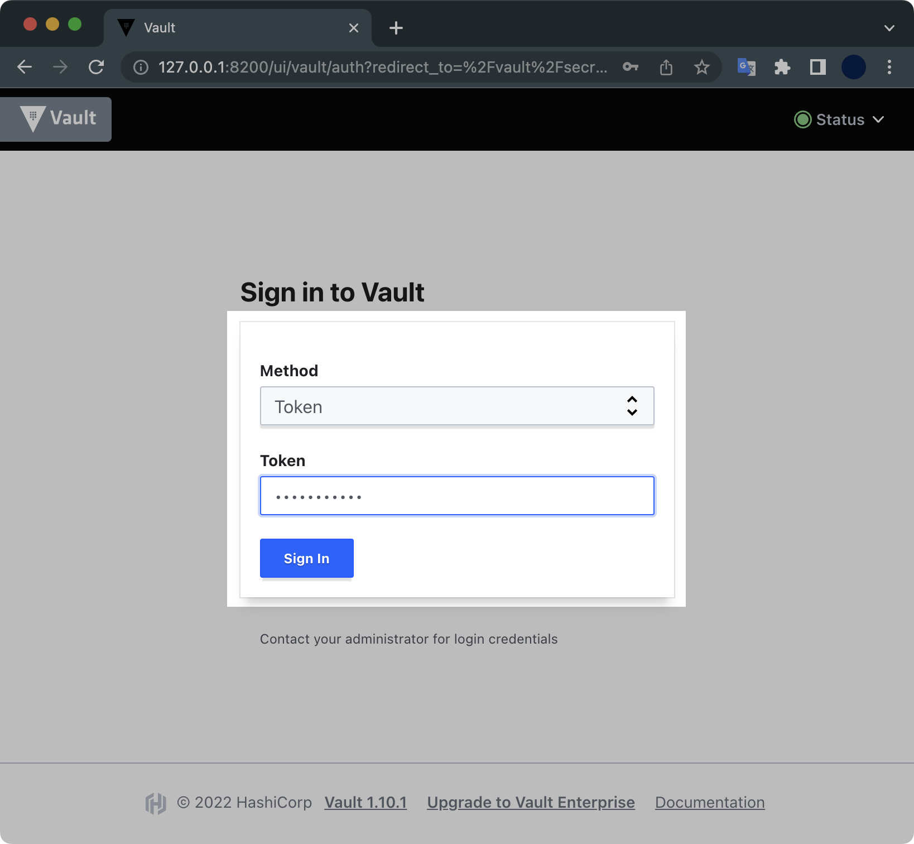
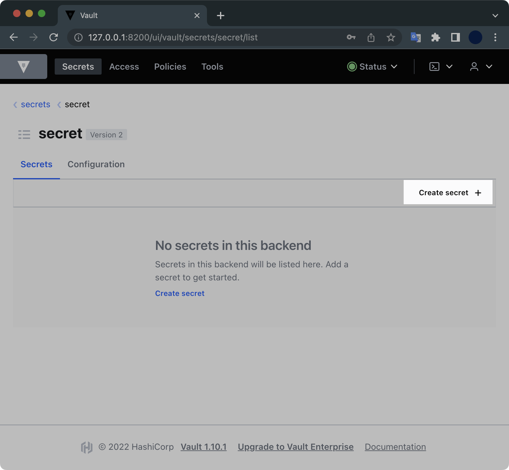
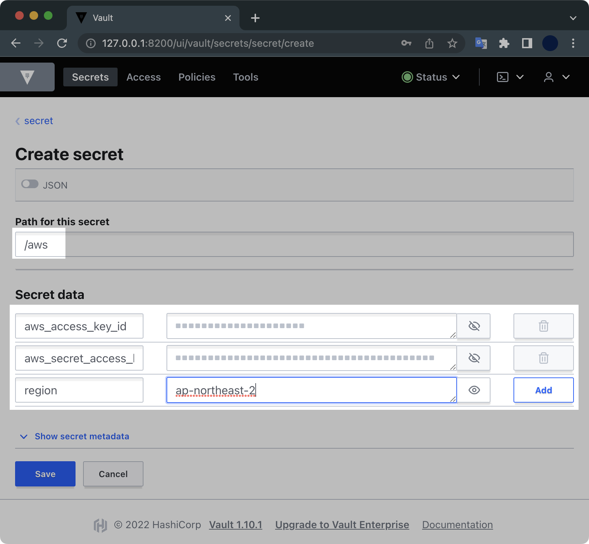
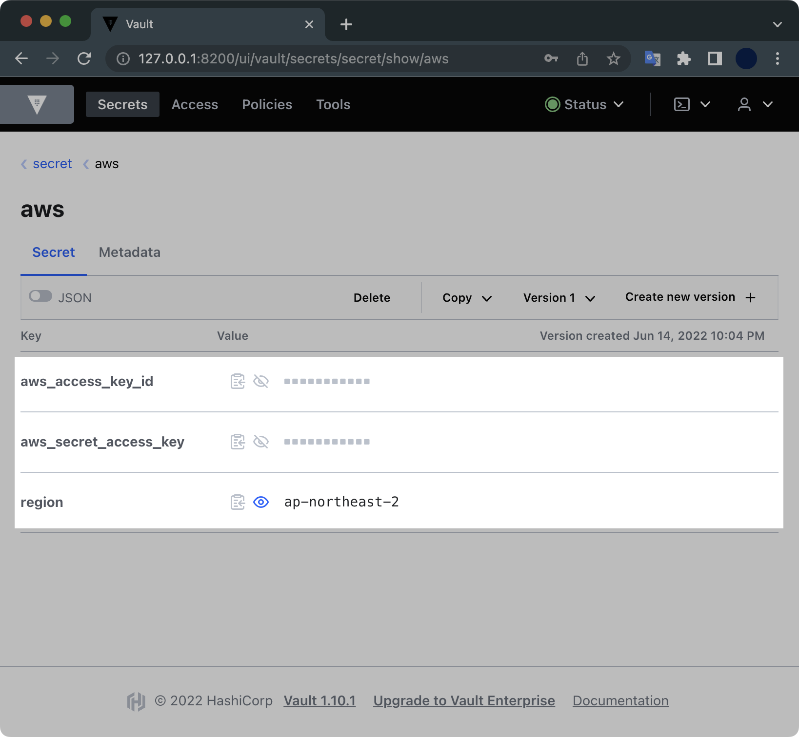

## 개요

Vault라는 솔루션이 어떤 건지 감이 안잡히는 분들을 위해 이 글을 작성합니다. 이 튜토리얼로 직접 실습해보면서 볼트에 대해 어렴풋이 이해할 수 있기를 바랍니다.

이 글에 작성된 실습 예제에서는 다음과 같은 내용을 다룹니다.

- 로컬 환경에 vault를 설치하고 개발 서버를 구축합니다.
- vault에 키를 생성하고 저장합니다.
- 테라폼으로 EC2 인스턴스를 배포할 때 Vault의 키를 가져오도록 설정하는 방법을 소개합니다.

&nbsp;

## 환경

- **OS** : macOS Monterey 12.4
- **Shell** : zsh + oh-my-zsh
- Homebrew 3.5.2

&nbsp;

## 전제조건

- macOS용 패키지 관리자인 brew가 설치되어 있어야 합니다.
- 테라폼을 실행할 AWS IAM의 Administrator 권한과 Access Key, Secret Key가 있어야 합니다.

&nbsp;

## 배경지식

Vault는 HashiCorp 사가 개발한 크로스플랫폼 패스워드 및 인증 관리 시스템입니다. 공개되면 안되는 비밀번호, API 키, 토큰 등을 저장하고 관리합니다.

볼트의 장점은 다양한 Cloud Provider와 Secret 종류들을 중앙에서 제공할 수 있다는 점입니다.

아래는 볼트의 아키텍처입니다.


‘Manage Secrets and Protect Sensitive Data, Secure dynamic infrastructure across clouds and environments’ 라는 컨셉으로 다양하게 변화하는 Cloud 환경에서 민감하게 제어되어야 하는 Secrets (Token, 암호, 인증서, SSH Key 등)을 안전하게 보관하고 제어할 수 있도록 해주는 저장소 서비스라고 이해하면 될 듯 합니다.

&nbsp;

## 데모

### Vault 설치

brew를 사용해서 최신 버전의 볼트를 로컬에 설치합니다.

```bash
$ brew install vault
```

&nbsp;

`vault` 명령어가 동작하는지 확인합니다.

```bash
$ vault version
Vault v1.10.1 ('e452e9b30a9c2c8adfa1611c26eb472090adc767+CHANGES')
```

&nbsp;

### 로컬 Vault 서버 시작

개발용 Vault 서버를 로컬에 띄우겠습니다.

```bash
$ vault server -dev \
    -dev-root-token-id="environment"
```

&nbsp;

명령어 실행결과는 다음과 같습니다.

```bash
==> Vault server configuration:

             Api Address: http://127.0.0.1:8200
                     Cgo: disabled
         Cluster Address: https://127.0.0.1:8201
              Go Version: go1.18.1
              Listener 1: tcp (addr: "127.0.0.1:8200", cluster address: "127.0.0.1:8201", max_request_duration: "1m30s", max_request_size: "33554432", tls: "disabled")
               Log Level: info
                   Mlock: supported: false, enabled: false
           Recovery Mode: false
                 Storage: inmem
                 Version: Vault v1.10.1
             Version Sha: e452e9b30a9c2c8adfa1611c26eb472090adc767+CHANGES

==> Vault server started! Log data will stream in below:

2022-06-14T21:41:45.810+0900 [INFO]  proxy environment: http_proxy="" https_proxy="" no_proxy=""
2022-06-14T21:41:45.810+0900 [WARN]  no `api_addr` value specified in config or in VAULT_API_ADDR; falling back to detection if possible, but this value should be manually set
2022-06-14T21:41:45.811+0900 [INFO]  core: Initializing versionTimestamps for core
2022-06-14T21:41:45.811+0900 [INFO]  core: security barrier not initialized
2022-06-14T21:41:45.811+0900 [INFO]  core: security barrier initialized: stored=1 shares=1 threshold=1
2022-06-14T21:41:45.811+0900 [INFO]  core: post-unseal setup starting
2022-06-14T21:41:45.813+0900 [INFO]  core: loaded wrapping token key
2022-06-14T21:41:45.813+0900 [INFO]  core: Recorded vault version: vault version=1.10.1 upgrade time="2022-06-14 12:41:45.813223 +0000 UTC"
2022-06-14T21:41:45.813+0900 [INFO]  core: successfully setup plugin catalog: plugin-directory=""
2022-06-14T21:41:45.813+0900 [INFO]  core: no mounts; adding default mount table
2022-06-14T21:41:45.813+0900 [INFO]  core: successfully mounted backend: type=cubbyhole path=cubbyhole/
2022-06-14T21:41:45.813+0900 [INFO]  core: successfully mounted backend: type=system path=sys/
2022-06-14T21:41:45.813+0900 [INFO]  core: successfully mounted backend: type=identity path=identity/
2022-06-14T21:41:45.814+0900 [INFO]  core: successfully enabled credential backend: type=token path=token/
2022-06-14T21:41:45.814+0900 [INFO]  rollback: starting rollback manager
2022-06-14T21:41:45.815+0900 [INFO]  core: restoring leases
2022-06-14T21:41:45.815+0900 [INFO]  expiration: lease restore complete
2022-06-14T21:41:45.815+0900 [INFO]  identity: entities restored
2022-06-14T21:41:45.815+0900 [INFO]  identity: groups restored
2022-06-14T21:41:46.020+0900 [INFO]  core: post-unseal setup complete
2022-06-14T21:41:46.020+0900 [INFO]  core: root token generated
2022-06-14T21:41:46.020+0900 [INFO]  core: pre-seal teardown starting
2022-06-14T21:41:46.020+0900 [INFO]  rollback: stopping rollback manager
2022-06-14T21:41:46.020+0900 [INFO]  core: pre-seal teardown complete
2022-06-14T21:41:46.020+0900 [INFO]  core.cluster-listener.tcp: starting listener: listener_address=127.0.0.1:8201
2022-06-14T21:41:46.020+0900 [INFO]  core.cluster-listener: serving cluster requests: cluster_listen_address=127.0.0.1:8201
2022-06-14T21:41:46.020+0900 [INFO]  core: post-unseal setup starting
2022-06-14T21:41:46.020+0900 [INFO]  core: loaded wrapping token key
2022-06-14T21:41:46.020+0900 [INFO]  core: successfully setup plugin catalog: plugin-directory=""
2022-06-14T21:41:46.020+0900 [INFO]  core: successfully mounted backend: type=system path=sys/
2022-06-14T21:41:46.020+0900 [INFO]  core: successfully mounted backend: type=identity path=identity/
2022-06-14T21:41:46.020+0900 [INFO]  core: successfully mounted backend: type=cubbyhole path=cubbyhole/
2022-06-14T21:41:46.021+0900 [INFO]  core: successfully enabled credential backend: type=token path=token/
2022-06-14T21:41:46.021+0900 [INFO]  rollback: starting rollback manager
2022-06-14T21:41:46.021+0900 [INFO]  core: restoring leases
2022-06-14T21:41:46.021+0900 [INFO]  identity: entities restored
2022-06-14T21:41:46.021+0900 [INFO]  identity: groups restored
2022-06-14T21:41:46.021+0900 [INFO]  core: post-unseal setup complete
2022-06-14T21:41:46.021+0900 [INFO]  core: vault is unsealed
2022-06-14T21:41:46.022+0900 [INFO]  expiration: lease restore complete
2022-06-14T21:41:46.022+0900 [INFO]  expiration: revoked lease: lease_id=auth/token/root/ha0bd2026f65d879aa21234ba2754f71bf0a6a6cb3487e11bf95b579ba5f722b7
2022-06-14T21:41:46.024+0900 [INFO]  core: successful mount: namespace="" path=secret/ type=kv
2022-06-14T21:41:46.035+0900 [INFO]  secrets.kv.kv_d2b4bf33: collecting keys to upgrade
2022-06-14T21:41:46.035+0900 [INFO]  secrets.kv.kv_d2b4bf33: done collecting keys: num_keys=1
2022-06-14T21:41:46.035+0900 [INFO]  secrets.kv.kv_d2b4bf33: upgrading keys finished
WARNING! dev mode is enabled! In this mode, Vault runs entirely in-memory
and starts unsealed with a single unseal key. The root token is already
authenticated to the CLI, so you can immediately begin using Vault.

You may need to set the following environment variable:

    $ export VAULT_ADDR='http://127.0.0.1:8200'

The unseal key and root token are displayed below in case you want to
seal/unseal the Vault or re-authenticate.

Unseal Key: 7EVjAVuu7sOtz6/9QBs0R652qYB8ErrH0ydQ4Ci+Vng=
Root Token: environment

Development mode should NOT be used in production installations!
```

마지막 라인 부근에 출력된 `VAULT_ADDR`, `Unseal Key`, `Root Token` 값은 이후 Vault에 로그인하고 테라폼 배포할 때 사용하는 중요한 정보이기 때문에 따로 기록해둡니다.

&nbsp;

### 시크릿 구성

로컬 Vault 웹서버 주소인 <http://127.0.0.1:8200>으로 접속합니다.



- **Method** : Token
- **Token** : environment

토큰 값은 vault 서버 시작시에 출력되었던 `Root Token` 값을 입력합니다.

&nbsp;



Vault에 로그인 되었습니다.  
Create secret 버튼을 클릭합니다.

&nbsp;



- `aws_access_key_id`
- `aws_secret_access_key`
- `region`

위 3개의 Secret data를 입력하고 [Save] 버튼을 누릅니다.

&nbsp;



Secret data가 새롭게 생성된 걸 확인할 수 있습니다.

&nbsp;

### 테라폼 코드 작성

테라폼 배포할 코드는 다음과 같은 구조입니다.  

```bash
$ tree
.
├── instance.tf
├── provider.tf
├── variables.tf
└── versions.tf

0 directories, 4 files
```

테라폼 코드는 4개 파일로 분할 구성됩니다.  
결국은 t3.micro 타입의 EC2 인스턴스 1대를 배포한다는 내용입니다.

&nbsp;

각 코드의 내용은 다음과 같습니다.  
아래 내용들을 복사 붙여넣기 해서 한 디렉토리에 모아 담도록 합니다.

```terraform
# [1/4] instance.tf

resource "aws_instance" "example" {
  ami           = var.AMIS[var.AWS_REGION]
  instance_type = "t3.micro"
  provisioner "local-exec" {
    command = "echo ${aws_instance.example.private_ip} >> private_ips.txt"
  }

  tags = {
    Name      = "vault-test-ec2"
    ManagedBy = "terraform"
  }
}

output "ip" {
  value = aws_instance.example.public_ip
}

```

인스턴스 타입으로는 `t3.micro`를 사용하겠습니다.  
`output`으로 생성한 EC2 인스턴스의 Public IP가 출력되도록 설정했습니다.

&nbsp;

```terraform
# [2/4] provider.tf

terraform {
  required_providers {
    aws = {
      source  = "hashicorp/aws"
      version = "= 4.7.0"
    }
  }
}

# ========================================
# Vault
# ========================================
data "vault_generic_secret" "aws_creds" {
    path = "secret/aws"
}

provider "aws" {
  region     = data.vault_generic_secret.aws_creds.data["region"]
  access_key = data.vault_generic_secret.aws_creds.data["aws_access_key_id"]
  secret_key = data.vault_generic_secret.aws_creds.data["aws_secret_access_key"]
}

```

테라폼으로 배포할 때 볼트에 들어있는 Access Key, Secret Key, Region을 사용할 예정입니다.

&nbsp;

```terraform
# [3/4] variables.tf

variable "AWS_REGION" {
  default = "ap-northeast-2"
}

variable "AMIS" {
  type        = map(string)
  description = "The id of the machine image (AMI) to use for the server."

  #------------------------------------------
  # Amazon Linux 2 AMI (HVM) - Kernel 5.10
  # SSD Volume Type on ap-northeast-2.
  #------------------------------------------
  default = {
    ap-northeast-2 = "ami-0cbec04a61be382d9"
  }
}

```

리소스를 배포할 리전은 `ap-northeast-2` 서울 리전이고, AMI 이미지는 Amazon Linux 2를 사용할 예정입니다.

&nbsp;

```terraform
# [4/4] versions.tf

terraform {
  required_version = ">= 0.12"
}

```

&nbsp;

### 테라폼 배포

테라폼 실행환경을 초기화합니다.

```bash
$ terraform init
```

&nbsp;

apply 하기 전에 생성될 리소스 정보를 미리 확인합니다.

```bash
$ terraform plan
```

&nbsp;

`terraform plan`의 실행결과는 다음과 같습니다.

```bash
provider.vault.address
  URL of the root of the target Vault server.

  Enter a value:
```

`plan`을 실행하면 Vault 서버의 URL를 입력하라고 나옵니다.  
처음에 볼트 서버를 생성할 때 출력되었던 `http://127.0.0.1:8200`을 입력합니다.

&nbsp;

이후 plan이 완료됩니다.

```bash
provider.vault.address
  URL of the root of the target Vault server.

  Enter a value: http://127.0.0.1:8200

data.vault_generic_secret.aws_creds: Reading...
data.vault_generic_secret.aws_creds: Read complete after 0s [id=secret/aws]

...

Plan: 1 to add, 0 to change, 0 to destroy.

Changes to Outputs:
  + ip = (known after apply)

──────────────────────────────────────────────────────────────────────────────────────────────────────────

Note: You didn't use the -out option to save this plan, so Terraform can't guarantee to take exactly these
actions if you run "terraform apply" now.
```

테라폼이 vault에 보관된 AWS Credential을 참고하는 걸 확인할 수 있습니다.  
plan을 돌려본 결과 1대의 EC2 인스턴스 리소스가 배포될 예정입니다.

&nbsp;

plan을 확인했으니 이제 실제 배포를 실행합니다.  
이번에도 동일하게 Vault 서버 URL `http://127.0.0.1:8200`을 입력합니다.

```bash
$ terraform apply -auto-approve

...

  Enter a value: http://127.0.0.1:8200

data.vault_generic_secret.aws_creds: Reading...
data.vault_generic_secret.aws_creds: Read complete after 0s [id=secret/aws]

Terraform used the selected providers to generate the following execution plan. Resource actions are
indicated with the following symbols:
  + create

Terraform will perform the following actions:

  # aws_instance.example will be created
  + resource "aws_instance" "example" {
      + ami                                  = "ami-0cbec04a61be382d9"
      + arn                                  = (known after apply)
      + associate_public_ip_address          = (known after apply)
      + availability_zone                    = (known after apply)
```

Vault에 들어있는 AWS Access Key, Secret Key를 사용해서 배포가 완료되었습니다.

&nbsp;

```bash
...

aws_instance.example (local-exec): Executing: ["/bin/sh" "-c" "echo 172.31.53.235 >> private_ips.txt"]
aws_instance.example: Creation complete after 13s [id=i-086fc61bd6b09a54b]

Apply complete! Resources: 1 added, 0 changed, 0 destroyed.

Outputs:

ip = "3.36.46.71"
```

1개의 리소스가 배포 완료되었습니다.  
마지막에는 출력값으로 생성한 EC2의 Public IP가 나오는 걸 확인할 수 있습니다.

&nbsp;

### 실습환경 정리

#### 테라폼 삭제

실습이 끝났습니다.
테라폼으로 생성한 EC2 인스턴스를 삭제<sup>destroy</sup>합니다.

```bash
$ terraform destroy
provider.vault.address
  URL of the root of the target Vault server.

  Enter a value: http://127.0.0.1:8200

data.vault_generic_secret.aws_creds: Reading...
data.vault_generic_secret.aws_creds: Read complete after 0s [id=secret/aws]
aws_instance.example: Refreshing state... [id=i-074398431097768c9]
```

&nbsp;

삭제도 마찬가지로 중간에 Vault Server의 URL인 `http://127.0.0.1:8200`을 입력합니다.

```bash
provider.vault.address
  URL of the root of the target Vault server.

  Enter a value: http://127.0.0.1:8200
```

&nbsp;

정말 삭제를 실행할 건지 묻는데 <kbd>yes</kbd> 입력 후 <kbd>Enter</kbd>를 칩니다.

```bash
$ terraform destroy
...

Do you really want to destroy all resources?
  Terraform will destroy all your managed infrastructure, as shown above.
  There is no undo. Only 'yes' will be accepted to confirm.

  Enter a value: yes
```

&nbsp;

50초 후 EC2 인스턴스 1대가 삭제되었습니다.

```bash
...
aws_instance.example: Destroying... [id=i-074398431097768c9]
aws_instance.example: Still destroying... [id=i-074398431097768c9, 10s elapsed]
aws_instance.example: Still destroying... [id=i-074398431097768c9, 20s elapsed]
aws_instance.example: Still destroying... [id=i-074398431097768c9, 30s elapsed]
aws_instance.example: Still destroying... [id=i-074398431097768c9, 40s elapsed]
aws_instance.example: Still destroying... [id=i-074398431097768c9, 50s elapsed]
aws_instance.example: Destruction complete after 50s

Destroy complete! Resources: 1 destroyed.
```

&nbsp;

#### Vault 서버 종료

이후 터미널로 돌아와서 개발용 볼트 서버도 <kbd>Ctrl</kbd> + <kbd>C</kbd> 키를 눌러서 중지하도록 합니다.

```bash
Unseal Key: 7EVjAVuu7sOtz6/9QBs0R652qYB8ErrH0ydQ4Ci+Vng=
Root Token: environment

Development mode should NOT be used in production installations!

b^C==> Vault shutdown triggered
2022-06-14T22:43:57.088+0900 [INFO]  core: marked as sealed
...
```

&nbsp;

이상으로 테라폼에서 Vault를 사용하는 법에 대한 튜토리얼을 마치겠습니다.
