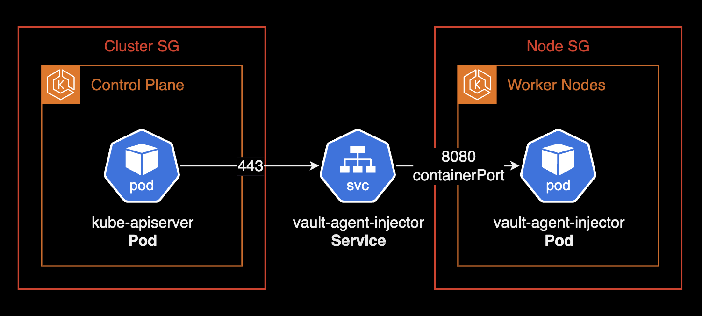
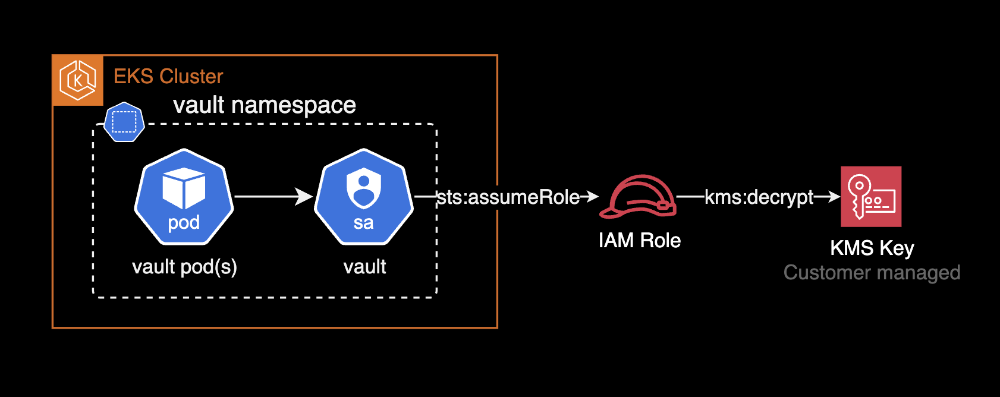

## 개요

EKS 클러스터에 Vault 클러스터를 설치하고 AWS KMS를 사용한 Auto Unseal을 구성하는 방법을 설명합니다.


&nbsp;

주요 내용:

- Vault HA 구성 (3개의 `vault` 파드로 구성된 Raft 클러스터)
- AWS KMS를 사용한 자동 봉인해제(Auto Unseal) 설정
- EKS IRSA를 통한 AWS 권한 관리

이 가이드는 쿠버네티스 클러스터에 Vault를 설치하는 방법을 설명합니다. 쿠버네티스 클러스터 설치 및 관리 방법에 대한 설명은 포함되지 않습니다.

&nbsp;

## 환경

- EKS v1.30 (amd64)
- Vault v1.18.1
- Vault Chart 0.29.0
- 클러스터에 서비스메시로 Linkerd가 설치되어 있습니다.

&nbsp;

## 가이드

### 사전 네트워크 구성

설치 전에 EKS 컨트롤플레인과 vault sidecar injector 간의 통신이 가능한 환경이 되어야 합니다.

컨트롤플레인의 `kube-apiserver`와 `vault-agent-injector` 파드 간의 네트워크 연결이 구성되지 않으면, Mutating Webhook 호출에 대한 대기 시간이 길어져 클러스터 전체적으로 롤아웃 재시작, 포드 종료, 컨테이너 생성 등의 문제가 발생할 수 있습니다.



가장 큰 영향은 클러스터의 모든 파드의 생성(containerCreating)과 종료(Terminating) 상태가 지연되는 것입니다. `vault`가 쿠버네티스의 [Mutating Webhook](https://kubernetes.io/docs/reference/access-authn-authz/extensible-admission-controllers/#webhook-configuration)을 통해 파드에 `vault-agent`를 삽입하는지 검증하기 위해서는 네트워크 연결이 필요합니다. `kube-apiserver`의 Mutating Webhook 호출이 지연되는 경우, 파드 생성과 종료가 지연되는 것을 확인할 수 있습니다.

&nbsp;

네트워크 구성이 안된 경우, `kube-apiserver`의 CloudWatch Logs 로그에서 `context deadline exceeded` 메시지가 반복되는 것을 확인할 수 있습니다.

```bash
E0610 20:50:30.214031      10 dispatcher.go:214] failed calling webhook "vault.hashicorp.com": failed to call webhook: Post "[https://vault-agent-injector-svc.vault.svc:443/mutate?timeout=30s](https://vault-agent-injector-svc.vault.svc/mutate?timeout=30s)": context deadline exceeded
```

> **주의사항**: 항상 Mutating Webhook을 사용하는 서비스에 대해서는 컨트롤플레인과 파드 간의 네트워크 연결이 구성되어 있는지 확인해야 합니다.

&nbsp;

Mutating Webhook 문제에 대한 자세한 원인 및 해결방법은 다음 이슈를 참고하세요.

- [hashicorp/vault-helm#163 - Mutation webhook failing to inject vault sidecars](https://github.com/hashicorp/vault-helm/issues/163#issuecomment-2165959438)
- [Linkerd-Viz Tap FailedDiscoveryCheck while Running on EKS](https://linkerd.buoyant.io/t/linkerd-viz-tap-faileddiscoverycheck-while-running-on-eks/252): `vault-agent-injector`의 Mutating Webhook 문제는 Linkerd 서비스 메시에서 발생하는 네트워크 구성 문제와 동일한 원인으로 발생합니다.

&nbsp;

EKS 테라폼 모듈을 사용해서 클러스터를 생성하는 경우, `node_security_group_additional_rules` 옵션을 통해 워커노드의 보안그룹에 추가 인바운드 룰을 설정할 수 있습니다.

```hcl {hl_lines=["4-13"]}
module "eks" {
  source  = "terraform-aws-modules/eks/aws"

  node_security_group_additional_rules = {
    ingress_vault_agent_injector_mutating_webhook = {
      description                   = "Allow ingress mutating webhook traffic from kube-apiserver to vault-agent-injector pod"
      protocol                      = "tcp"
      from_port                     = 8080
      to_port                       = 8080
      type                          = "ingress"
      source_cluster_security_group = true
    }
  }
  # ... omitted for brevity ...
}
```

&nbsp;

기본적으로 Mutating Webhook의 API 서버 역할을 하는 `vault-agent-injector` 파드는 8080 포트를 통해 컨트롤플레인과 통신합니다. 아래는 `vault` 차트의 `injector` 설정입니다.

```yaml {hl_lines=["11"]}
# charts/vault/values.yaml
# chart version 0.29.0
injector:
  # True if you want to enable vault agent injection.
  # @default: global.enabled
  enabled: "-"

  replicas: 1

  # Configures the port the injector should listen on
  port: 8080
```

&nbsp;

### vault 설치

`vault` 네임스페이스를 먼저 생성합니다. `vault` 네임스페이스에 vault 차트를 설치할 예정입니다.

```bash
kubectl create namespace vault
```

&nbsp;

`vault` 차트에서 사용할 `values.yaml` 파일을 작성합니다. 세부 설정으로는 [High Availability(HA) 모드](https://www.vaultproject.io/docs/concepts/ha)를 활성화하고 3개의 파드를 배포합니다.

```yaml {hl_lines=["3-5"]}
# charts/vault/values.yaml
server:
  ha:
    enabled: true
    replicas: 3
```

&nbsp;

또한 ingress-nginx-controller 등의 인그레스 컨트롤러가 있다는 가정하에 Ingress 설정인 `server.ingress`를 추가합니다. `server.ingress.hosts`의 `host` 값에는 Vault 클러스터에 접근할 도메인을 입력합니다.

완성된 `values.yaml` 파일은 다음과 같습니다.

```yaml
# charts/vault/values.yaml
server:
  ha:
    enabled: true
    replicas: 3

  ingress:
    enabled: true
    labels: {}
      # traffic: external
    annotations: {}
      # |
      # kubernetes.io/ingress.class: nginx
      # kubernetes.io/tls-acme: "true"
      #   or
      # kubernetes.io/ingress.class: nginx
      # kubernetes.io/tls-acme: "true"

    # Optionally use ingressClassName instead of deprecated annotation.
    # See: https://kubernetes.io/docs/concepts/services-networking/ingress/#deprecated-annotation

    ## `kubernetes.io/ingress.class: nginx` 어노테이션은 쿠버네티스 1.19 버전부터 사용 중단되었기 때문에,
    ## `ingressClassName` 옵션을 사용합니다.
    ingressClassName: "nginx"

    # As of Kubernetes 1.19, all Ingress Paths must have a pathType configured. The default value below should be sufficient in most cases.
    # See: https://kubernetes.io/docs/concepts/services-networking/ingress/#path-types for other possible values.
    pathType: Prefix

    # When HA mode is enabled and K8s service registration is being used,
    # configure the ingress to point to the Vault active service.
    activeService: true
    hosts:
      - host: vault.example.com
        paths: []

ui:
  # True if you want to create a Service entry for the Vault UI.
  #
  # serviceType can be used to control the type of service created. For
  # example, setting this to "LoadBalancer" will create an external load
  # balancer (for supported K8S installations) to access the UI.
  enabled: true
  publishNotReadyAddresses: true
  # The service should only contain selectors for active Vault pod
  activeVaultPodOnly: false
  serviceType: "ClusterIP"
  serviceNodePort: null
  externalPort: 8200
  targetPort: 8200
```

&nbsp;

Vault 권장사항인 dataStorage와 auditStorage를 통해 PVC를 구성합니다.

Vault의 시크릿 데이터와 감사 로그는 파드가 재시작되어도 유지되어야 하므로 쿠버네티스의 [PersistentVolume](https://kubernetes.io/docs/concepts/storage/persistent-volumes/)을 사용합니다. 또한 Raft 클러스터의 안정적인 운영과 감사 로그의 안전한 저장을 위해 PVC 구성을 권장합니다.

```yaml {hl_lines=["3-9"]}
# charts/vault/values.yaml
server:
  dataStorage:
    enabled: true
    size: 10Gi
  auditStorage:
    enabled: true
    size: 10Gi
```

&nbsp;

위 `dataStorage`와 `auditStorage` 설정을 통해 추후 클러스터 확장 시 데이터 저장소와 감사 로그를 위한 추가 스토리지를 사용할 수 있습니다.

```bash
# 추후에 다음과 같이 각 vault 파드에 대한 PVC가 생성되는 것을 확인할 수 있습니다.
$ kubectl get pvc -n vault
NAME            STATUS   VOLUME                                     CAPACITY   ACCESS MODES   STORAGECLASS   VOLUMEATTRIBUTESCLASS   AGE
audit-vault-0   Bound    pvc-43ab46eb-e60e-422a-90d0-384ca8c0e6df   10Gi       RWO            gp3            <unset>                 39m
audit-vault-1   Bound    pvc-8b5bc4a9-b66b-4ee8-a8fa-d8a432447ddd   10Gi       RWO            gp3            <unset>                 39m
audit-vault-2   Bound    pvc-60a1e129-8c7d-4deb-baba-abd420ce6140   10Gi       RWO            gp3            <unset>                 39m
data-vault-0    Bound    pvc-30e6cd3c-3a73-4178-b643-a5b8cd886ea7   10Gi       RWO            gp3            <unset>                 39m
data-vault-1    Bound    pvc-0d8c03ad-bc6f-4275-a3eb-3c1a4aeee555   10Gi       RWO            gp3            <unset>                 39m
data-vault-2    Bound    pvc-d06b18ea-2a72-4f32-bfd7-1af5cd74b1e7   10Gi       RWO            gp3            <unset>                 39m
```

&nbsp;

`vault` 네임스페이스에 `vault` 차트를 설치합니다.

```bash
kubectl config current-context
helm upgrade \
    --install \
    --values values.yaml \
    --namespace vault \
    --create-namespace \
    vault . \
    --wait
```

&nbsp;

`vault` 차트를 설치한 후 다음과 같이 설치된 차트 버전을 확인할 수 있습니다.

```bash
$ helm list -n vault
NAME 	NAMESPACE	REVISION	UPDATED                             	STATUS  	CHART       	APP VERSION
vault	vault    	2       	2024-11-20 19:04:06.041512 +0900 KST	deployed	vault-0.29.0	1.18.1
```

&nbsp;

`vault` 파드들은 statefulset으로 배포됩니다.

```bash
kubectl get sts -n vault -o wide

NAME    READY   AGE   CONTAINERS   IMAGES
vault   0/3     14m   vault        hashicorp/vault:1.18.1
```

&nbsp;

Vault는 시크릿을 보호하기 위해 시작할 때마다 항상 Sealed 상태로 시작됩니다. 기본적으로 Vault 운영자가 직접 마스터 키를 입력하여 수동으로 Unseal을 수행해야 하며, 이는 클러스터 재시작이나 장애 복구 시에도 매번 필요한 작업입니다. 특히나 쿠버네티스에서는 빈번히 파드가 언제든 삭제되고 다시 생성될 수 있는 환경이므로 Auto Unseal 구성을 권장합니다.

```bash
$ kubectl get pod -n vault
NAME                                    READY   STATUS    RESTARTS   AGE
vault-0                                 1/2     Running   0          2m46s
vault-1                                 1/2     Running   0          2m46s
vault-2                                 1/2     Running   0          2m46s
vault-agent-injector-7c59f6dc9f-xxfwk   2/2     Running   0          2m46s
```

&nbsp;

`vault` 파드 로그를 모니터링합니다.

```bash
kubectl logs -l app.kubernetes.io/name=vault -n vault -c vault
```

```bash {hl_lines=["1-2"]}
2024-11-20T07:23:18.974Z [INFO]  core: security barrier not initialized
2024-11-20T07:23:18.974Z [INFO]  core: seal configuration missing, not initialized
2024-11-20T07:23:23.990Z [INFO]  core: security barrier not initialized
2024-11-20T07:23:23.990Z [INFO]  core: seal configuration missing, not initialized
... omitted for brevity ...
```

Vault 파드가 초기화되지 않았고(not initialized), 잠긴(Sealed) 상태임을 확인할 수 있습니다.

&nbsp;

`vault-0` 파드에 접속해서 `vault`의 상태를 확인합니다.

```bash
kubectl exec vault-0 -n vault -c vault -- vault status
```

```bash
Key                Value
---                -----
Seal Type          shamir
Initialized        false
Sealed             true
Total Shares       0
Threshold          0
Unseal Progress    0/0
Unseal Nonce       n/a
Version            1.18.1
Build Date         2024-10-29T14:21:31Z
Storage Type       raft
HA Enabled         true
command terminated with exit code 2
```

Initialized 상태가 false이고 Sealed 상태가 true임을 확인할 수 있습니다. 이는 아직 Vault가 초기화되지 않았고 잠긴 상태임을 의미합니다.

```bash
Key                Value
---                -----
Seal Type          shamir
Initialized        false
Sealed             true
...                ...
command terminated with exit code 2
```

`exit code 2` 응답은 Vault가 잠긴 상태로 초기화되었음을 의미합니다.

&nbsp;

Vault를 처음 설치한 후에는 초기화(initialization) 작업이 필요합니다. 초기화는 Vault가 처음 시작될 때 한 번만 수행하는 작업으로, 이 과정에서 Unseal Key와 Root Token이 생성됩니다. 이 키들은 Vault의 보안 및 데이터 보호에 중요한 역할을 합니다.

마스터 키는 Vault의 암호화 키를 암호화하는 데 사용되며, 이를 통해 Vault의 데이터를 보호합니다. 보안 강화를 위해 마스터 키는 여러 조각으로 나눌 수 있습니다.

```bash
kubectl exec vault-0 -n vault -c vault \
  -- vault operator init \
  -key-shares=1 \
  -key-threshold=1 \
  -format=json > cluster-keys.json
```

`-key-shares=1`와 `-key-threshold=1` 옵션은 마스터 키를 암호화하는 데 사용되는 조각의 수와 해제에 필요한 조각의 수를 지정합니다. 이 예제에서는 단일 키 공유와 단일 키 임계값을 사용합니다. 안전한 운영을 위해 프로덕션에서 권장하는 옵션 값은 `-key-shares=5`와 `-key-threshold=3`입니다.

&nbsp;

`vault operator init` 명령어를 통해 생성된 `cluster-keys.json` 파일에서 Unseal Key를 확인합니다.

```bash
$ cat cluster-keys.json | jq -r ".unseal_keys_b64[]"
cwNeAen3nwDJDtkHtP2AdCivNVI4sWwqHQ6MOVM+trA=
```

> **Key 주의사항**: 실제로 운영하는 `vault` 클러스터에서는 단일 키 공유(`-key-shares=1`)와 단일 키 임계값(`-key-threshold=1`) 설정은 권장하지 않습니다. 이 예제는 초기 봉인 해제 프로세스를 단순화하기 위해 여기에서만 사용됩니다.  
> 
> 단일 키 공유와 단일 키 임계값을 사용하면 보안성이 크게 저하됩니다. 만약 마스터 키가 유출되거나 분실될 경우, Vault의 모든 데이터에 대한 접근이 가능해지며, 이는 심각한 보안 위협을 초래할 수 있습니다. 따라서, 여러 개의 키 조각을 사용하여 보안을 강화하고, 복구 시 여러 조각 중 일부만 필요하도록 설정하는 것이 좋습니다. 권장하는 옵션 값은 `-key-shares=5`와 `-key-threshold=3`입니다.

&nbsp;

vault operator init 과정에서 생성된 `cluster-keys.json` 파일에서 Vault 클러스터의 Unseal Key를 추출합니다.

```bash
VAULT_UNSEAL_KEY=$(cat cluster-keys.json | jq -r ".unseal_keys_b64[]")
```

&nbsp;

Unseal Key를 사용해서 `vault-0` 파드의 Vault를 초기화합니다.

```bash
kubectl exec vault-0 -n vault -c vault \
  -- vault operator unseal $VAULT_UNSEAL_KEY
```

```bash
Key                     Value
---                     -----
Seal Type               shamir
Initialized             true
Sealed                  false
Total Shares            1
Threshold               1
Version                 1.18.1
Build Date              2024-10-29T14:21:31Z
Storage Type            raft
HA Enabled              true
```

&nbsp;

Vault 관리자가 Unseal Key를 사용해서 봉인 해제(Unseal) 한 후 정상적으로 파드가 실행되는 것을 확인할 수 있습니다.

```bash
$ kubectl get pod -n vault
NAME                                    READY   STATUS    RESTARTS   AGE
vault-0                                 2/2     Running   0          98m
vault-1                                 1/2     Running   0          98m
vault-2                                 1/2     Running   0          98m
vault-agent-injector-7c59f6dc9f-xxfwk   2/2     Running   0          98m
```

&nbsp;

`cluster-keys.json` 파일에서 Root Token을 추출합니다.

```bash
$ cat cluster-keys.json | jq -r ".root_token"
hvs.q7y...REDACTED...BZb

$ CLUSTER_ROOT_TOKEN=$(cat cluster-keys.json | jq -r ".root_token")
```

&nbsp;

초기화 과정에서 생성된 Root Token을 사용해서 Vault에 로그인합니다.

```bash
kubectl exec vault-0 -n vault -c vault \
  -- vault login $CLUSTER_ROOT_TOKEN
```

```bash
Success! You are now authenticated. The token information displayed below
is already stored in the token helper. You do NOT need to run "vault login"
again. Future Vault requests will automatically use this token.

Key                  Value
---                  -----
token                hvs.q7y...REDACTED...BZb
token_accessor       tBKVb1No3UIk8tbkRTAf2EUI
token_duration       ∞
token_renewable      false
token_policies       ["root"]
identity_policies    []
policies             ["root"]
```

&nbsp;

Vault 클러스터의 피어 목록을 확인합니다. Cluster root token을 사용해서 `vault login`을 한 상태에서 확인할 수 있습니다.

```bash
kubectl exec vault-0 -n vault -c vault \
  -- vault operator raft list-peers
```

```bash
Node       Address                        State     Voter
----       -------                        -----     -----
vault-0    vault-0.vault-internal:8201    leader    true
```

위 Vault 클러스터 상태는 `vault-0` 파드가 리더(leader)로 동작하고 있음을 의미합니다.

&nbsp;

`vault-1` 파드에 접속해서 Vault 클러스터에 조인합니다.

```bash
kubectl exec vault-1 -n vault -c vault \
  -- vault operator raft join http://vault-0.vault-internal:8200
```

```bash
Key       Value
---       -----
Joined    true
```

&nbsp;

`vault-1` 파드에 접속해서 Vault 클러스터에 조인한 후 봉인 해제 키를 사용해서 봉인 해제(Unseal) 합니다.

```bash
kubectl exec vault-1 -n vault -c vault \
  -- vault operator unseal $VAULT_UNSEAL_KEY
```

```bash
Key                Value
---                -----
Seal Type          shamir
Initialized        true
Sealed             true
Total Shares       1
Threshold          1
Unseal Progress    0/1
Unseal Nonce       n/a
Version            1.18.1
Build Date         2024-10-29T14:21:31Z
Storage Type       raft
HA Enabled         true
```

&nbsp;

`vault-2` 파드에 접속해서 Vault 클러스터에 조인합니다.

```bash
kubectl exec vault-2 -n vault -c vault \
  -- vault operator raft join http://vault-0.vault-internal:8200
```

```bash
Key       Value
---       -----
Joined    true
```

&nbsp;

`vault-2` 파드에 접속해서 Vault 클러스터에 조인한 후 봉인 해제 키를 사용해서 봉인 해제(Unseal) 합니다.

```bash
kubectl exec vault-2 -n vault -c vault \
  -- vault operator unseal $VAULT_UNSEAL_KEY
```

```bash
Key                Value
---                -----
Seal Type          shamir
Initialized        true
Sealed             true
Total Shares       1
Threshold          1
Unseal Progress    0/1
Unseal Nonce       n/a
Version            1.18.1
Build Date         2024-10-29T14:21:31Z
Storage Type       raft
HA Enabled         true
```

&nbsp;

Vault 클러스터의 피어 목록을 확인합니다. Cluster root token을 사용해서 `vault login`을 한 상태에서 확인할 수 있습니다.

```bash
kubectl exec vault-0 -n vault -c vault \
  -- vault operator raft list-peers
```

```bash
Node       Address                        State       Voter
----       -------                        -----       -----
vault-0    vault-0.vault-internal:8201    leader      true
vault-1    vault-1.vault-internal:8201    follower    true
vault-2    vault-2.vault-internal:8201    follower    true
```

&nbsp;

Vault 클러스터의 파드 목록을 확인합니다. 모든 Vault 파드가 정상적으로 실행되고 있음을 확인할 수 있습니다.

```bash {hl_lines=["3-5"]}
$ kubectl get pods -n vault
NAME                                    READY   STATUS    RESTARTS   AGE
vault-0                                 2/2     Running   0          106m
vault-1                                 2/2     Running   0          106m
vault-2                                 2/2     Running   0          106m
vault-agent-injector-7c59f6dc9f-xxfwk   2/2     Running   0          106m
```

&nbsp;

### Auto unseal 설정

Vault 서버는 보안 강화를 위해 설치 후 초기 시작 시 봉인된(Sealed) 상태로 시작된다. 이 상태에서 Vault를 사용하기 위해서는 마스터 키를 이용한 봉인 해제, 즉 "Unseal" 과정이 필수적입니다.

일반적으로, 이 과정은 보안을 위해 수동으로 진행되며, 이는 특히 Vault가 재시작될 때마다 반복되어야 하므로, 특히 대규모 클러스터 환경에서는 운영 부담을 크게 증가시킵니다. 이러한 문제를 해결하기 위해 Vault는 자동 봉인해제(Auto Unseal) 기능을 제공합니다.

&nbsp;

Auto Unseal을 지원하는 서비스 목록은 다음과 같습니다.

- **AWS KMS**: vault가 AWS KMS에 저장된 키를 참조해서 Auto Unseal 하는 방식입니다.
- **GCP Cloud KMS**
- **Azure Key Vault**
- **Transit Secret Engine**: vault가 다른 vault에 저장된 키를 참조해서 Auto Unseal 하는 방식입니다.

이 시나리오에서는 AWS KMS Key를 사용해서 Auto Unseal을 실행하는 시나리오입니다.

&nbsp;

vault 파드의 KMS Key 획득을 위해서는 [IAM Role for Service Accounts (IRSA)](https://docs.aws.amazon.com/eks/latest/userguide/iam-roles-for-service-accounts.html) 구성이 필요합니다. IRSA는 특정 서비스 어카운트에 IAM Role을 부여해서 권한을 획득하는 방식입니다.

Vault 파드는 다음과 같은 방식으로 권한 획득 및 KMS Key 획득을 진행해서 Auto Unseal을 실행합니다.



&nbsp;

테라폼을 사용해서 KMS Auto Unseal을 위해 필요한 리소스들을 생성합니다.

- IAM Role (Vault 파드가 IRSA에서 사용)
- IAM Policy
- Customer Managed KMS Key

&nbsp;

IRSA 관련 리소스들을 생성하기 위한 [terraform 코드](https://github.com/younsl/box/tree/main/box/terraform/vault/irsa)를 다운로드 받습니다.

```bash
mkdir vault-irsa
wget -O vault-irsa/main.tf https://raw.githubusercontent.com/younsl/box/main/box/asset/vault/irsa/main.tf
wget -O vault-irsa/outputs.tf https://raw.githubusercontent.com/younsl/box/main/box/asset/vault/irsa/outputs.tf
wget -O vault-irsa/versions.tf https://raw.githubusercontent.com/younsl/box/main/box/asset/vault/irsa/versions.tf
```

&nbsp;

`main.tf` 파일에는 클러스터 이름을 지정하는 부분이 있습니다. `data.aws_eks_cluster.this.name`에는 `vault`를 설치할 EKS 클러스터 이름으로 변경합니다.

```terraform {hl_lines=["7"]}
#===============================================================================
# External Data (Account ID, OIDC Provider ARN)
#===============================================================================
data "aws_caller_identity" "current" {}

data "aws_eks_cluster" "this" {
  name = "<CHANGE_YOUR_CLUSTER_NAME_HERE>"
}

data "aws_iam_openid_connect_provider" "this" {
  url = data.aws_eks_cluster.this.identity[0].oidc[0].issuer
}

# ... omitted for brevity ...
```

&nbsp;

terraform 코드를 실행합니다. 로컬 환경에 AWS CLI 프로필을 설정한 후 실행합니다.

```bash
export AWS_PROFILE=<YOUR_PROFILE>
terraform init
terraform plan
terraform apply
```

```bash
module.iam_policy.aws_iam_policy.policy[0]: Creating...
module.irsa_role.aws_iam_role.this[0]: Creating...
module.iam_policy.aws_iam_policy.policy[0]: Creation complete after 1s [id=arn:aws:iam::111122223333:policy/vault-auto-unseal-policy]
module.irsa_role.aws_iam_role.this[0]: Creation complete after 1s [id=vault-irsa-role]
module.irsa_role.aws_iam_role_policy_attachment.this["policy"]: Creating...
module.irsa_role.aws_iam_role_policy_attachment.this["policy"]: Creation complete after 1s [id=vault-irsa-role-20241120095622455100000001]

Apply complete! Resources: 3 added, 0 changed, 0 destroyed.

Outputs:

iam_policy_arn = "arn:aws:iam::111122223333:policy/vault-auto-unseal-policy"
iam_role_arn = "arn:aws:iam::111122223333:role/vault-irsa-role"
iam_role_name = "vault-irsa-role"
iam_role_path = "/"
iam_role_unique_id = "XXXXZMNKXXFD6BVW32XYZ"
```

생성된 IAM Role ARN을 확인합니다. 쿠버네티스 `serviceAccount`에 어노테이션으로 이 Role ARN을 추가할 예정입니다.

&nbsp;

`terraform apply`를 실행한 후 생성된 리소스들을 확인합니다.

```bash
terraform state list
```

&nbsp;

이 명령어는 Terraform 상태 파일에 정의된 모든 리소스를 나열합니다. 각 리소스는 Terraform이 관리하는 AWS 리소스와 관련된 정보를 포함합니다.

```bash
data.aws_caller_identity.current
data.aws_eks_cluster.this
data.aws_iam_openid_connect_provider.this
aws_kms_alias.vault_auto_unseal
aws_kms_key.vault_auto_unseal
module.iam_policy.aws_iam_policy.policy[0]
module.irsa_role.data.aws_caller_identity.current
module.irsa_role.data.aws_iam_policy_document.this[0]
module.irsa_role.data.aws_partition.current
module.irsa_role.data.aws_region.current
module.irsa_role.aws_iam_role.this[0]
module.irsa_role.aws_iam_role_policy_attachment.this["policy"]
```

&nbsp;

IRSA 설정:

`eks.amazonaws.com/role-arn` 어노테이션에는 이전에 생성한 IAM Role ARN을 추가합니다.

```yaml {hl_lines=["19"]}
# charts/vault/values.yaml
server:
  serviceAccount:
    # Specifies whether a service account should be created
    create: true
    # The name of the service account to use.
    # If not set and create is true, a name is generated using the fullname template
    name: ""
    # Create a Secret API object to store a non-expiring token for the service account.
    # Prior to v1.24.0, Kubernetes used to generate this secret for each service account by default.
    # Kubernetes now recommends using short-lived tokens from the TokenRequest API or projected volumes instead if possible.
    # For more details, see https://kubernetes.io/docs/concepts/configuration/secret/#service-account-token-secrets
    # serviceAccount.create must be equal to 'true' in order to use this feature.
    createSecret: false
    # Extra annotations for the serviceAccount definition. This can either be
    # YAML or a YAML-formatted multi-line templated string map of the
    # annotations to apply to the serviceAccount.
    annotations:
      eks.amazonaws.com/role-arn: "arn:aws:iam::111122223333:role/vault-irsa-role"
```

`server.serviceAccount.name`을 지정하지 않으면 기본적으로 `vault`라는 이름으로 서비스 어카운트가 생성됩니다.

&nbsp;

`vault` serviceAccount에 추가한 IAM Role ARN을 확인합니다.

```bash {hl_lines=["8"]}
$ kubectl describe sa vault -n vault
Name:                vault
Namespace:           vault
Labels:              app.kubernetes.io/instance=vault
                     app.kubernetes.io/managed-by=Helm
                     app.kubernetes.io/name=vault
                     helm.sh/chart=vault-0.29.0
Annotations:         eks.amazonaws.com/role-arn: arn:aws:iam::111122223333:role/vault-irsa-role
                     meta.helm.sh/release-name: vault
                     meta.helm.sh/release-namespace: vault
Image pull secrets:  <none>
Mountable secrets:   <none>
Tokens:              <none>
Events:              <none>
```

`eks.amazonaws.com/role-arn` 어노테이션이 정상적으로 붙었습니다.

&nbsp;

Auto unseal 설정시 주의할 점은 `server.ha.raft.config`에 설정을 추가해야합니다. `server.ha.config`에 넣으면 Vault의 Auto unseal이 정상 동작하지 않습니다. vault는 HA 구성시 Kubernetes의 etcd처럼 [Raft Consensus Algorithm](https://raft.github.io/)을 사용해서 클러스터로서 동작하기 때문에 반드시 `raft`에 Auto Unseal 설정을 추가해야합니다.

```yaml {hl_lines=["6-9"]}
# charts/vault/values.yaml
server:
  ha:
    raft:
      config: |
        seal "awskms" {
          region     = "ap-northeast-2"
          kms_key_id = "<YOUR_KMS_KEY_ID_NOT_ARN>"
        }
```

&nbsp;

Auto Unseal이 추가된 Vault configuration은 다음과 같습니다.

```yaml
# charts/vault/values.yaml
server:
  ha:
    enabled: true
    replicas: 3

    # Set the api_addr configuration for Vault HA
    # See https://developer.hashicorp.com/vault/docs/configuration#api_addr
    # If set to null, this will be set to the Pod IP Address
    apiAddr: null

    # Set the cluster_addr configuration for Vault HA
    # See https://developer.hashicorp.com/vault/docs/configuration#cluster_addr
    # If set to null, this will be set to https://$(HOSTNAME).{{ template "vault.fullname" . }}-internal:8201
    clusterAddr: null

    # Enables Vault's integrated Raft storage.  Unlike the typical HA modes where
    # Vault's persistence is external (such as Consul), enabling Raft mode will create
    # persistent volumes for Vault to store data according to the configuration under server.dataStorage.
    # The Vault cluster will coordinate leader elections and failovers internally.
    raft:

      # Enables Raft integrated storage
      enabled: true
      # Set the Node Raft ID to the name of the pod
      setNodeId: true

      # Note: Configuration files are stored in ConfigMaps so sensitive data
      # such as passwords should be either mounted through extraSecretEnvironmentVars
      # or through a Kube secret.  For more information see:
      # https://developer.hashicorp.com/vault/docs/platform/k8s/helm/run#protecting-sensitive-vault-configurations
      # Supported formats are HCL and JSON.

      config: |
        ui = true

        listener "tcp" {
          tls_disable = 1
          address = "[::]:8200"
          cluster_address = "[::]:8201"
          # Enable unauthenticated metrics access (necessary for Prometheus Operator)
          #telemetry {
          #  unauthenticated_metrics_access = "true"
          #}
        }

        storage "raft" {
          path = "/vault/data"
        }

        seal "awskms" {
          region     = "ap-northeast-2"
          kms_key_id = "<YOUR_KMS_KEY_ID_NOT_ARN>"
        }

        service_registration "kubernetes" {}
```

완성된 `vault` 차트의 Auto Unseal 설정은 위와 같습니다. `kms_key_id`에는 이전에 테라폼을 사용해서 생성한 KMS Key ID를 사용합니다.

&nbsp;

`serviceAccount`와 Auto Unseal 설정을 반영하기 위해 `vault` 차트를 업그레이드합니다.

```bash
helm upgrade \
    --install \
    --values values.yaml \
    --namespace vault \
    --create-namespace \
    vault . \
    --wait
```

&nbsp;

`vault` 파드가 정상적으로 올라온 것을 확인합니다. 아직 Initialized 된 상태가 아니므로 아래와 같이 파드들이 Ready 되지 않습니다.

```bash {hl_lines=["3-5"]}
$ kubectl get pod -n vault
NAME                                    READY   STATUS    RESTARTS   AGE
vault-0                                 1/2     Running   0          35s
vault-1                                 1/2     Running   0          35s
vault-2                                 1/2     Running   0          35s
vault-agent-injector-7c59f6dc9f-fkhdf   2/2     Running   0          35s
```

&nbsp;

`vault-0` 파드에 접속해서 Vault를 초기화합니다. `cluster-keys.json` 파일에 Vault 클러스터의 루트 토큰과 초기 마스터 키를 저장합니다.

```bash
kubectl exec vault-0 -n vault -c vault \
  -- vault operator init -format=json > cluster-keys.json
```

> **주의사항**:
> AWS KMS 키를 사용해서 Auto unseal을 구성하면 `vault operator init` 명령어에서 `-key-shares=1`과 `-key-threshold=1` 옵션을 사용할 수 없습니다.

```bash {hl_lines=["4-5"]}
# Wrong `vault operator init` command
kubectl exec vault-0 -n vault -c vault \
  -- vault operator init \
  -key-shares=1 \
  -key-threshold=1 \
  -format=json > cluster-keys.json
```

&nbsp;

즉 KMS Auto Unseal 구성에서 위와 같은 명령어를 실행할 경우 아래와 같은 `parameters secret_shares,secret_threshold not applicable to seal type awskms` 에러가 발생합니다.

```bash {hl_lines=["6"]}
Error initializing: Error making API request.

URL: PUT http://127.0.0.1:8200/v1/sys/init
Code: 400. Errors:

* parameters secret_shares,secret_threshold not applicable to seal type awskms
command terminated with exit code 2
```

&nbsp;

Vault의 봉인 타입(Seal Type), 봉인(Sealed) 및 초기화 상태(Initialized)를 확인합니다.

```bash
kubectl exec vault-0 -n vault -c vault \
  -- vault status
```

```bash {hl_lines=["3","5-6"]}
Key                      Value
---                      -----
Seal Type                awskms
Recovery Seal Type       shamir
Initialized              true
Sealed                   false
Total Recovery Shares    5
Threshold                3
Version                  1.18.1
Build Date               2024-10-29T14:21:31Z
Storage Type             raft
Cluster Name             vault-cluster-0c3c3c82
Cluster ID               8ae9c0f8-212f-2fcd-f2fb-a12819e5ac36
HA Enabled               true
HA Cluster               https://vault-0.vault-internal:8201
HA Mode                  active
Active Since             2024-11-20T23:51:46.98699563Z
Raft Committed Index     62
Raft Applied Index       62
```

`Seal Type`이 `awskms`이어야 합니다.

&nbsp;

`vault` 파드 상태를 확인합니다. `vault-0` 파드만 정상적으로 올라온 것을 확인할 수 있습니다.

```bash
kubectl get pod -n vault
NAME                                    READY   STATUS    RESTARTS   AGE
vault-0                                 2/2     Running   0          3m2s
vault-1                                 1/2     Running   0          3m2s
vault-2                                 1/2     Running   0          3m2s
vault-agent-injector-7c59f6dc9f-cb4xw   2/2     Running   0          3m2s
```

&nbsp;

파드 로그를 확인해보면 `vault-0` 파드가 KMS를 통해 자동으로 Auto unseal 된 것을 확인할 수 있습니다.

```bash
$ kubectl logs -n vault -c vault vault-0 | grep unsealed
2024-11-20T23:51:46.750Z [INFO]  core: vault is unsealed
2024-11-20T23:51:46.828Z [INFO]  core: unsealed with stored key
2024-11-20T23:51:46.828Z [WARN]  core: attempted unseal with stored keys, but vault is already unsealed
```

&nbsp;

`vault-1`과 `vault-2` 파드도 Vault 클러스터에 조인합니다.

```bash
# Join vault-1 pod to vault cluster
kubectl exec -n vault vault-1 -c vault \
  -- vault operator raft join http://vault-0.vault-internal:8200

# Join vault-2 pod to vault cluster
kubectl exec -n vault vault-2 -c vault \
    -- vault operator raft join http://vault-0.vault-internal:8200
```

&nbsp;

`vault-0`에 Root Token을 사용해서 로그인하여 `vault` 클러스터에 접속합니다.

```bash
$ cat cluster-keys.json | jq -r ".root_token"
hvs.q7y...REDACTED...BZb
```

`cluster-keys.json` 파일에서 Root Token을 획득합니다. `cluster-keys.json` 파일은 이전에 `vault operator init` 명령어를 실행해서 생성한 파일입니다.

```bash
$ CLUSTER_ROOT_TOKEN=$(cat cluster-keys.json | jq -r ".root_token")
```

`vault-0` 파드에 접속해서 Vault에 로그인합니다.

```bash
$ kubectl exec vault-0 -n vault -c vault \
  -- vault login $CLUSTER_ROOT_TOKEN
```

&nbsp;

Vault 클러스터에 조인된 피어들을 확인합니다.

```bash
kubectl exec vault-0 -n vault -c vault \
  -- vault operator raft list-peers
```

&nbsp;

Vault 클러스터에 조인된 피어(파드)들 목록과 상태가 출력됩니다. 여기서 `Voter`의 의미는 클러스터에 참여하는 노드가 투표권을 가지고 있는 노드임을 의미합니다.

```bash
Node       Address                        State       Voter
----       -------                        -----       -----
vault-0    vault-0.vault-internal:8201    leader      true
vault-1    vault-1.vault-internal:8201    follower    true
vault-2    vault-2.vault-internal:8201    follower    true
```

&nbsp;

Vault 파드가 조인되는 즉시 KMS를 사용해서 Auto Unseal 된 것을 `READY` 상태를 통해 확인할 수 있습니다.

```bash
$ kubectl get pod -n vault
NAME                                    READY   STATUS    RESTARTS   AGE
vault-0                                 2/2     Running   0          7m50s
vault-1                                 2/2     Running   0          7m50s
vault-2                                 2/2     Running   0          7m50s
vault-agent-injector-7c59f6dc9f-cb4xw   2/2     Running   0          7m50s
```

&nbsp;

AWS KMS를 사용해서 자동 봉인해제(Auto Unseal)가 되는지 테스트하기 위해, `vault` 네임스페이스에 있는 모든 `vault` 파드를 삭제합니다.

```bash
kubectl delete --all pods -n vault
```

```bash
pod "vault-0" deleted
pod "vault-1" deleted
pod "vault-2" deleted
pod "vault-agent-injector-7c59f6dc9f-z2c9n" deleted
```

`vault` 네임스페이스의 모든 파드들이 삭제되었습니다.

&nbsp;

재시작된 모든 `vault` 파드가 KMS Key를 사용해서 Auto Unseal 된 것을 확인할 수 있습니다.

```bash
$ kubectl get pod -n vault
NAME                                    READY   STATUS    RESTARTS   AGE
vault-0                                 2/2     Running   0          57s
vault-1                                 2/2     Running   0          57s
vault-2                                 2/2     Running   0          56s
vault-agent-injector-7c59f6dc9f-4xdbk   2/2     Running   0          68s
```

&nbsp;

## 결론

이 문서에서는 EKS 클러스터에 Vault를 설치하고 AWS KMS를 사용한 Auto Unseal을 설정하는 방법을 다루었습니다. Vault 클러스터의 고가용성(HA) 구성과 PersistentVolume을 통한 시크릿 데이터 저장소 설정을 통해 안정적인 운영을 보장하며, Auto Unseal 기능을 통해 운영 부담을 줄일 수 있습니다. 이 과정을 통해 Vault의 보안성과 가용성을 높일 수 있습니다.

&nbsp;

## 관련자료

- [Vault Helm Chart](https://github.com/hashicorp/vault-helm)
- [Vault installation to Amazon Elastic Kubernetes Service via Helm](https://developer.hashicorp.com/vault/tutorials/kubernetes/kubernetes-amazon-eks)
- [Network connectivity issue between kube-apiserver and vault-sidecar-injector](https://github.com/hashicorp/vault-helm/issues/163#issuecomment-2165959438)
- [HashiCorp Vault Auto Unseal 기능 사용하여 구성하기 (AWS KMS)](https://wlsdn3004.tistory.com/78)
- [제 블로그에서 다른 Vault 데모 글](/blog/vault-demo)