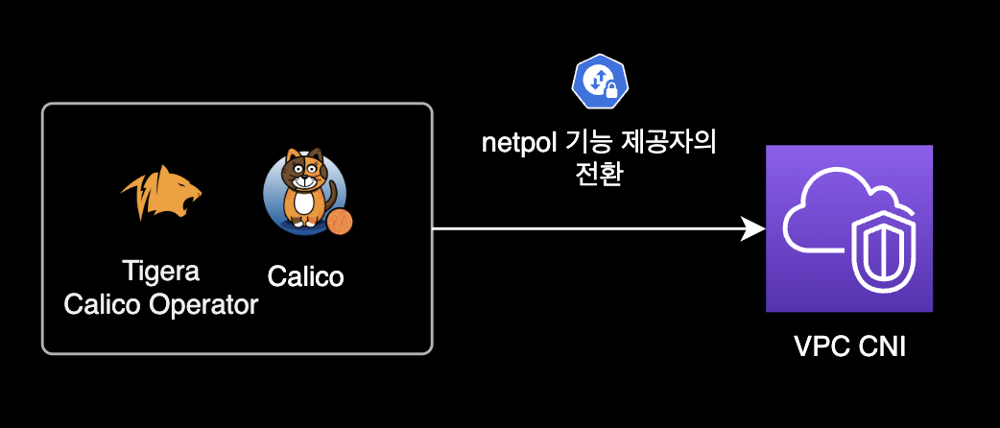
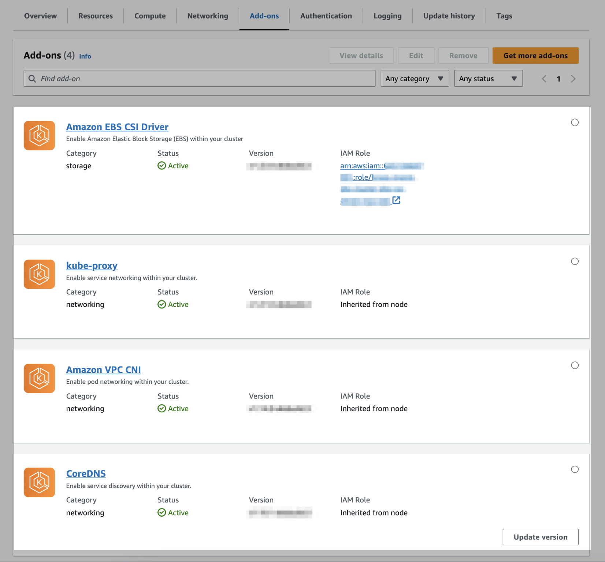
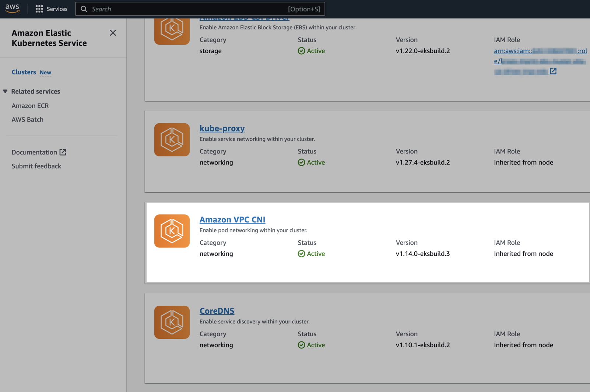
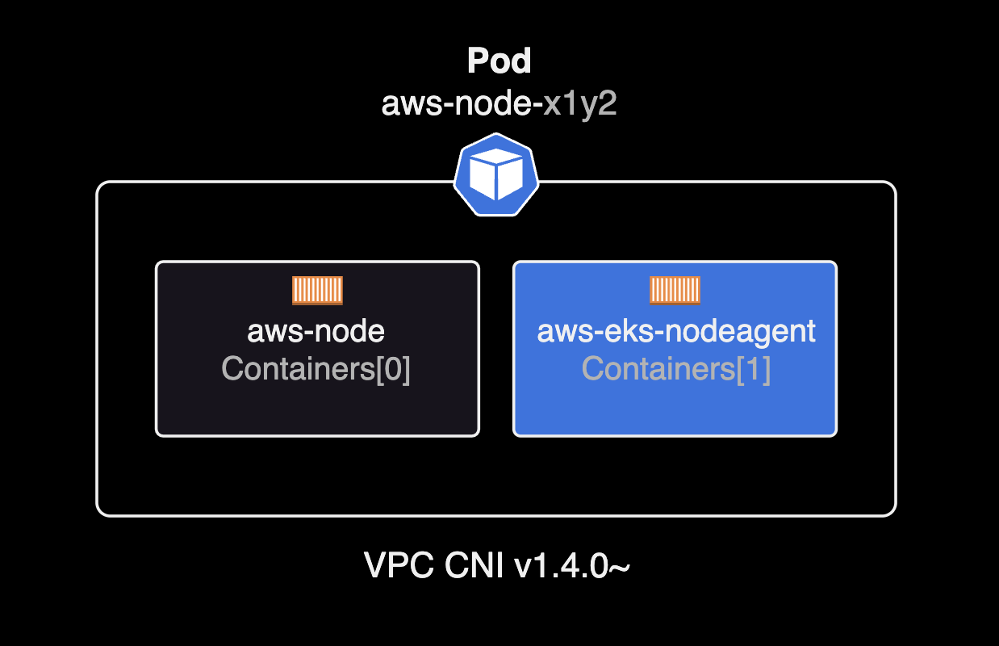
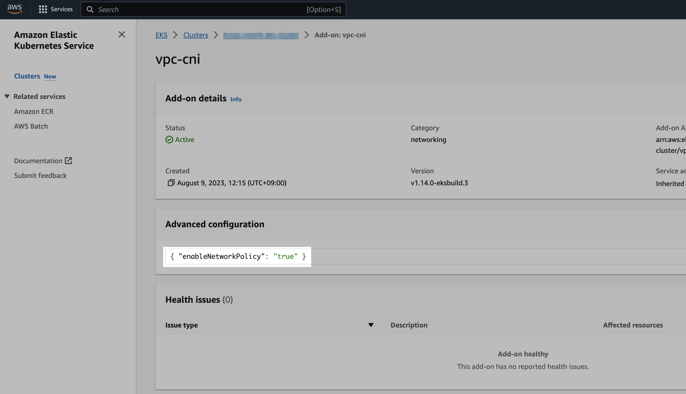

## 개요

VPC CNI에서 쿠버네티스 netpol을 사용할 수 있도록 설정하는 가이드입니다.

EKS 클러스터 관리자를 대상으로 작성된 페이지입니다.

&nbsp;

## 배경지식

### VPC CNI

기존에 EKS에서 Kubernetes NetworkPolicy<sup>netpol</sup>을 사용하려면 반드시 Calico CNI + Tigera Operator를 별도로 설치해서 운영해야 했습니다.

하지만 2023년 8월 29일에 출시된 VPC CNI v1.14.0 버전 이상부터는 Calico 등의 별도 CNI 설치 없이도 network policy를 지원합니다.



netpol 사용을 위해 설치했던 Calico를 VPC CNI로 대체하면 크게 2가지 기대효과가 있습니다.

- **비용 절감** : netpol 제공자를 VPC CNI로 대체한 후 Calico와 Tigera Operator 리소스를 삭제해도 되므로, 클러스터 전체적인 리소스 여유공간을 확보할 수 있습니다.
- **운영 오버헤드 절약** : 클러스터 관리자가 운영해야 할 에드온인 Calico와 Tigera Operator가 사라진다는 걸 의미하므로 운영상의 오버헤드도 절약됩니다.

더 자세한 정보는 [Amazon VPC CNI, 이제 Kubernetes NetworkPolicy 시행 지원](https://aws.amazon.com/ko/about-aws/whats-new/2023/08/amazon-vpc-cni-kubernetes-networkpolicy-enforcement/) 뉴스를 참고합니다.

&nbsp;

### network policy

기본적으로 Kubernetes에서는 모든 파드가 같은 클러스터 내의 다른 포드와 제한 없이 통신할 수 있습니다.

클러스터 내부의 네트워크 보안을 위해 Kubernetes에서 제공하는 [NetworkPolicy](https://kubernetes.io/docs/concepts/services-networking/network-policies/)<sup>netpol</sup>를 사용하면 클러스터 관리자는 포드가 어떤 대상과 통신할 수 있는지 정의할 수 있습니다.  
NetworkPolicy를 통해 애플리케이션에 대한 액세스와 애플리케이션으로부터의 액세스를 안전하게 보호할 수 있습니다.

```bash
$ kubectl api-resources --api-group=networking.k8s.io
NAME              SHORTNAMES   APIVERSION             NAMESPACED   KIND
ingressclasses                 networking.k8s.io/v1   false        IngressClass
ingresses         ing          networking.k8s.io/v1   true         Ingress
networkpolicies   netpol       networking.k8s.io/v1   true         NetworkPolicy
```

그러나 이를 위해서는 클러스터 관리자가 NetworkPolicy를 구현하기 위해 Calico CNI 등의 추가 소프트웨어를 설치 및 구성해야 하므로 서드 파티 플러그인을 설치하고 유지 관리하는 데 운영 오버헤드와 비용이 발생하게 됩니다.

&nbsp;

클러스터 관리자는 `kubectl explain <RESOURCE_NAME>` 명령어를 사용해서 특정 리소스에 대한 상세한 정보를 얻을 수 있습니다.

아래는 Network Policy 리소스에 대한 상세 설명입니다.

```bash
$ kubectl explain netpol
GROUP:      networking.k8s.io
KIND:       NetworkPolicy
VERSION:    v1

DESCRIPTION:
    NetworkPolicy describes what network traffic is allowed for a set of Pods

FIELDS:
  apiVersion    <string>
    APIVersion defines the versioned schema of this representation of an object.
    Servers should convert recognized schemas to the latest internal value, and
    may reject unrecognized values. More info:
    https://git.k8s.io/community/contributors/devel/sig-architecture/api-conventions.md#resources

  kind  <string>
    Kind is a string value representing the REST resource this object
    represents. Servers may infer this from the endpoint the client submits
    requests to. Cannot be updated. In CamelCase. More info:
    https://git.k8s.io/community/contributors/devel/sig-architecture/api-conventions.md#types-kinds

  metadata  <ObjectMeta>
    Standard object's metadata. More info:
    https://git.k8s.io/community/contributors/devel/sig-architecture/api-conventions.md#metadata

  spec  <NetworkPolicySpec>
    spec represents the specification of the desired behavior for this
    NetworkPolicy.

  status    <NetworkPolicyStatus>
    status represents the current state of the NetworkPolicy. More info:
    https://git.k8s.io/community/contributors/devel/sig-architecture/api-conventions.md#spec-and-status


```

&nbsp;

## 준비사항

VPC CNI만으로 netpol을 사용하도록 설정하기 전에 크게 3가지 준비사항이 필요합니다.

&nbsp;

### EKS Cluster 버전

netpol을 사용하려고 하는 EKS 클러스터는 Kubernetes 버전 `1.25` 이상이어야 합니다.

특정 EKS 클러스터의 쿠버네티스 버전을 확인하려면 아래 AWS CLI 명령어를 사용합니다.

```bash
aws eks describe-cluster \
  --name <YOUR_CLUSTER_NAME> \
  --query cluster.version \
  --output text \
  --region ap-northeast-2 \
  | cat
```

```bash
1.27
```

이 시나리오의 경우 클러스터는 EKS v1.27 버전입니다.

&nbsp;

### VPC CNI 버전

클러스터의 Kubernetes용 Amazon VPC CNI 플러그인이 `v1.14.0` 이상이어야 합니다.

다음 명령을 사용하면 현재 사용 중인 VPC CNI의 버전을 확인할 수 있습니다.

```bash
kubectl describe daemonset aws-node --namespace kube-system \
  | grep amazon-k8s-cni: \
  | cut -d : -f 3
```

```bash
v1.13.4-eksbuild.1
```

현재 EKS 클러스터에 설치된 VPC CNI 플러그인은 `v1.13.4`입니다.

netpol을 사용하려면 VPC CNI의 버전 업그레이드가 필요합니다.

&nbsp;

### Linux kernel

모든 노드가 Linux 커널 버전 5.10 이상이어야 합니다. `uname -r`로 커널 버전을 확인할 수 있습니다.

```bash
$ uname -r
5.10.186-179.751.amzn2.x86_64
```

참고로 Amazon EKS에 최적화된 Amazon Linux 및 Bottlerocket AMI의 최신 버전을 사용하는 경우 필요한 커널 버전이 이미 설치되어 있습니다.

&nbsp;

자세한 사항은 AWS 공식문서 [Kubernetes network policies](https://docs.aws.amazon.com/eks/latest/userguide/cni-network-policy.html#cni-network-policy-prereqs)를 참고합니다.

&nbsp;

## 설정하기

### 기존 구성 확인

제 경우 테라폼으로 EKS 클러스터를 생성하고 운영하는 환경이었습니다.

디렉토리 안의 테라폼 코드 구조는 다음과 같습니다.

```bash
tree
.
├── backend.tf
├── main.tf
├── outputs.tf
├── variables.tf
└── versions.tf
```

위 테라폼 코드들이 하나의 EKS 클러스터를 생성하고 있으며 AWS 공식 EKS 테라폼 모듈을 사용하고 있습니다.

&nbsp;

기존 EKS 클러스터의 테라폼 코드 `main.tf`의 일부는 다음과 같습니다.

```bash
# main.tf
...

#===============================================================================
# EKS Module
#===============================================================================
module "eks_cluster" {
  source = "git::https://github.example.com/dogecompany/terraform-modules.git//aws/eks"

  cluster_name                   = local.name
  cluster_version                = local.cluster_version
  cluster_endpoint_public_access = true

  cluster_addons = {
    coredns = {
      addon_version = "v1.10.1-eksbuild.2"
    }
    kube-proxy = {
      most_recent = true
    }
    vpc-cni = {
      most_recent = true
    }
    aws-ebs-csi-driver = {
      most_recent              = true
      service_account_role_arn = "arn:aws:iam::111122223333:role/${module.eks_cluster.cluster_name}-ebs-csi-driver-irsa-role"
    }
  }

  ...

}
```

&nbsp;

클러스터 테라폼 코드에서 `cluster_addons` 값을 보면, 아래 4개 에드온도 테라폼으로 같이 관리합니다.



&nbsp;

클러스터에 현재 설치된 VPC CNI의 버전은 다음 명령어로 확인 가능합니다.

```bash
kubectl describe daemonset aws-node --namespace kube-system \
  | grep amazon-k8s-cni: \
  | cut -d : -f 3
```

```bash
v1.13.4-eksbuild.1
```

VPC CNI `v1.13.4`가 설치되어 있습니다.

&nbsp;

netpol을 지원하기 전 버전의 VPC CNI 데몬셋과 파드 구성은 다음과 같습니다.

```bash
$ kubectl get daemonset,pod \
    -n kube-system \
    -l app.kubernetes.io/instance=aws-vpc-cni
```

```bash
NAME                      DESIRED   CURRENT   READY   UP-TO-DATE   AVAILABLE   NODE SELECTOR   AGE
daemonset.apps/aws-node   3         3         3       3            3           <none>          29d

NAME                 READY   STATUS    RESTARTS   AGE
pod/aws-node-b2btt   1/1     Running   0          29d
pod/aws-node-h8p9t   1/1     Running   0          29d
pod/aws-node-zzvb8   1/1     Running   0          10d
```

`aws-node` 파드는 `aws-node` 컨테이너 하나로만 구성됩니다.

&nbsp;

### 버전 업그레이드

VPC CNI 버전을 올리기 위해 `terraform apply`를 실행합니다.

```bash
terraform apply
```

```bash
...
module.eks_cluster.module.self_managed_node_group["on_demand_basic"].aws_iam_role.this[0]: Modifying... [id=eks-cluster-iam-role]
module.eks_cluster.module.self_managed_node_group["on_demand_basic"].aws_iam_role.this[0]: Modifications complete after 2s [id=eks-cluster-iam-role]
module.eks_cluster.module.self_managed_node_group["on_demand_basic"].aws_iam_instance_profile.this[0]: Modifying... [id=eks-cluster-iam-role]
module.eks_cluster.module.self_managed_node_group["on_demand_basic"].aws_iam_instance_profile.this[0]: Modifications complete after 0s [id=eks-cluster-iam-role]
module.eks_cluster.module.self_managed_node_group["on_demand_basic"].aws_launch_template.this[0]: Modifying... [id=lt-0df700f752b37ae55]
module.eks_cluster.module.self_managed_node_group["on_demand_basic"].aws_launch_template.this[0]: Modifications complete after 1s [id=lt-0df700f752b37ae55]
module.eks_cluster.module.self_managed_node_group["on_demand_basic"].aws_autoscaling_group.this[0]: Modifying... [id=eks-cluster]
module.eks_cluster.module.self_managed_node_group["on_demand_basic"].aws_autoscaling_group.this[0]: Modifications complete after 1s [id=eks-cluster]
module.eks_cluster.aws_eks_addon.this["aws-ebs-csi-driver"]: Modifying... [id=eks-cluster:aws-ebs-csi-driver]
module.eks_cluster.aws_eks_addon.this["vpc-cni"]: Modifying... [id=eks-cluster:vpc-cni]
module.eks_cluster.aws_eks_addon.this["kube-proxy"]: Modifying... [id=eks-cluster:kube-proxy]
...
```

&nbsp;

아래와 같이 테라폼의 에드온 코드에 `most_recent = true`가 선언되어 있으므로 클러스터는 그대로 유지되고 VPC CNI와 kube-proxy 등의 에드온들만 최신 버전으로 업그레이드 됩니다.

```bash
# main.tf
  cluster_addons = {
    ...
    kube-proxy = {
      # `terraform` 실행 할 때마다 항상 최신 버전으로 업그레이드
      most_recent = true
    }
    vpc-cni = {
      # `terraform` 실행 할 때마다 항상 최신 버전으로 업그레이드
      most_recent = true
    }
    ...
  }
```

&nbsp;

### 업그레이드 결과 확인

VPC CNI 데몬셋의 버전을 확인합니다.

```bash
kubectl describe daemonset aws-node \
  --namespace kube-system \
  | grep amazon-k8s-cni: \
  | cut -d : -f 3
```

```bash
v1.14.0-eksbuild.3
```

VPC CNI 에드온의 버전이 `v1.14.0`으로 업그레이드 되었습니다. 이제 EKS 클러스터는 Calico 설치 없이, VPC CNI만으로도 network policy를 사용할 수 있습니다.

&nbsp;

AWS Management Console을 열고 [EKS 콘솔](https://console.aws.amazon.com/eks/home#/clusters)에 접속합니다.



클러스터에 설치된 VPC 에드온 버전을 확인합니다.

VPC CNI가 `v1.13.4-eksbuild.1`에서 최신버전인 `v1.14.0-eksbuild.3`으로 업그레이드 되었습니다.

&nbsp;

VPC CNI 데몬셋과 파드의 상태를 확인합니다.

```bash
kubectl get daemonset,pod \
  -n kube-system \
  -l app.kubernetes.io/instance=aws-vpc-cni
```

```bash
NAME                      DESIRED   CURRENT   READY   UP-TO-DATE   AVAILABLE   NODE SELECTOR   AGE
daemonset.apps/aws-node   3         3         3       3            3           <none>          29d

NAME                 READY   STATUS    RESTARTS   AGE
pod/aws-node-54wsx   2/2     Running   0          3m8s
pod/aws-node-l9qmg   2/2     Running   0          2m43s
pod/aws-node-zzdg5   2/2     Running   0          89s
```

network policy 기능이 활성화된 경우 `aws-node` 파드에 2개의 컨테이너가 있습니다.

VPC CNI `v1.14.0` 이전 버전에서는 network policy가 비활성화된 경우 `aws-node` 파드에 `aws-node` 컨테이너 하나만 있습니다.

&nbsp;

VPC CNI 파드 하나를 지정해서 상세 정보를 확인합니다.

```bash
kubectl describe pod aws-node-l9qmg -n kube-system
```

```bash
...
Containers:
  aws-node:
    ...
  aws-eks-nodeagent:
    ...
    Image:         111122223333.dkr.ecr.ap-northeast-2.amazonaws.com/amazon/aws-network-policy-agent:v1.0.1-eksbuild.1
    Image ID:      111122223333.dkr.ecr.ap-northeast-2.amazonaws.com/amazon/aws-network-policy-agent@sha256:70344c0658e340a8ba1b4b8a3d528b2e7398febcfb5f9e1e47cd7c7ca8bb4e82
    Port:          <none>
    Host Port:     <none>
    Args:
      --enable-ipv6=false
      --enable-network-policy=false
      --enable-cloudwatch-logs=false
    State:          Running
      Started:      Fri, 08 Sep 2023 02:12:33 +0900
    Ready:          True
    Restart Count:  0
    Requests:
      cpu:  25m
    Environment:
      MY_NODE_NAME:   (v1:spec.nodeName)
    Mounts:
      /host/opt/cni/bin from cni-bin-dir (rw)
      /sys/fs/bpf from bpf-pin-path (rw)
      /var/log/aws-routed-eni from log-dir (rw)
      /var/run/aws-node from run-dir (rw)
      /var/run/secrets/kubernetes.io/serviceaccount from kube-api-access-pgcth (ro)
...
```

`aws-eks-nodeagent` 컨테이너의 Args를 자세히 보면 `--enable-network-policy=false`로 netpol 기능이 비활성화 되어 있음을 유추할 수 있습니다.

&nbsp;

VPC CNI v1.14.0부터 `aws-node` 파드는 1개가 아닌 2개 컨테이너로 구성됩니다.



VPC CNI v1.14.0부터 새로 추가된 Network Policy Node Agent<sup>`aws-eks-nodeagent`</sup> 컨테이너는 netpol과 밀접한 연관이 있으며, eBPF 프로그램을 생성하여 노드에 Network Policy를 구현하는 역할을 합니다.

&nbsp;

`aws-eks-nodeagent` 컨테이너는 각 노드에 BPF<sup>Berkeley Packet Filter</sup> 파일 시스템 `/sys/fs/bpf`을 마운트하고 있습니다.

```bash
Volumes:
  bpf-pin-path:
    Type:          HostPath (bare host directory volume)
    Path:          /sys/fs/bpf
    HostPathType:
```

&nbsp;

EKS v1.27 이하 버전이거나, EKS optimized Amazon Linux AMI version v20230703 이하인 경우는 번거롭게 추가 작업이 필요합니다.

각 노드에 BPF<sup>Berkeley Packet Filter</sup> 파일 시스템을 마운트해주어야 합니다.

```bash
sudo mount -t bpf bpffs /sys/fs/bpf
```

그런 다음 새 노드에 영구반영을 위해, Amazon EC2 Auto Scaling 그룹에 대한 Launch Template의 Userdata에도 동일한 `mount` 명령어을 추가해야 합니다.

&nbsp;

### netpol 활성화

VPC CNI 에드온에서 network policy 기능을 활성화만 해주면 작업은 완료됩니다.

> **중요**  
> VPC CNI v1.14부터는 Kubernetes 버전 1.25 이상을 실행하는 새 클러스터에서 NetworkPolicy 지원을 사용할 수 있지만, 출시 시점에는 기본적으로 Network Policy 기능이 **비활성화**되어 있습니다.

&nbsp;

VPC CNI 에드온 파드가 사용하는 ConfigMap의 정보를 확인합니다.

```bash
kubectl get cm \
  -n kube-system amazon-vpc-cni \
  -o yaml
```

```bash
apiVersion: v1
data:
  enable-network-policy-controller: "false"
  enable-windows-ipam: "false"
kind: ConfigMap
metadata:
  ...
```

`enable-network-policy-controller` 값이 아직 `false`이며 이는 Network Policy 기능이 비활성화되었음을 의미합니다.

| Key                                | Value   | Status        |
|------------------------------------|---------|---------------|
| `enable-network-policy-controller` | `false` | netpol 비활성화 |
| `enable-network-policy-controller` | `true`  | netpol 활성화  |

> **주의사항**  
> 만약 VPC CNI를 EKS 콘솔에서 설치한 경우 무조건 Addon의 세부 설정을 통해 파라미터 값을 수정하세요. ConfigMap의 YAML 직접 수정은 클러스터 오류를 발생시킬 수 있습니다.

&nbsp;

저는 테라폼을 사용해서 EKS 클러스터를 관리하므로 EKS 클러스터의 `main.tf` 코드를 다음과 같이 변경합니다.

VPC CNI 에드온에 network policy 활성화 세부 설정을 추가합니다.

```diff
  cluster_addons = {
    coredns = {
      addon_version = "v1.10.1-eksbuild.2"
    }
    kube-proxy = {
      most_recent = true
    }
    vpc-cni = {
      most_recent          = true
+     configuration_values = jsonencode({
+       enableNetworkPolicy = "true"
+     })
    }
```

EKS Add-on에 대한 테라폼 코드 작성 방법은 [Terraform 공식문서](https://registry.terraform.io/providers/hashicorp/aws/latest/docs/resources/eks_addon.html#example-add-on-usage-with-custom-configuration_values)를 참고합니다.

&nbsp;

이후 테라폼 변경사항을 실제 AWS 인프라에 적용합니다.

```bash
terraform plan
terraform apply
```

```bash
Do you want to perform these actions?
  Terraform will perform the actions described above.
  Only 'yes' will be accepted to approve.

  Enter a value: yes
```

&nbsp;

인프라의 변경사항이 적용되며 터미널에 실시간 진행사항 로그가 출력됩니다.

```bash
cluster_addons = {
  ...
  "vpc-cni" = {
    "addon_name" = "vpc-cni"
    "addon_version" = "v1.14.0-eksbuild.3"
    ...
    "configuration_values" = "{\"enableNetworkPolicy\":\"true\"}"
    "created_at" = "2023-08-09T03:15:22Z"
    ...
    "tags" = tomap({
      ...
    })
    "tags_all" = tomap({
      ...
    })
    "timeouts" = {
      "create" = tostring(null)
      "delete" = tostring(null)
      "update" = tostring(null)
    }
  }
}
```

`apply` 후에 실제 인프라에 적용되는 로그 중간 부분을 보면, VPC CNI에 `configuration_values`가 새로 추가된 걸 확인할 수 있습니다.

```diff
  cluster_addons = {
    ...
    "vpc-cni" = {
      "addon_name" = "vpc-cni"
      "addon_version" = "v1.14.0-eksbuild.3"
      ...
-     "configuration_values" = ""
+     "configuration_values" = "{\"enableNetworkPolicy\":\"true\"}"
      "created_at" = "2023-08-09T03:15:22Z"
      ...
      "tags" = tomap({
        ...
      })
      "tags_all" = tomap({
        ...
      })
      "timeouts" = {
        "create" = tostring(null)
        "delete" = tostring(null)
        "update" = tostring(null)
      }
    }
  }
```

&nbsp;

VPC CNI의 ConfigMap 설정 정보를 같이 확인합니다.

```bash
kubectl get configmap amazon-vpc-cni \
  -n kube-system \
  -o yaml
```

```diff
  apiVersion: v1
  data:
-   enable-network-policy-controller: "false"
+   enable-network-policy-controller: "true"
    enable-windows-ipam: "false"
  kind: ConfigMap
  metadata:
  ...
```

실제 `amazon-vpc-cni` ConfigMap에도 Network Policy 활성화 옵션이 `true`로 바뀐 걸 확인할 수 있습니다.

`terraform apply` 이후 ConfigMap에 반영되는 데 까지는 약간의 시간이 소요됩니다. EKS 콘솔에서 VPC CNI 에드온의 상태가 `Updating`에서 `Active`로 바뀔 때까지 모니터링 합니다.

&nbsp;

테라폼 코드 반영 후, EKS 콘솔에서 확인한 Addon 결과는 다음과 같습니다.



Advanced configuration에 `{ "enableNetworkPolicy": "true" }`가 새로 추가되었습니다.

&nbsp;

에드온의 환경변수 설정 이후 VPC CNI 파드의 환경변수도 확인합니다.

```bash
kubectl describe pod aws-node-ngzvn -n kube-system
```

```yaml
Name:                 aws-node-ngzvn
Namespace:            kube-system
  ...
  aws-eks-nodeagent:
    Container ID:  containerd://0b6a1e9413773fd7cfdc055000083db1eacb334e497e0e0f6cc48cc0352a604b
    Image:         111122223333.dkr.ecr.ap-northeast-2.amazonaws.com/amazon/aws-network-policy-agent:v1.0.1-eksbuild.1
    Image ID:      111122223333.dkr.ecr.ap-northeast-2.amazonaws.com/amazon/aws-network-policy-agent@sha256:70344c0658e340a8ba1b4b8a3d528b2e7398febcfb5f9e1e47cd7c7ca8bb4e82
    Port:          <none>
    Host Port:     <none>
    Args:
      --enable-ipv6=false
      --enable-network-policy=true
      --enable-cloudwatch-logs=false
```

`--enable-network-policy` 값도 `false`에서 `true`로 변경된 걸 확인할 수 있습니다.

&nbsp;

### 동작 테스트

이제 VPC CNI를 이용해 netpol을 사용할 수 있는 상태가 되었습니다.

&nbsp;

필요한 netpol 리소스는 직접 생성해서 적용하도록 합니다.

임시로 테스트해볼 netpol 데모가 필요한 경우 AWS 공식문서의 [Stars demo of network policy](https://docs.aws.amazon.com/eks/latest/userguide/cni-network-policy.html#network-policy-stars-demo) 섹션을 참고하세요.

&nbsp;

## 참고자료

[Amazon VPC CNI, 이제 Kubernetes NetworkPolicy 시행 지원](https://aws.amazon.com/ko/about-aws/whats-new/2023/08/amazon-vpc-cni-kubernetes-networkpolicy-enforcement/)  
AWS Korea 소식

[Kubernetes network policies](https://docs.aws.amazon.com/eks/latest/userguide/cni-network-policy.html)

[Terraform: aws_eks_addon](https://registry.terraform.io/providers/hashicorp/aws/latest/docs/resources/eks_addon.html#example-add-on-usage-with-custom-configuration_values)

[Network Policy Related Components](https://github.com/aws/amazon-vpc-cni-k8s/tree/master?tab=readme-ov-file#network-policy-related-components)  
netpol 관련 컴포넌트 목록 (amazon-vpc-cni-k8s 공식문서)
