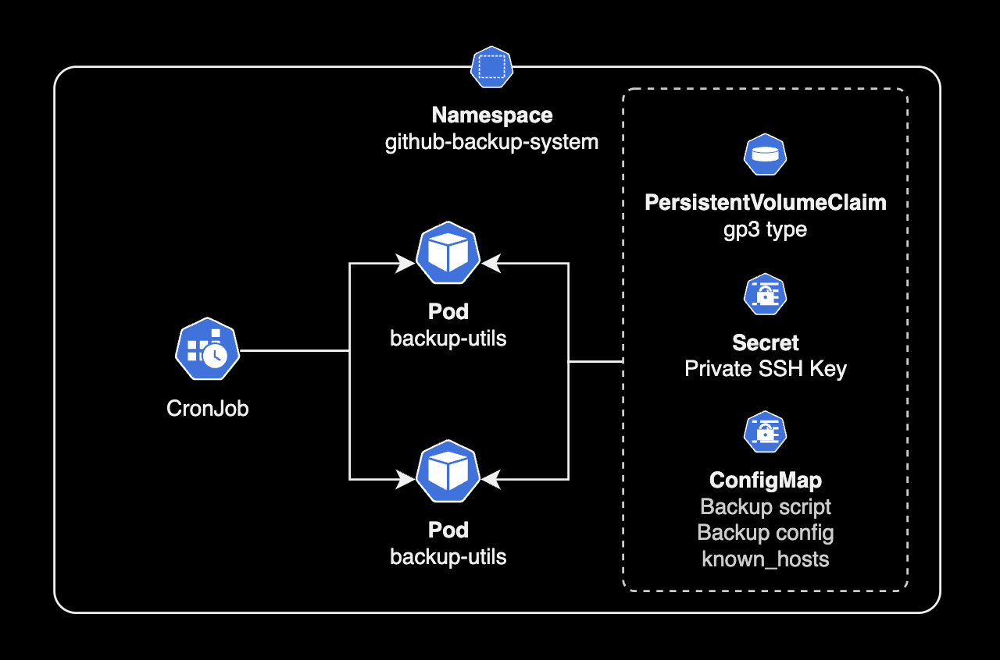
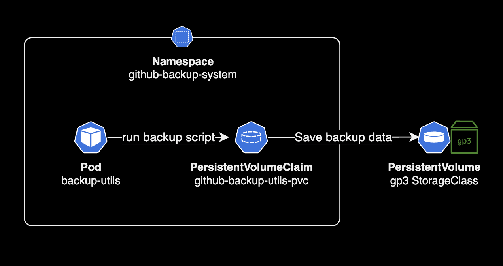

# backup-utils-chart

[](https://github.com/younsl/backup-utils-chart/blob/main/LICENSE)
[](https://github.com/younsl/backup-utils-chart/issues)

## Summary

A Helm chart for GitHub Enterprise backup utility (`backup-utils`) implemented as a [Kubernetes CronJob](https://kubernetes.io/docs/concepts/workloads/controllers/cron-jobs/). This helm chart is inspired by [mail2sandeppd/github-backup-utils-kubernetes](https://github.com/mail2sandeepd/github-backup-utils-kubernetes).

> [!WARNING]
> The backup-utils chart uses the backup-utils official container image, but it is not an official project provided by Github.

## Compatibility Matrix

| EKS          | 1.32 | 1.31 | 1.30 | 1.29 | 1.28 | 1.27 | 1.26 |
|--------------|------|------|------|------|------|------|------|
| backup-utils | ✅ | ✅ | ✅ | ✅ | ✅ | ✅ | ✅ |

## Architecture

All components of backup-utils run on k8s native resources.





## Installation

### Generate SSH Key

Generate an Ed25519 type SSH key pair.

```bash
ssh-keygen \
    -t ed25519 \
    -C "backup-utils@github.example.com" \
    -P ""
```

When you execute this command, the `ssh-keygen` utility will generate two key files in the current user's home directory:

```bash
$ ls -lh ~/.ssh/
total 16
-rw-------@ 1 doge  staff   411B  6 29 07:28 id_ed25519
-rw-r--r--@ 1 doge  staff    96B  6 29 07:28 id_ed25519.pub
```

- `id_ed25519`: This is the private key file and should be kept secure on your local machine. Inject the `id_ed25519` private key from the Secret into a pod controlled by CronJob.
- `id_ed25519.pub`: This is the public key file, and its contents are meant to be copied and added to the `/home/admin/.ssh/authorized_keys` file on the remote github enterprise servers you want to access using this key.

### Add public key to GHE instance as backup target

In order for backup-utils pods to be properly backed up, the SSH public key of the backup server (created in the previous step) must be registered in the target Github Enterprise Server instance.

Add the `id_ed25519.pub` key generated into the Github Enterprise server's Management Console.

The following command has the same effect as registering an SSH Key in Management Console.

```bash
# Add public key in your GHE instance as backup target
echo "ssh-ed25519 <your-public-key> backup-utils@github.example.com" | tee -a /home/admin/.ssh/authorized_keys
```

For more detailed information, please refer to [the official documentation of Github Enterprise](https://docs.github.com/en/enterprise-server/admin/administering-your-instance/accessing-the-administrative-shell-ssh).

### Push image to container registry

backup-utils chart uses the [backup-utils](https://github.com/github/backup-utils) container image officially provided by Github.

Build the backup-utils docker image using [official dockerfile](https://github.com/github/backup-utils/blob/v3.9.1/Dockerfile) on your local machine.

```bash
git clone https://github.com/github/backup-utils
cd backup-utils
```

```bash
docker build \
    -t github-backup-utils:v3.10.0 \
    -f Dockerfile \
    --platform linux/amd64 .
```

| Option       | Description | Value |
|--------------|-------------|-------|
| `--platform` | Target platform for running the backup-utils container image | `linux/amd64` or `linux/arm64` |
| `-f` | Name of the Dockerfile to be used for building the container image | `Dockerfile` or `Dockefile-alpine` |

Push the built image to your private ECR repository.

```bash
# Change the tag of an image
docker tag backup-utils:v3.10.0 111122223333.dkr.ecr.ap-northeast-2.amazonaws.com/github-backup-utils:v3.10.0

# Push docker image to private Amazon ECR
docker push 111122223333.dkr.ecr.ap-northeast-2.amazonaws.com/github-backup-utils:v3.10.0
```

### helm

> [!NOTE]  
> For the CronJob-created Pods to back up data to PersistentVolumes, the Kubernetes cluster must have the "gp3" StorageClass installed already. To view the available storageclass resources in your Kubernetes cluster, execute the command: `kubectl get storageclass -o wide`.

#### Helm install

```bash
helm upgrade \
    --install \
    --namespace github-backup-system \
    --create-namespace \
    github-backup-utils . \
    -f values.yaml
```

```bash
# Save SSH Private Key to k8s secret
kubectl create secret generic \
    github-backup-utils-ssh-private-key \
    --from-file="$HOME/.ssh/id_ed25519" \
    --namespace github-backup-system
```

```bash
secret/github-backup-utils-ssh-private-key created
```

#### Helm uninstall

```bash
helm uninstall --namespace github-backup-system github-backup-utils
kubectl delete namespace github-backup-system
```

## Adapters

This is the list of organizations and users that have publicly shared how they are using backup-utils.

| Organization                     | Success Story                                 |
|:---------------------------------|:----------------------------------------------|
| [Coinone](https://coinone.co.kr) | We saved EC2 costs and improved resource efficiency by combining backup-utils with EKS. |

Add your organization by creating a PR.

## References

[Github Issue for Helm chart support request](https://github.com/github/backup-utils/issues/1067)

[Official backup-utils repository](https://github.com/github/backup-utils)

[Accessing the administrative shell (SSH)](https://docs.github.com/en/enterprise-server@3.9/admin/administering-your-instance/accessing-the-administrative-shell-ssh)  
Github Enterprise official doc
