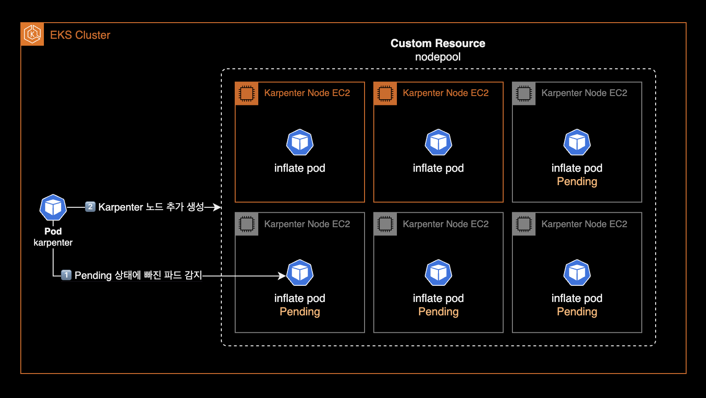

# karpenter-nodepool

## 사용법

### 설치

`karpenter-nodepool` 차트를 설치합니다.

```bash
helm upgrade \
  --install \
  --namespace kube-system \
  karpenter-nodepool . \
  --values values.yaml \
  --wait
```

&nbsp;

`karpenter-nodepool` 차트에는 NodePool과 EC2NodeClass 커스텀 리소스가 포함되어 있습니다.

```bash
$ kubectl api-resources --categories karpenter
NAME             SHORTNAMES     APIVERSION                  NAMESPACED   KIND
ec2nodeclasses   ec2nc,ec2ncs   karpenter.k8s.aws/v1beta1   false        EC2NodeClass
nodeclaims                      karpenter.sh/v1beta1        false        NodeClaim
nodepools                       karpenter.sh/v1beta1        false        NodePool
```

&nbsp;

## 테스트

테스트 파드 배포

```bash
cat <<EOF | kubectl apply -f -
apiVersion: apps/v1
kind: Deployment
metadata:
  name: inflate
spec:
  replicas: 0
  selector:
    matchLabels:
      app: inflate
  template:
    metadata:
      labels:
        app: inflate
    spec:
      terminationGracePeriodSeconds: 0
      containers:
        - name: inflate
          image: public.ecr.aws/eks-distro/kubernetes/pause:3.7
          resources:
            requests:
              cpu: 1
EOF

kubectl scale deployment inflate --replicas 60
```

&nbsp;

이후 karpenter controller pod의 로그를 확인하고 새 노드를 할당하는 지 모니터링합니다.

```bash
kubectl logs -f -n kube-system -l app.kubernetes.io/name=karpenter -c controller
```

## 운영자 가이드

### 카펜터 노드 수동으로 늘리기 (Inflate)

Karpenter 노드는 ASG<sup>Auto Scaling Group</sup>를 사용하지 않는 특성으로 인해 Cluster Autoscaler와 다르게 각 노드그룹의 최소(Min), 현재(Desired), 최대(Max) 인스턴스 개수를 지정할 수 없습니다. 이것이 Karpenter와 Cluster Autoscaler의 가장 큰 차이점입니다.

기본적으로 Karpenter는 클러스터의 워크로드 요구 사항을 감지하고 적절한 시점에 노드를 자동으로 추가하거나 제거하여 리소스 사용을 최적화합니다. 그러나 특정 상황에서는 클러스터 관리자가 카펜터 노드 수를 수동으로 조절할 필요가 있을 수 있습니다.

Karpenter에서는 수동으로 노드 수를 늘리는 행위를 인플레이트<sup>inflate</sup>라고 부르며, 일반적인 방법은 임시 워크로드를 생성하여 클러스터에 리소스 요구 사항을 인위적으로 생성하는 것입니다. 이를 통해 Karpenter나 다른 자동 스케일러가 더 많은 노드를 추가하도록 유도할 수 있습니다.



```bash
KARPENTER_NODEPOOL_NAME=default
cat << EOF | kubectl apply -f -
---
apiVersion: apps/v1
kind: Deployment
metadata:
  name: karpenter-inflate
spec:
  # spec.replicas 값을 증가시키면, 각각의 파드가 다른 노드에 배포될 것입니다.
  replicas: 1
  selector:
    matchLabels:
      app: karpenter-inflate
  template:
    metadata:
      labels:
        app: karpenter-inflate
    spec:
      terminationGracePeriodSeconds: 0
      containers:
      - name: inflate
        image: public.ecr.aws/eks-distro/kubernetes/pause:3.7
        resources:
          requests:
            cpu: 1
      affinity:
        podAntiAffinity:
          requiredDuringSchedulingIgnoredDuringExecution:
          - labelSelector:
              matchExpressions:
              - key: app
                operator: In
                values:
                - karpenter-inflate
            topologyKey: "kubernetes.io/hostname"
        nodeAffinity:
          requiredDuringSchedulingIgnoredDuringExecution:
            nodeSelectorTerms:
            - matchExpressions:
              - key: karpenter.sh/nodepool
                operator: In
                values:
                - ${KARPENTER_NODEPOOL_NAME}
EOF
```

Kubernetes에서 `nodeAffinity`와 `podAntiAffinity` 설정은 함께 사용될 때 AND 조건으로 작동합니다. 이는 파드가 스케줄링될 때, nodeAffinity에 정의된 노드 선택 조건 그리고 podAntiAffinity에 정의된 다른 파드와의 위치 분리 조건을 동시에 만족해야 함을 의미합니다.

따라서 위 `karpenter-inflate` deployment를 사용하면 `default` 노드풀에 속하는 Karpenter Node는 `spec.replicas` 개수와 동일하게 늘어나게 됩니다.

아래 명령어를 통해 `default` nodepool에 속한 노드를 6개로 고정합니다.

```bash
kubectl scale deployment karpenter-inflate --replicas 6
```

&nbsp;

karpenter controller pod 로그에서 Karpenter Node Autoscaling 과정을 실시간으로 확인할 수 있습니다.

```bash
kubectl logs -f \
  -n kube-system \
  -l app.kubernetes.io/name=karpenter \
  -c controller

# Check the list of newly created Karpenter Nodes
kubectl get nodeclaim -o wide
```
