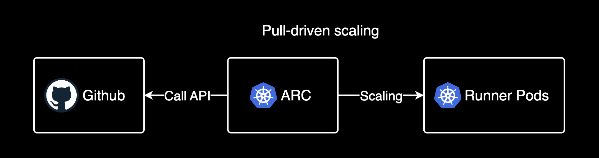
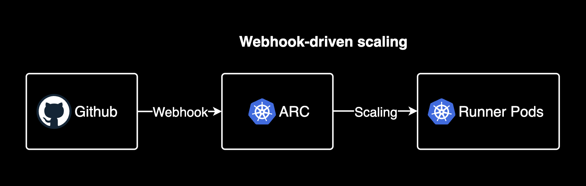
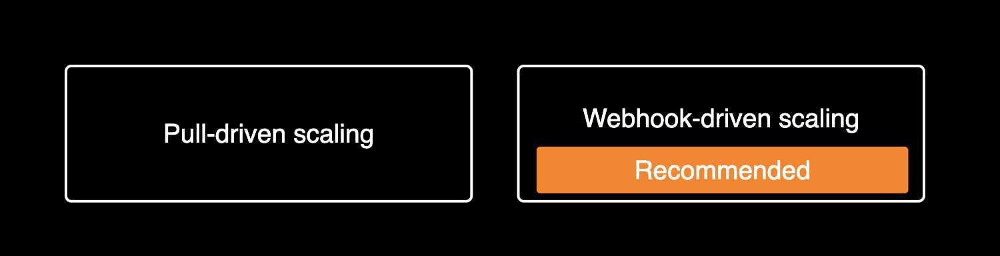
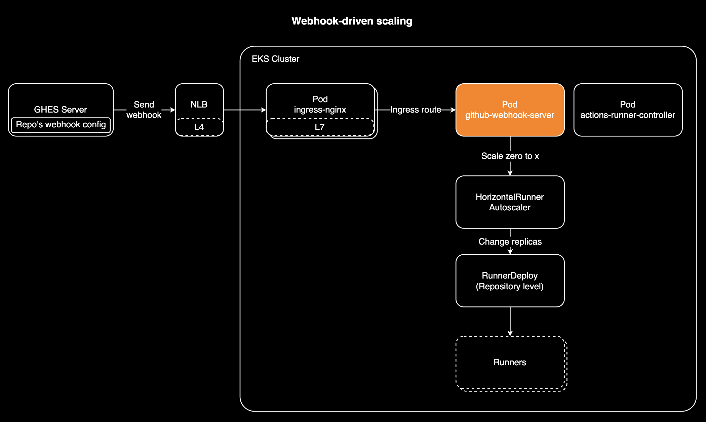

## Actions Runner Controller Scaling

Scale-zero로 러너 컴퓨팅 비용 절감하기

---

### Topics

- **Actions Runner Controller의 스케일링 방식**
- **Webhook-driven scaling 구현 방법**
- **Scale zero 설정시 주의사항**

---

### Actions Runner Controller의 스케일링 방식



---

### Actions Runner Controller의 스케일링 방식



---

### ARC에서 권장하는 스케일링 방식



반응 빠름, Scale zero 가능, 안전함 (Github API Rate Limit 영향 받지 않음)

---

### Actions Runner Controller 아키텍처



---

### 웹훅의 여정


---

### HorizontalRunnerAutoscaler 설정

```yaml
apiVersion: actions.summerwind.dev/v1alpha1
kind: HorizontalRunnerAutoscaler
metadata:
  name: scalezero-test-runner-hra
  namespace: actions-runner
spec:
  # You can set minReplicas to 0 to enable scale-to-zero functionality
  minReplicas: 0
  maxReplicas: 5
  scaleTargetRef:
    kind: RunnerDeployment
    name: scalezero-test-runner
  scaleUpTriggers:
  - amount: 1
    duration: 5m
    githubEvent:
      # Workflow job queued, waiting, in progress, or completed on a repository
      workflowJob: {}
```

---

### RunnerDeployment 설정 및 주의사항

```yaml
apiVersion: actions.summerwind.dev/v1alpha1
kind: RunnerDeployment
metadata:
  name: scalezero-test-runner
  namespace: actions-runner
spec:
  template:
    spec:
      labels:
      - self-hosted  # Explicitly add this label for GHES
      - linux        # Explicitly add this label for GHES
      - test-runner
      repository: ORGANIZATION_NAME/REPO_NAME
```

<style scoped>
code {
  line-height: 1.1;
}
pre {
  line-height: 1.1;
}
</style>

:warning: runnerDeployment에 러너에 **자동생성되는 라벨**도 명시적(Explicitly)으로 추가해야 ARC 웹훅 서버가 웹훅 이벤트를 받아 스케일링 대상(scale target)을 인식할 수 있습니다.

---

### EOD.