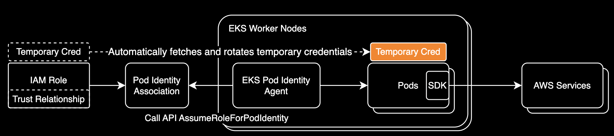
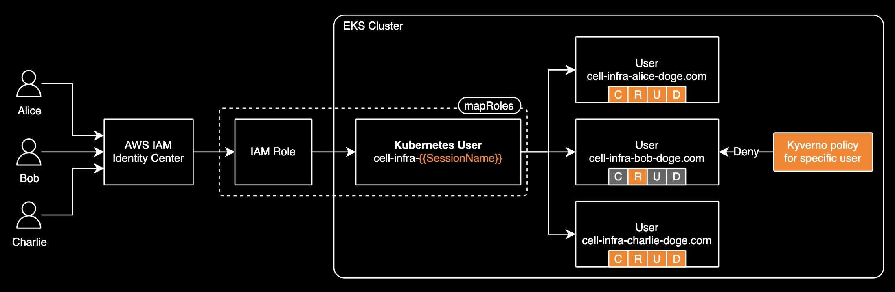

## EKS Security Enhancements

EKS Security 구성 개선 방법

---

### Topics

- **EKS Pod Identity 아키텍처와 동작 원리** <sup>:label: EKS :label: IAM</sup>
- **Kyverno를 활용한 EKS RBAC 가드레일 구현** <sup>:label: EKS :label: IAM</sup>

---

### EKS Pod Identity


---


---


---



[EKS Pod Identity](https://aws.amazon.com/ko/blogs/korea/amazon-eks-pod-identity-simplifies-iam-permissions-for-applications-on-amazon-eks-clusters/) is a credential management service that automatically fetches and rotates temporary AWS credentials for pods.

---

Pod Identity Association 테라폼 예시:

<style scoped>
code {
  font-size: 15px;
  line-height: 1;
}
pre {
  line-height: 1;
}
</style>

```terraform
module "loki_pod_identity" {
  source  = "terraform-aws-modules/eks-pod-identity/aws"
  version = "1.10.0"

  association_defaults = {
    namespace       = "loki"
    service_account = "loki"
    tags = {
      Environment = "dev"
    }
  }

  associations = {
    dev = {
      cluster_name = module.eks.cluster_name
    }
  }
}
```

---

### 쿠버네티스 RBAC 가드레일

쿠버네티스 RBAC은 허용 정책만 지원하고 **거부 정책을 지원하지 않아 세밀한(Fine-grained) 접근 제어가 어려움**

[Kyverno](https://kyverno.io/)와 [OPA](https://www.openpolicyagent.org/)가 제공하는 거부 정책을 활용하면 세밀한 접근 제어가 가능합니다.


---



IAM Role에 K8s RBAC 권한을 할당할 때 사용자 이름에 `{{SessionName}}`을 포함해서 구성하면 사용자별로 접근 제어를 세밀하게 제어할 수 있습니다. [Cluster Access 권장사항](https://docs.aws.amazon.com/ko_kr/eks/latest/best-practices/identity-and-access-management.html#_cluster_access_recommendations)입니다.

---

<style scoped>
code {
  font-size: 11px;
  line-height: 1;
}
pre {
  line-height: 0.5;
}
</style>

실제 적용 예시

```bash
$ kubectl auth whoami -o yaml
```

```yaml
apiVersion: authentication.k8s.io/v1
kind: SelfSubjectReview
metadata:
  creationTimestamp: "2025-02-06T19:49:41Z" 
status:
  userInfo:
    extra:
      accessKeyId:
      - ASIA1234567890EXAMPLE
      arn:
      - arn:aws:sts::123456789012:assumed-role/AWSReservedSSO_DevOps_Admin_1234abcd/john.doe@example.com
      canonicalArn:
      - arn:aws:iam::123456789012:role/AWSReservedSSO_DevOps_Admin_1234abcd
      principalId:
      - AROA1234567890EXAMPLE
      sessionName:
      - john.doe@example.com # <-- sessionName is the email address of the IAM Identity Center user by default
      sigs.k8s.io/aws-iam-authenticator/principalId:
      - AROA1234567890EXAMPLE
    groups:
    - system:masters
    - system:authenticated
    uid: aws-iam-authenticator:123456789012:AROA1234567890EXAMPLE
    username: devops-john.doe-example.com # <-- HERE
```

---

<style scoped>
code {
  font-size: 12px;
  line-height: 0.4;
}
pre {
  line-height: 0.6;
}
</style>

#### Kyverno 정책 설명

특정 유저의 모든 리소스에 대한 CREATE, UPDATE, DELETE 액션을 거부하는 [Cluster Policy](https://raw.githubusercontent.com/kyverno/policies/main/other/block-cluster-admin-from-ns/block-cluster-admin-from-ns.yaml)

```yaml
spec:
  background: false
  rules:
  - name: block-cluster-admin-from-ns
    match:
      any:
      - resources:
          kinds:
          - "*"
        clusterRoles:
        - cluster-admin
        subjects:
        - kind: User
          # Username is registered as cell-infra-{{SessionName}} in aws-auth configmap's mapRoles section
          name: cell-infra-elon.musk-example.com
    validate:
      message: "The cluster-admin 'testuser' user cannot touch testnamespace Namespace."
      deny:
        conditions:
          any:
            - key: "{{ request.operation || 'BACKGROUND' }}"
              operator: AnyIn
              value:
              - CREATE
              - UPDATE
              - DELETE
```

---

#### 적용 시나리오


---

## EOD.

이 발표자료는 [marp](https://marp.app/)를 활용해 코드로 작성되었습니다.