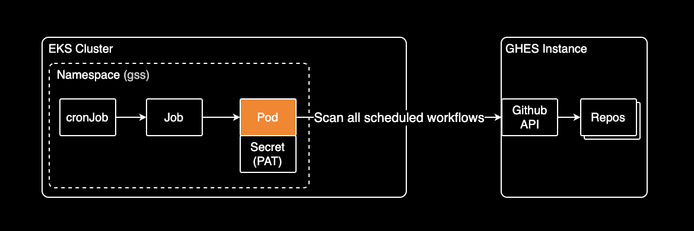
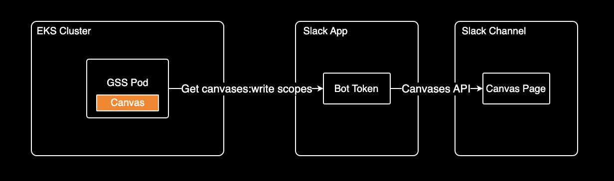
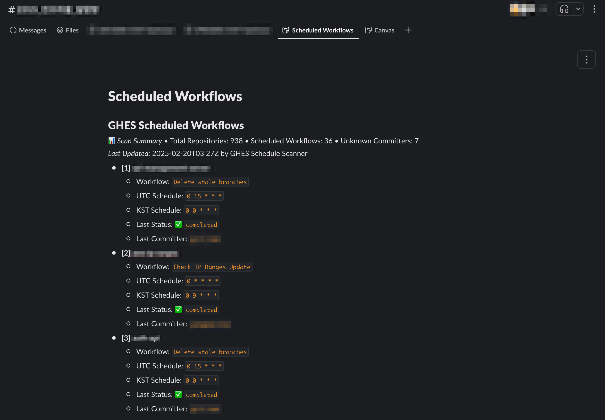

## GSS

Slack Canvas로 운영 현황 자동화하기

---

### Topic

- GSS
- Slack canvas
- Scanning Output
- Golang 모범사례

---

### GSS

Scanner for scheduled workflows in GitHub Enterprise Server

---

### GSS Language

Golang으로 작성된 컨테이너화된 프로그램이며 **헬름 차트** 지원.

---

### Slack canvases API

슬랙에서 제공하는 [Canvases API](https://api.slack.com/methods?query=canvases)로 캔버스 페이지를 CRUD 가능

---

### Scanning Output

GSS가 cronJob 스케줄에 맞춰 슬랙 캔버스에 Scheduled Workflow 기록

---

### Golang 모범사례

개발할 때 참고할 만한 모범사례

- [Go Standard Project](https://github.com/golang-standards/project-layout)

---

### EOD.
