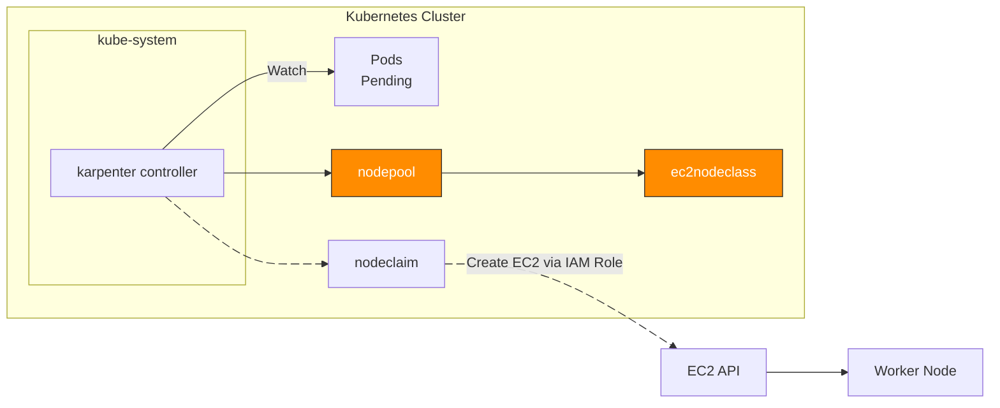
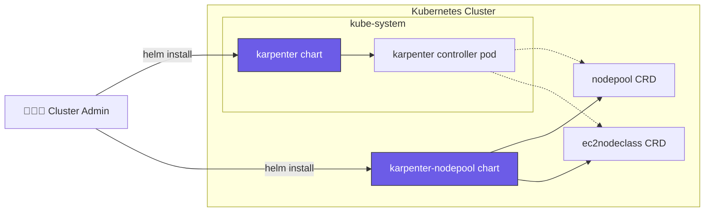
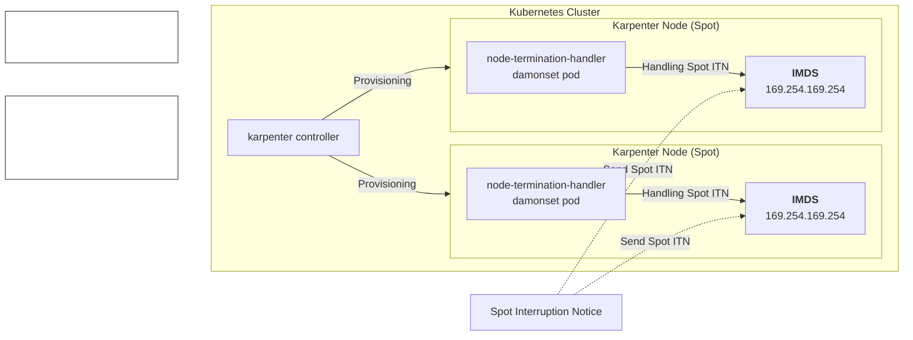
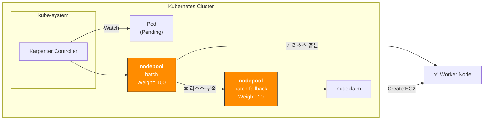
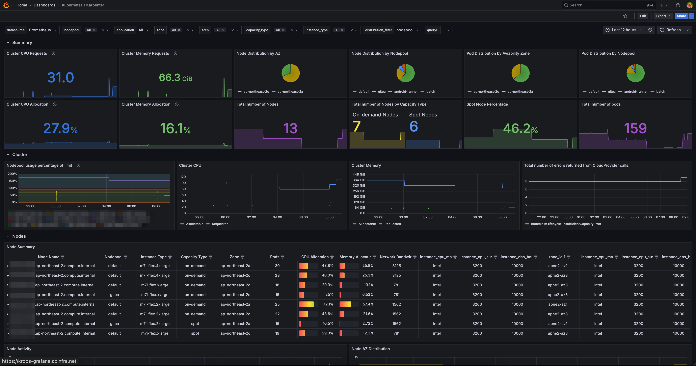
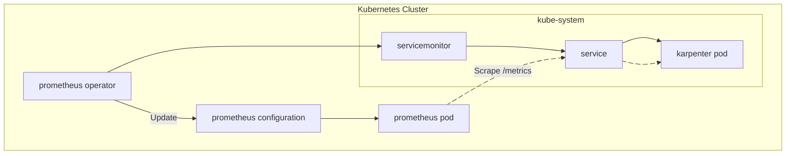

---
# try also 'default' to start simple
theme: default
# apply any unocss classes to the current slide
class: 'text-center'
background: https://unsplash.com/ko/%EC%82%AC%EC%A7%84/%EB%8F%84%EC%8B%9C-%EA%B1%B4%EB%AC%BC%EC%9D%98-%EA%B7%B8%EB%A0%88%EC%9D%B4%EC%8A%A4%EC%BC%80%EC%9D%BC-%EC%82%AC%EC%A7%84-jnuDx1MOIW8
# some information about the slides, markdown enabled
info: |
  ## Slidev Starter Template
  Presentation slides for developers.

  Learn more at [Sli.dev](https://sli.dev)
transition: fade
title: Karpenter Nodepool Strategy
mdc: true
lineNumbers: true
fonts:
  # basically the text
  sans: 'Noto Sans KR'
  # use with `font-serif` css class from UnoCSS
  serif: 'Robot Slab'
  # for code blocks, inline code, etc.
  mono: 'Fira Code'
googleFonts:
  # enable Google Fonts auto importing
  autoImport: true
  # or set custom Google Fonts URL
  # url: 'https://fonts.googleapis.com/css2?family=Noto+Sans+KR:wght@200;400;600&display=swap'
---

# Karpenter Nodepool Strategy

Spot 활용도를 높이기 위한 노드풀 전략

---

## Node Provisioning

Karpenter가 노드 프로비저닝하는 과정의 트리거는 Pending 상태의 파드가 있는 시점



---

## Helm Chart Structure

Karpenter 설치는 [공식 헬름 차트](https://github.com/aws/karpenter-provider-aws/tree/main/charts)로 진행



karpenter-nodepool 차트는 공식 제공되지 않아 직접 개발해서 운영중임

---

## Spot Interruption Handling

Karpenter가 노드 프로비저닝하며 Node Termination Handler가 Spot 중단신호 감지 및 파드 Eviction 담당



1: https://karpenter.sh/docs/faq/#interruption-handling

---

## Spot Nodepool Fallback [1/2]

[Fallback](https://karpenter.sh/docs/concepts/scheduling/#fallback) 기능을 사용하여 [가중치(Weight)](https://karpenter.sh/docs/concepts/scheduling/#weighted-nodepools) 기반 spot, on-demand 노드풀 선정

### 노드풀의 가중치(Weight) 설정

nodepool 리소스에 `spec.weight` 필드를 사용하여 가중치를 설정하면 됨. 높은 가중치를 가진 노드풀이 우선 선택됨

```yaml {13}
apiVersion: karpenter.sh/v1
kind: NodePool
metadata:
  name: batch
spec:
  template:
    spec:
      requirements:
      - key: karpenter.sh/capacity-type
        operator: In
        values:
        - spot
  weight: 100 # Set 10 for fallback on-demand nodepool
```

---

## Spot Nodepool Fallback [2/2]

아키텍처:



AWS Summit Seoul 2025의 샌드버드 발표 사례에서 많은 부분을 참고함

---

## Dashboard

Grafana 대시보드 [ID 20398](https://grafana.com/grafana/dashboards/20398-karpenter/)를 통해 노드풀, 스팟 현황 및 비중, 노드 레벨의 리소스 사용률 확인 가능



---

## Metric scraping

[prometheus-operator](https://github.com/prometheus-operator/prometheus-operator)를 사용하는 경우, 서비스 모니터링을 위해 노드풀 레벨의 메트릭을 수집하기 위해 servicemontior 리소스 생성

```yaml {4}
# charts/karpenter/values_your.yaml
serviceMonitor:
  # -- Specifies whether a ServiceMonitor should be created.
  enabled: true
```

메트릭 수집 과정



---

## TLDR

Karpenter를 써본 결과 72시간 동안 중단없이 스팟 인스턴스를 운영할 수 있다는게 검증됨.

```bash
# Retrieve all spot nodes provisioned by karpenter
$ kubectl get node -l karpenter.sh/capacity-type=spot
NAME                                               STATUS   ROLES    AGE     VERSION
ip-10-xxx-xx-xxx.ap-northeast-2.compute.internal   Ready    <none>   2d22h   v1.32.3-eks-473151a
ip-10-xxx-xx-xxx.ap-northeast-2.compute.internal   Ready    <none>   42h     v1.32.3-eks-473151a
ip-10-xxx-xx-xx.ap-northeast-2.compute.internal    Ready    <none>   37h     v1.32.3-eks-473151a
ip-10-xxx-xx-xx.ap-northeast-2.compute.internal    Ready    <none>   25h     v1.32.3-eks-473151a
ip-10-xxx-xx-xx.ap-northeast-2.compute.internal    Ready    <none>   25h     v1.32.3-eks-473151a
```