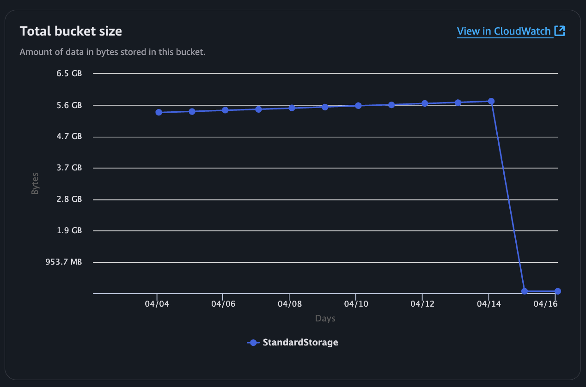

## Loki zstd

**Storage cost optimization for Loki**
<sup>:label: Kubernetes :label: FinOps :label: Storage</sup>

---

### Topics

- Chunk Encoding
- Configurations
- Case 1: zstd 압축 적용
- Case 2: Retention
- Prometheus zstd
- Conclusion

---

### Chunk Encoding

Prometheus, Loki 등의 메트릭 스토리지, 로그 스토리지는 기본적으로 Google의 [Snappy](https://github.com/google/snappy) 압축 알고리즘을 사용합니다.

---

### Configurations

Loki의 Ingester 파드가 데이터 저장(Write) 및 압축(Compress)을 수행합니다.

```yaml
# charts/loki/values.yaml (loki 3.4.2)
loki:
  ingester:
    autoforget_unhealthy: true
    chunk_encoding: zstd
```

> Related issue: [Add zstd and flate compressions algorithms](https://github.com/grafana/loki/pull/3064)

---

### Case 1: zstd 압축 적용

원본 로그 데이터의 크기가 클수록 절감율이 높아집니다.

| 환경 | 압축방식 | 측정 기간 | 이전 용량 | 이후 용량 | 절감율 |
| --- | --- | --- | --- | --- | --- |
| Case 1 | snappy → zstd | 5일 (4/11 ~ 4/16) | 14.4 GB | 9.5 GB | <span class="savings-rate">-34.4%</span> |
| Case 2 | snappy → zstd | 5일 (4/11 ~ 4/16) | 57.2 GB | 35.2 GB | <span class="savings-rate">-38.4%</span> |

---

### Case 2: Retention

Compactor 파드가 IAM 권한 오류로 인해 데이터를 삭제하지 못하는 문제가 있었는데 개선되었습니다.

| 환경 | 조치전 용량 | 조치후 용량 | 절감율 |
| --- | --- | --- | --- |
| Case 3 | 5.7 GB | 59.9 MB | <span class="savings-rate">99.0%</span> |



---

### Prometheus zstd


[Prometheus Remote Write 2.0](https://prometheus.io/docs/specs/prw/remote_write_spec_2_0/)은 컨텐츠 인코딩을 snappy만 지원합니다. 향후 버전에서 여러 알고리즘을 지원할 예정이라고만 적혀있음. [Allow Content-Encoding zstandard / zstd for scraping metrics #13866](https://github.com/prometheus/prometheus/issues/13866)에서 논의중.

---

### Conclusion

Loki의 `chunk_encoding` 설정을 `zstd`로 변경하고 Retention 정책을 올바르게 적용하면 스토리지 비용을 크게 절감할 수 있습니다(Loki 약 30-40% + Retention).

Prometheus Remote Write도 향후 압축 방식 지원 시 추가적인 비용 절감 기회가 있습니다.

---

### EOD.
