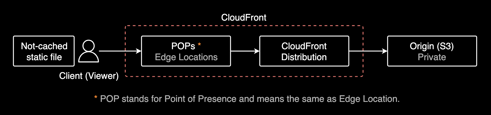
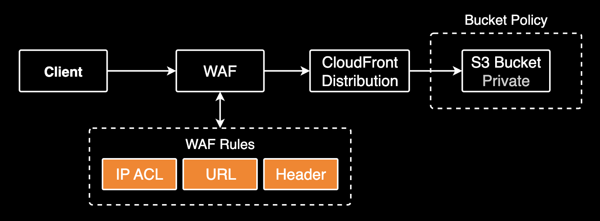
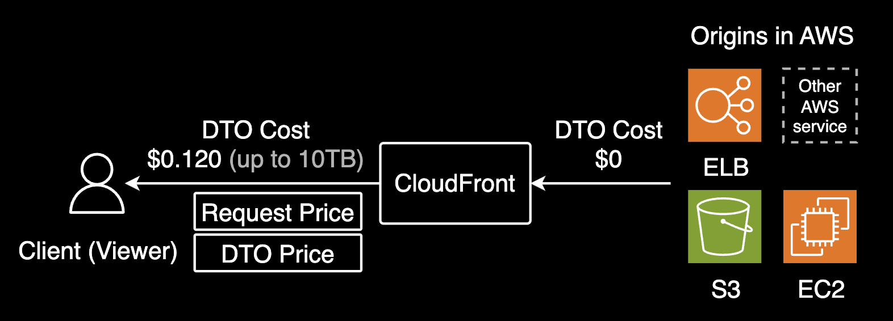

## No cache S3 with CloudFront

안전하게 실시간 데이터를 서빙하는 방법

---

### ToC

- 요구사항
- 시스템 아키텍처
- 테스트
- CloudFront 비용 모델
- 결론

---

### 요구사항 1



사용자가 호출할 때마다 항상 최신 데이터를 서빙해야 합니다. 즉 캐싱이 비활성화되어야 합니다.

---

### 요구사항 2


GET 조회만 하는 클라이언트와 POST 쓰기를 하는 백엔드 파드가 S3 양쪽에서 데이터를 조회하고 쓰기를 해야 합니다.

---

### 시스템 아키텍처


정책으로 캐싱 비활성화와 CORS 지원을 설정합니다.

---

### 테스트

```bash
curl -s -I https://<REDACTED>/<REDACTED>/coins.json \
  | egrep '^x-amz-cf-pop|^x-cache|^server'
```

```bash
...
server: AmazonS3
x-cache: Miss from cloudfront
x-amz-cf-pop: ICN57-P3
```

`x-cache: Miss from cloudfront` 헤더가 항상 반환되며, 이는 엣지 로케이션<sup>POP, Point of Presence</sup>에서 캐시 데이터가 아닌 오리진(S3)에서 가져온 데이터를 서빙하고 있음을 의미합니다.

---

### 개발환경 격리



개발환경 CDN 인프라는 WAF를 붙여 오피스 IP 범위에서만 접근 가능하도록 보호합니다.

---

### CloudFront 비용 모델



S3와 CloudFront 간 데이터 전송(DTO)은 무료. CloudFront에서 사용자에게 전달되는 데이터 전송 및 메서드 요청 수에 대해서는 비용이 발생합니다.

---

### 결론

- CloudFront는 [관리형 캐시 정책](https://docs.aws.amazon.com/ko_kr/AmazonCloudFront/latest/DeveloperGuide/using-managed-cache-policies.html)을 통해 캐싱 비활성화 가능
- CloudFront를 캐싱 비활성화하면 일종의 실시간 데이터 서빙 용도로 사용 가능
- [**오리진(S3)과 CloudFront 간 데이터 전송은 무료**](https://aws.amazon.com/cloudfront/pricing/?nc1=h_ls)이므로 보안 뿐만 아니라 비용 면에서도 이점이 있습니다.

---

### References

- [Amazon CloudFront Pricing: How to Approach it and Save Money?](https://www.stormit.cloud/blog/amazon-cloudfront-pricing-how-to-approach-it-and-save-money/)
- [관리형 캐시 정책 사용](https://docs.aws.amazon.com/ko_kr/AmazonCloudFront/latest/DeveloperGuide/using-managed-cache-policies.html)
- [CloudFront 엣지 서버의 위치 및 IP 주소 범위](https://docs.aws.amazon.com/ko_kr/AmazonCloudFront/latest/DeveloperGuide/LocationsOfEdgeServers.html)
- [Amazon CloudFront pricing](https://aws.amazon.com/cloudfront/pricing/?nc1=h_ls) :label: finops
- [Amazon CloudFront, 한국에서 최대 26% 데이터 전송 요금 할인](https://aws.amazon.com/ko/blogs/korea/cloudfront-price-cut-data-transfer-out-to-internet-in-korea/) :label: finops

---

### EOD.