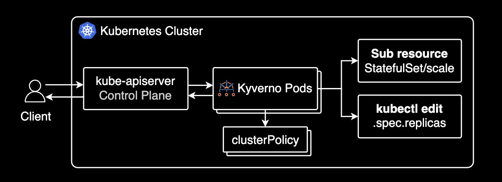
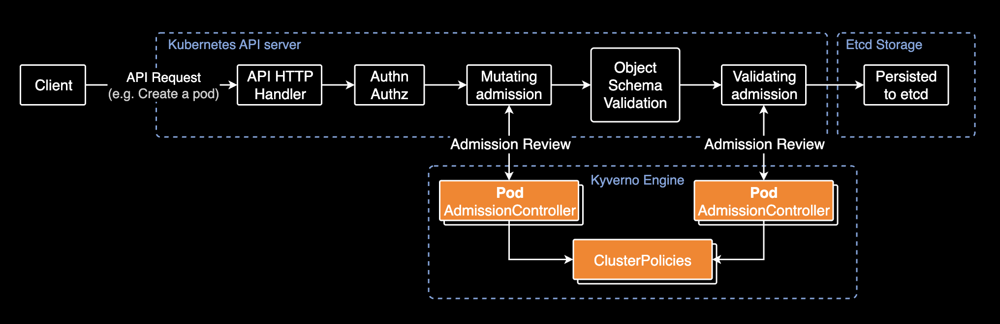
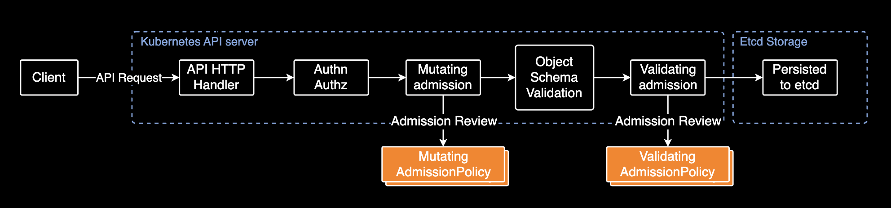

## Kubernetes native admission policy

Kubernetes Admission Policy vs Kyverno


---

### Topics

- **API Request Architecture**
- **Policy Engine**
- **Admission APIs**
- **Conclusion**

---

### API Request Architecture



---

### API Request Architecture



[A Guide to Kubernetes Admission Controllers](https://kubernetes.io/blog/2019/03/21/a-guide-to-kubernetes-admission-controllers/)

---

### Policy Engine


- **OPA Gatekeeper**: Cloudflare, Toss Bank
- **Kyverno**: Coinbase, Coinone

---

#### 코인원의 주요 사용 예시

DevOps의 쿠버네티스 리소스 및 RBAC 운영의 가드레일 역할로 활용

1. 새로 합류한 클러스터 관리자의 프로덕션 CUD(Create, Update, Delete) 행위에 대한 가드레일
2. 파드에 CPU Limit 설정 시 경고
3. 파드에 `ndots: 2`가 없을 경우 경고
4. KEDA의 `.spec.fallback` 설정 있을 경우 경고
5. 의도치 않은 퍼블릭 노출 방지를 위한 LoadBalancer 생성 거부

---

### Admission API

Kubernetes 1.32부터 `admissionregistration.k8s.io` API 그룹에서 **Mutating** (alpha)을 네이티브하게 지원함

| API Group | Resource Name | 1.32 |
| -- | -- | -- |
| admissionregistration.k8s.io | MutatingAdmissionPolicy | alpha |
| admissionregistration.k8s.io | ValidatingAdmissionPolicy | stable |

---

#### Admission Policy (k8s native)

API 요청 처리의 흐름도



---

#### CEL

[Common Expression Language](https://kubernetes.io/docs/reference/using-api/cel/)로 정책을 작성:

```yaml
apiVersion: admissionregistration.k8s.io/v1
kind: ValidatingAdmissionPolicy
metadata:
  name: "deploy-replica-policy.example.com"
spec:
  matchConstraints:
    resourceRules:
    - apiGroups:   ["apps"]
      apiVersions: ["v1"]
      operations:  ["CREATE", "UPDATE"]
      resources:   ["deployments"]
  validations:
  - expression: "object.replicas > 1" # should be "object.spec.replicas > 1"
    message: "must be replicated"
    reason: Invalid
```

---

#### Pros and Cons

Pros:

- **표준화**: Admission Registration API가 Kubernetes 리소스를 검증하는 표준이 될 예정임
- **운영 효율성**: 정책 엔진이 하나 사라지므로 관리 포인트가 줄어든다는 장점이 있음
- **비용**: 서드파티 정책 엔진 대신 Admission Registration API를 쓰면 파드 리소스 절약, Control Plane과 노드간 트래픽 비용 절감

---

Cons:

- **지원하는 정책 범위**: Kubernetes의 Admission Registration API는 아직 복잡한 정책 로직이나 Cleanup Policy, Generate Policy, Image Verify Policy 와 같은 다양한 정책 타입을 지원하지 않음
- **복잡한 정책 구현 불가**: [CEL](https://kubernetes.io/docs/reference/using-api/cel/) 언어가 서드파티 정책 엔진만큼 디테일한 문법을 지원하지 않음

---

### Conclusion

클러스터 관리자들 사이에서도 쿠버네티스 네이티브 정책(AdmissionPolicy)과 Kyverno 중 어떤게 더 좋을지 의견이 분분함. 이정도만 인지하고 있어도 도움이 될듯.

- [ValidatingAdmissionPolicy vs Kyverno : r/kubernetes](https://www.reddit.com/r/kubernetes/comments/1jrch91/validatingadmissionpolicy_vs_kyverno/)
- [So are Validating Admission Policies a replacement for Kyverno / OPA Gatekeeper](https://www.reddit.com/r/kubernetes/comments/1gpvk95/so_are_validating_admission_policies_a/)

---

### References

- [A Guide to Kubernetes Admission Controllers](https://kubernetes.io/blog/2019/03/21/a-guide-to-kubernetes-admission-controllers/)
- [Kubernetes Validating Admission Policies: A Practical Example](https://kubernetes.io/blog/2023/03/30/kubescape-validating-admission-policy-library/)
- [CEL](https://kubernetes.io/docs/reference/using-api/cel/)
- [Mutating Admission Policy](https://kubernetes.io/docs/reference/access-authn-authz/mutating-admission-policy/)
- [Validating Admission Policy](https://kubernetes.io/docs/reference/access-authn-authz/validating-admission-policy/)

---

### EOD.