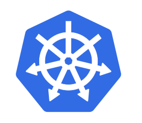
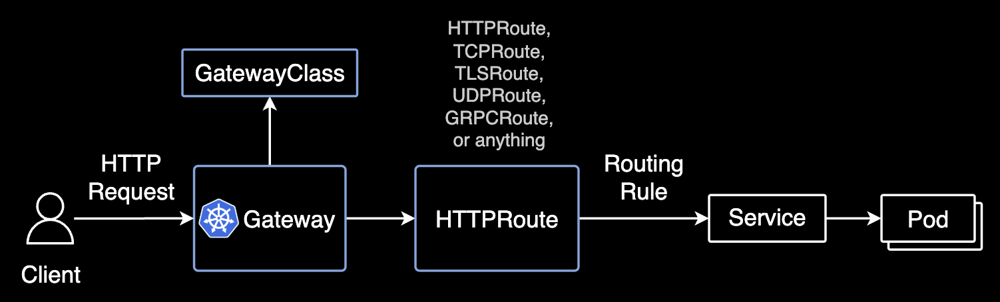
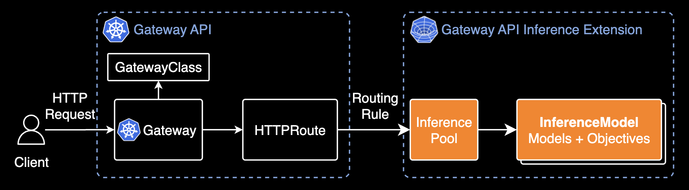

## Gateway API Inference Extension

**Generative AI Inference on Kubernetes**  
:label: Kubernetes :label: Networking :label: Machine Learning

---

### Topics

- **Gateway API**
- **Ingress**
- **Gateway API Inference Extension**
- **마치며**

---

### Gateway API

[Gateway API](https://gateway-api.sigs.k8s.io/) is an official Kubernetes project focused on L4 and L7 routing in Kubernetes

---

### Ingress

[쿠버네티스 공식문서](https://kubernetes.io/docs/concepts/services-networking/ingress/)에 의하면 Ingress는 더 이상 업데이트되지 않고 Gateway API에 새로운 기능이 추가되고 있습니다.

> Ingress is frozen. New features are being added to the Gateway API.

---

### Gateway API Inference Extension

Gateway API의 확장 기능인 Inference Extension이 공식적으로 출시되었음

:newspaper: [News: Google, Bytedance, and Red Hat make Kubernetes generative AI inference aware](https://cloud.google.com/blog/products/containers-kubernetes/google-bytedance-and-red-hat-improve-ai-on-kubernetes?hl=en)

---

#### Gateway API vs Inference Extension

Inference Extension은 기존 Gateway API의 기능을 확장해서 추론 모델의 라우팅을 지원함.

자세한 핵심 기능들은 [Key Features](https://gateway-api-inference-extension.sigs.k8s.io/#key-features)에서 확인할 수 있음.

---

#### Areas of Interest

an inference gateway - supporting inference platform teams self-hosting large language models on Kubernetes.

---

### 마치며

#### Networking API의 현상황

- 쿠버네티스 로드맵에 따라 여러 인그레스 컨트롤러와 서비스메시 도구들이 자신들의 커스텀 리소스 대신 Gateway API를 표준으로 사용하는 움직임을 보임. 대표적으로 [Istio도 Gateway API를 적극 채택](https://istio.io/latest/docs/tasks/traffic-management/ingress/gateway-api/)함.
- Ingress 리소스는 여전히 사용되지만 더 이상 업데이트되지 않는(frozen) 상태이고 Gateway API에만 새로운 기능이 추가되고 있다는 점을 명심해야 함.

---

### References

- [Gateway API](https://gateway-api.sigs.k8s.io/)
- [Gateway API FAQ](https://gateway-api.sigs.k8s.io/faq/)
- [Gateway API Inference Extension](https://gateway-api-inference-extension.sigs.k8s.io/)
- [News: Google, Bytedance, and Red Hat make Kubernetes generative AI inference aware](https://cloud.google.com/blog/products/containers-kubernetes/google-bytedance-and-red-hat-improve-ai-on-kubernetes?hl=en)
- [Istio Gateway API](https://istio.io/latest/docs/tasks/traffic-management/ingress/gateway-api/)
- [Ingress + API Gateway = Kubernetes Gateway API](https://www.anyflow.net/sw-engineer/kubernetes-gateway-api-1#5c36cf33-c682-4f84-90da-2f5c961fbf61)

---

### EOD.