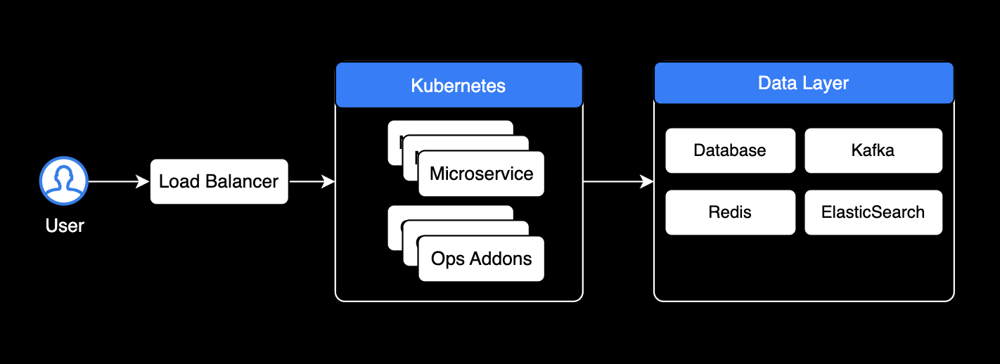
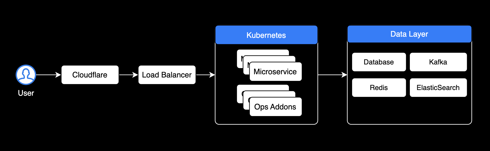
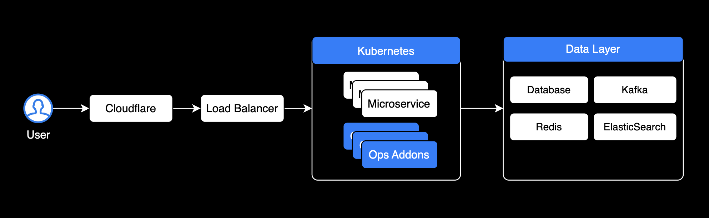
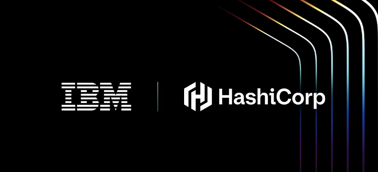
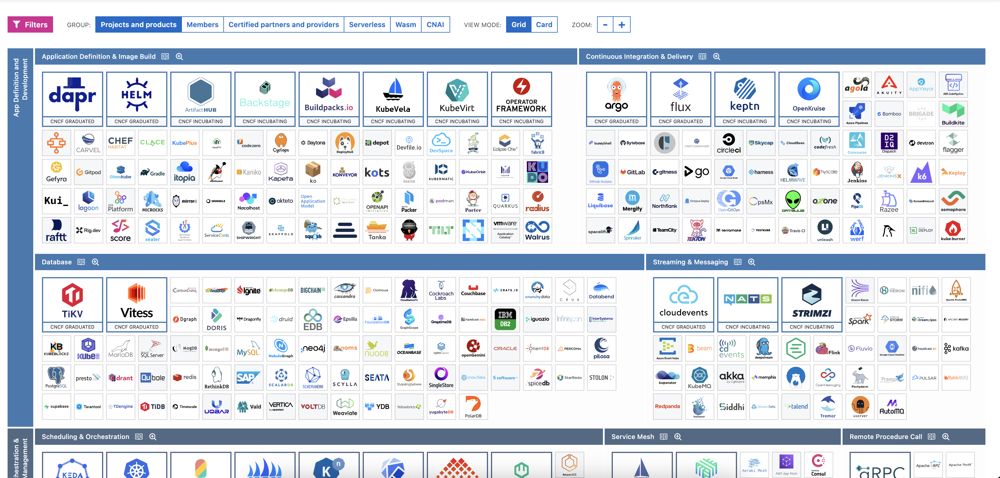

## Infrastructure for Sales

세일즈 및 프리세일즈를 위한 인프라 강의

Speaker: Younsung Lee

---

## Speaker 

### Younsung Lee

DevOps Engineer @ Coinone

 

---

## 아젠다

- 클라우드 인프라가 등장한 배경과 현재 표준 아키텍처 이해
- 인프라 카테고리별 솔루션 이해
- 인프라 트렌드 파악 팁
- 엔지니어 인사이트

---

## 클라우드 인프라의 역사 그리고 표준 아키텍처

---

### 인프라 역사

컨테이너 기반 인프라 시대가 오기 전까지의 역사 [1](https://kubernetes.io/docs/concepts/overview/)

---

### 표준 인프라 아키텍처

---

### 표준 인프라 아키텍처

---

### 표준 인프라 아키텍처

Addon 영역에 엔터프라이즈 솔루션이 들어감

---

### DevOps 엔지니어의 일

---

## 인프라 카테고리별 솔루션

---

### 필드에서 수요가 높은 Cloud Native 솔루션

- Istio (서비스메시)
- Vault (시크릿 관리)
- Terraform (코드로서 인프라)
- ArgoCD (쿠버네티스 배포 도구)
- Packer (이미지 빌드)

---

### IBM의 Hashicorp 인수

메인 스트림이 된 클라우드 네이티브 솔루션 시장

---

### 시나리오별 솔루션 적용 사례

- 쿠버네티스 내부 가시성 확보가 필요함 → Istio (OSS), Gloo (Enterprise)
- 모니터링 → Prometheus, Grafana, Loki (모두 OSS)
- Database Monitoring이 부족한 것 같음 → 데이터독 (Enterprise)
- 개발자 생산성 향상 도구 → Copilot Business, Cursor
- 쿠버네티스 비용 → Kubecost (OSS & Enterprise)
- 1password → 모든 직원의 시크릿 관리

---

## 트렌드 파악 방법

---

### CNCF Landscape

CNCF 조감도(Landscape)를 보고 전체적인 솔루션 현황과 트렌드를 파악

---

### DevOps Roadmap

클라우드 인프라 관련 기술들의 표준과 권장하는 스킬셋을 파악할 수 있음

---

### Geek News

개발 트렌드 및 테크 업계 소식

---

## 엔지니어 입장에서 본 클라우드 인프라

---

### 몇 가지 인사이트

- AWS가 등장하면서 인프라 관련 기술들이 대부분 클라우드 기반으로 이동하고 있음
- 모든 관리용 서비스와 비즈니스 로직이 컨테이너화되고 쿠버네티스 클러스터 내부에서 운영되고 있음
- 결제조차 AWS Account에 연결된 Credit Card에 의해 결제되는 비율이 높음
- Megazone Cloud 등의 MSP사의 출몰로 인해 엔터프라이즈 프로덕트 판매 기업들은 더 경쟁이 치열해진 듯

---

### Enterprise Software가 마주한 허들

---

#### AWS Marketplace

- 결제 지불도 편하고, 엔지니어는 계약서 작성보다는 AWS 콘솔이 익숙함
- 총판사의 가격 인하 조건이 메리트 없으면 이 방식으로 구매 및 운영

---

#### 뛰어난 CNCF Ecosystem

- 쿠버네티스 커뮤니티가 크고 무료로 쓰기 미안할 정도로 좋은 오픈소스 솔루션이 많음
  - IBM도 CNCF Platinum 회원사 중 하나 [*](https://www.cncf.io/about/members/)
- 가격을 지불할 정도로 좋은 솔루션인가? 오픈소스의 퀄리티를 뛰어넘는 솔루션인가?

---

## 관련 자료

[AWS로 여는 미래의 금융 - 코인원의 클라우드 도입 여정](https://www.youtube.com/watch?v=qXF0mgh3E4A)

---

## End Of Document

이 발표자료는 [marp](https://marp.app/)를 활용해 코드로 작성되었습니다.